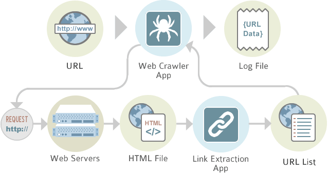
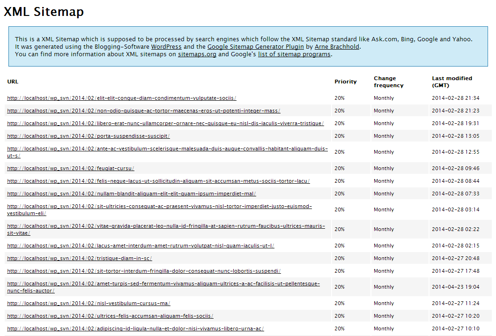
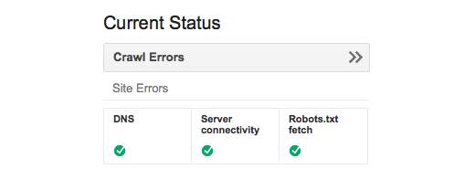
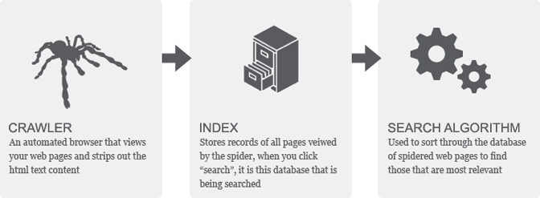
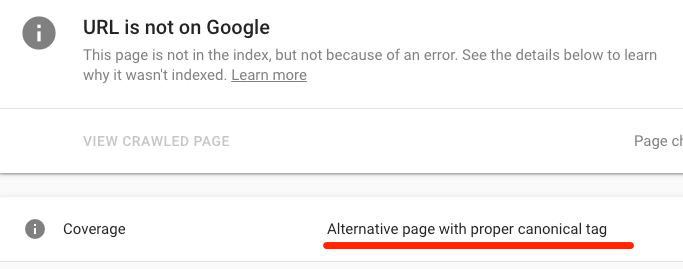
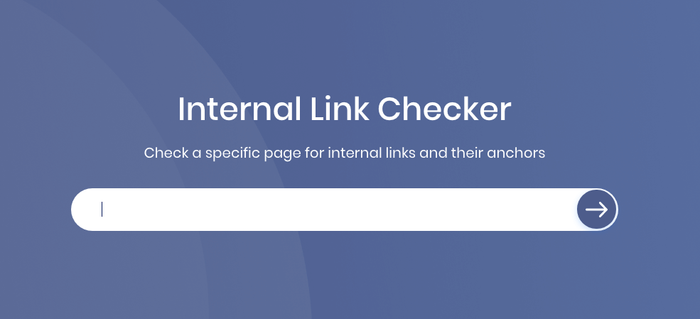

Let me show you how to check the website crawling and indexing status. Follow this guide:

Open your favourite web browser. Type `site:yourwebsite.com` and enter:


See the SERPs. That is your indexed pages in Google. 

What's next?

<div class="toc-master">
  <div class="toc-articles">
    <h3>Table of Content</h3>
    <ol>
      <li><a href="#crawling-theory">Crawling Theory</a></li>
      <li><a href="#how-to-speed-up-google-crawling">How to Speed Up Google Crawling?</a></li>
      <ul>
        <li><a href="#sitemap">Sitemap</a></li>
        <li><a href="#robotstxt">Robots.txt</a></li>
        <li><a href="#title-page">Title page</a></li>
        <li><a href="#meta-description">Meta description</a></li>
        <li><a href="#alt-tag">Alt tag</a></li>
        <li><a href="#content">Content</a></li>
      </ul>
      <li><a href="#indexing-theory">Indexing Theory</a></li>
      <li><a href="#how-to-fix-google-index-issue">How to Fix Google Index Issue</a></li>
      <ul>
        <li><a href="#remove-crawl-blocks">Remove crawl blocks</a></li>
        <li><a href="#remove-rogue-no-index-tags">Remove rogue no-index tags</a></li>
        <li><a href="#remove-rogue-canonical-tags">Remove rogue canonical tags</a></li>
        <li><a href="#the-page-isnt-orphaned">The page isn’t orphaned</a></li>
        <li><a href="#optimize-crawl-budget">Optimize “crawl budget”</a></li>
      </ul>
      <li><a href="#ranking-strategy">Ranking Strategy</a></li>
    </ol>
  </div>
</div>

---

## Crawling Theory

The first task of Google when you publish the post or page on your website is crawling.

Crawling means following a path.

GoogleBot following your links and [crawling around your website](http://retaliate1st.com/2016/07/28/improve-sites-crawling-ability-increase-rankings/). When bots come, they follow other linked pages also on your website.



Because of this, your website needs sitemaps. As you know, Sitemap contains all of the links in our blog and Google’s bots can use them to look deeply into a website.

In the days of Google domination, they will do **The Grandma Test**. [Grandmother Test](http://retaliate1st.com/2016/07/28/improve-sites-crawling-ability-increase-rankings/) will navigate the GoogleBots to crawl your website without becoming confused and frustrated.

GoogleBot's crawling link internally on your site, from page to page.

How to speed up Google crawling?

Crawling is the Google Bot process to understand a website. This process so needs the interlink. 

[Interlinks](http://retaliate1st.com/2016/07/28/improve-sites-crawling-ability-increase-rankings/) are like tiny bridges.  Don't build so many bridges. It can become easy for a visitor to get lost. Build enough bridges with good directions. It will make easier to visitor find a destination and go back home.


Make the Google Bot easier crawl your site with well-placed interlinks.

> Good interlink pathways increases the number of pages the bot will crawl and increasing your Page Rank in the end.

In the next, here is how to speed up Google crawl into your website. 

---

## How to Speed Up Google Crawling?

This guidance based on Google’s perspective. Lets start here.

### Sitemap
Since you upload the new content on your website, Google will discover a site. 

The fist GoogleBot job to your page is following hyperlinks on the web to discover new content. In the next step:

* Crawls the web (Google crawling process start)
* Discovering websites 
* Gathering information 
* Indexing that information to be returned in searching (Google indexing process)

To help the Googlebot within this process, you should create a sitemap first. For the Wordpress user, Install Wordpress [Google Sitemap Generator](http://wordpress.org/plugins/google-sitemap-generator).  



If not, you can upload the sitemap in manual using [xml-sitemaps.com](http://www.xml-sitemaps.com/). Upload sitemap you have created to your root directory.

After that, submit your website to [Webmaster Tool](https://www.google.com/webmasters/tools/submit-url) URL submission page.


### Robots.txt
Please remember it, Google doesn’t look at anything if you lock robots.txt.

If you set `Disallowed` in robot.txt, then Google won't not indexing them. Robots.txt is your permission for GoogleBot to crawl the site.

`Allow` and `Disallow` in robots.txt means:

* Allow: Yes, go ahead. Crawl everything.
* Disallow: You can crawl at these sections of my site, but not these other sections.

Basic robots.txt setting is like:

```
User-agent: *
Disallow:
```

If you want to set `Disallow`, type your page list anything after it.

```
Disallow: /trafficsystem/
Disallow: /wp-admin/
Disallow: /*?
Disallow: /*.css$
```
You can your robots.txt status using browser. 

Type `yourdomain.com/robots.txt`. Remove yourdomain.com with your URLs. You can see the result like this:


If not, use Google Webmaster Tools to check robots.txt.



If you have no robots.txt file, then Google will crawl and index anything in your entire site. 

### Title page
It’s a meta tag, written by `<title>` in your page’s HTML code.


The basic role in the title tag is:

* Google presents 65 characters in the title tag. The searcher will look these in SERPs.
* Google sees the keywords in the title but doesn’t want to see keyword stuffing. 

If you want to optimise the title tag, don't do keyword stuffing.

### Meta description
This is a part of the title tag. 

Google looks at the description to display to users on the SERP. But it doesn’t use as a ranking factor. 

`<description>` can improve your site click-through rate in SERPs. But Google limits the description tag only 160 characters. 


If you optimize this part, make sure the description for humans and search engines.

### Alt tag
Google can crawl anything within your site, but they can't look images. Google will read the alt tags of your images to understand what your image about.

An alt tag within your site looks like:

```

```

Remove the "Target Keyword" using a brief description of your image. On the other hands, don't use the alt tags automatically generated, you will get the alt tags like this:

```
alt=”image001″
alt=”heading-gif”
alt=”CANONDSC019919F80009″
alt=”file01-smiling-boy-2014-04-17″
```

These are useless and makes GoogleBot confuse. Thus, make sure the alt tags you have is a descriptive, contains keyword smart, and useful.

### Content
Content is the most important aspect of what Google sees. 

There are not limited how many pages you will create within the website. Google will crawl, index, and return. Google reaches all of that.

Because of that, produce the [SEO Content](https://gtag.dev/seo-content-marketing/). This is the most effective of SEO strategy as well. 

---

## Indexing Theory
Indexing is the entry point. 

This is the process where your website content will added within Google database.

When you publish the new page on, the search engine saves it on the database of information on the Internet. These databases contain billions of pages of information. 

For GoogleBot, they will crawl new pages online and store them in an index based on their topics, relevance, authority, and more.



When a user performs a search, Google’s search algorithm sorts through its giant database to find the most relevant pages.

All of that will happen if your site is on index tag.

Otherwise, a no-index tag means that you are not allowing GoogleBots to added post or page in the web search’s index.

In the short,

* Google is crawling a site with following your website links.
* They will look at the index or no-index tag as a crawling permission
* They will check your [page status](https://www.pigartgraphics.com/seo/search-engine-infographic/), what's already indexed (existing content) or not yet (new content) first.


In the next, Google will eventually discover and add your content on Google database. You can ensure the [google index status](https://ahrefs.com/blog/google-index/) of your page using Google Search Console.


If you see the index issue, try each tactic.

---

## How to Fix Google Index Issue

Before doing this guidence, make sure your website have backup.

### Remove crawl blocks
Go to `yourdomain.com/robots.txt.` Remove `yourdomain.com` with your URL

If you loo one of this code script, it means you are not allowing Google to crawl any pages on site. 

```
User-agent: Googlebot
Disallow: /
```

Or

```
User-agent: *
Disallow: /
```

Fix this issue with put the specific page on `disallow`. See the sample.

```
User-agent: Googlebot
Disallow: /super-important-page.html
```

### Remove rogue no-index tags
Sometimes, Google doesn't index your page, not because of robots.txt but meta tag. This condition keeping some web pages as private. 

There two ways to fix this issue:

Open your template using Code Editor
Go to `<head>`
Find either of these meta tags within

```
<meta name=“robots” content=“noindex”>
```

Or

```
<meta name=“googlebot” content=“noindex”>
```

Remove the no-index meta tag to make Google crawl and index the page.

### Remove rogue canonical tags
Google discovers the preferred version of a page using a canonical tag. It is like this:

```
<link rel="canonical” href="/page.html/">
```

There are three conditions you can discover a canonical tag:

* Index (no canonical tag). Page without a canonical tag will inform to Google that the page itself is the preferred and probably the only version. 
* Non-index (broken canonical tag): A broken canonical tag tells to Google that preferred a version of this page that doesn’t exist.
* Index with a canonical tag (health canonical tag): A health canonical tag tells Google that there are preferred a version for this page. 

The health [canonical tag](https://moz.com/learn/seo/canonicalization) prevents problems because identical or "duplicate" content appearing on multiple URLs. This canonical tag tells search engines which version of a URL you want to appear in search results.


You can check a canonical tag use Google’s URL inspection tool. 



If the canonical points to another page, “Alternate page with canonical tag” will appear.

### The page isn’t orphaned
Google discovers new content by crawling the web. The orphan page makes this crawling process longer. 

This page is hard to discover by GoogleBot and visitor. Because of this, check the page without an internal link with [Sitechecker](https://sitechecker.pro/internal-links). 

Type your URL address within the field.



Scroll down to see the result.


fix orphan pages in one of two ways:

* If the page is unimportant, delete it and remove from the sitemap.
* If the page is important, incorporate it into the internal link structure of the website.

### Optimize “crawl budget”
A [crawl budget](https://www.link-assistant.com/news/crawl-budget-optimization.html) is the number of times a search engine spider hits your website during a given period.

According to Barry Schwartz, [crawl budget](https://searchengineland.com/google-explains-crawl-budget-means-webmasters-267597) consist of:

* Crawl rate limit. Help Google to not crawl your pages too much and too fast where it hurts your server.
* Crawl demand. How much Google wants to crawl your pages. Based on how popular your pages are and how stale the content is in the Google index.
* Crawl budget. The number of URLs Googlebot can and wants. This is based on crawl rate and crawl demand.

Because of three-point above, low-quality pages on the website makes crawl budget being waste. 

How to find low-quality pages?

Use the [Google Console](https://search.google.com/search-console) and find the pages with low impression and click.


After that, improve the content with [SEO Content Tactics](https://gtag.dev/seo-content-marketing/)

---

## Ranking Strategy
Indexing and ranking are two different things.

Indexing means your website exists in the Google database. It doesn’t mean, Google put your site in the first rank within SERPs. Maybe no, maybe yes.


You need the art of [optimizing web pages](https://www.singlegrain.com/seo/effective-seo-techniques-that-work/) to grow up your rank in Google result. Because of this, SEO comes.

The general tactic of SEO like this:


Google has a lot of ways to put the page in Google first result. They work based on [Google Algorithm Fundamentals](https://gtag.dev/google-algorithm). Google has over 11 algorithms and updated time by time. Here is the result of [Google Ranking Strategy](https://backlinko.com/google-ranking-factors):

* Domain Factors
* Page-Level Factors
* Site-Level Factors
* Backlink Factors
* User Interaction
* Special Google Algorithm Rules
* Brand Signals
* On-Site Webspam Factors
* Off-Site Webspam Factors

These lists mostly consist of proven and controversial tactic. You need in-depth study case before implementing it. I will present the study case of the definitive of google ranking strategy for the next. 