Google Analytics not set or not provided is the most popular problem in GA. This article shows you how to fix 13 issues in 13 different ways. If you already set Google Analytics, this is the next step to get attention.

Let's see the issue and how to fix it!

I found this case for several days after [integrating Google Analytics and Google Tag Manager](https://gtag.dev/google-analytics-tutorial/). 

For the first time, I think this problem will fix in the next day. But the problem still appears. The "Not set" value looks like:

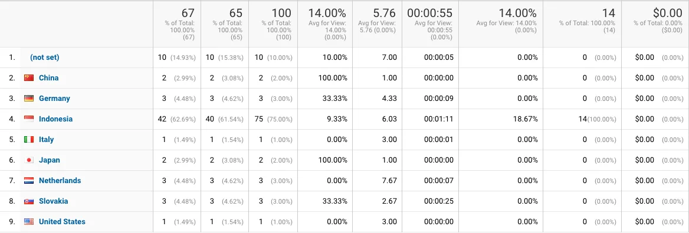

Follow this way to fix the issue looks like.

  

    <h3>Table of Content</h3>
    <ol>
      <li><a href="#what-the-value-not-set-means">What the value (not set) means?</a></li>
      <li><a href="#the-not-set-value-impacts-for-web-analysis">The "Not-set" value impacts for Web Analysis</a></li>
      <li><a href="#automated-check-issue">Automated Check Issue</a></li>
      <li><a href="#content-grouping-issue">Content Grouping Issue</a></li>
      <li><a href="#behavior-reports-issue">Behavior Reports Issue</a></li>
      <li><a href="#hostname-issue">Hostname Issue</a></li>
      <li><a href="#page-title-issue">Page Title Issue</a></li>
      <li><a href="#source-medium-campaign-and-ad-content-issue">Source, Medium, Campaign and Ad Content Issue</a></li>
      <li><a href="#organic-keyword-issue">Organic Keyword Issue</a></li>
      <li><a href="#paid-keywords-issue">Paid Keywords Issue</a></li>
      <li><a href="#browser-and-browser-version-issue">Browser and Browser Version Issue</a></li>
      <li><a href="#geo-location-issue">Geo Location Issue</a></li>
      <li><a href="#reverse-goal-path-issue">Reverse Goal Path Issue</a></li>
    </ol>
  

---

## What The Value (Not Set) Means?

[Google](https://support.google.com/analytics/answer/2820717?hl=en) means:

> Google Analytics hasn't received any information for the dimension you have selected. 

As a marketing specialist, you have numbers but it’s not clear what visitor mean and how to use in data analysis.

When [the "not-set" comes](https://online-metrics.com/not-set-google-analytics/#introduction), the reporting and analysis can be a real pain. 

The reason is, the (not set) label did not tell valuable stat for analysis or decision-making process. It hurts the usefulness of stats, right?

The (not set) label is a nightmare for Web ownership. Why?

---

## The "Not-set" Value Impacts for Web Analysis
Imagine you have the website with thousands of visitors per day and found this label.

It is a disaster!!

You can see, the web has a content grouping configuration. There are 9 group product category data. The"not-set" value is 45% of all data stats. 

Set up content grouping on the website is so important. That's can:

* Being a holistic overview of content performance with success events (conversions) indicators. 
* Being holistic navigational analysis and optimization.
* Overcoming technical hurdles with their content structure.

The result is, the higher the (not set) value makes data analysis becomes more difficult. The stats on Google Analytics is nothings. You can't know what the data says and means too.

Here are the details to fix the "not-set" first:

---

## Automated Check Issue
Needs a lot of time to manually checking (not set) data label. Even more, if you wanna monitoring the issue in every month or even more often.

You can track the not-set data using custom alerts with segmentation. Check this out:

This is the first alternative to set up an automated alert for each of the dimensions.

This setting will send the 3 notification about:

* Trigger an alert daily, weekly, monthly.
* The current base level of (not set).
* Ideal trigger needed. Increase of (not set) value with 10% or others.

Here's how to set up Custom Alert:

Open the Google Analytics
Go to Segments

Click to Create new Segments
Click +New Segment

Follow as well as the screenshot below:

Click Save.

Move to Custom Alerts.

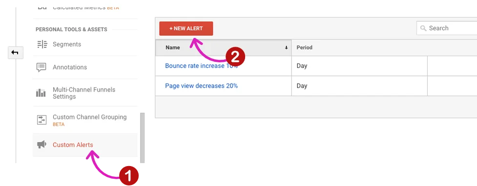

Click +New Alert

Type the setting as well as the screenshot:

Click Save.

---

## Content Grouping Issue
It can be an issue if the (not set) value is greater than 10% of total page views.

The [problems](https://www.owox.com/blog/use-cases/not-set-in-google-analytics/) appears because a `<title>` tag in the header is an error or not created at all. 

To know which pages cause the problem, use the additional page parameter. Maybe your GA tracking code is launching before the `<title>` tag. In this case, switch the order.

If this issue still exists, try to use [Paul guide](https://online-metrics.com/not-set-google-analytics/):

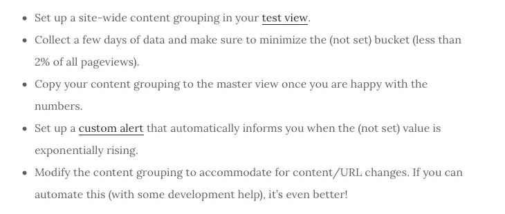

---

## Behavior Reports Issue
You can find this issue on the Site Content (Landing Pages report)

This report shows the landing page which the visitors start a session. The landing page looks like an entry-point for the visitor.

You can use it to check the bounce rate. 

> The bounce rate is the percentage of visitors who leave without taking any actions on the page.

In short, you can’t define which the pages need improvement if the not-set label exists. It's happening because:

* The session ended at midnight or after 30 minutes of visitor standby. Google marks a new session after that.
* A session has no page or screen views. You set a filter deleting specific page views or screen and page tracking settings are wrong. 
* There are two tracking codes at a time (analytics.js and gtag.js). Use one code only. 

---

## Hostname Issue
Web owner frequently ignorance this issue. It because the hostname dimension is "hidden". 

Check your hostname dimension here:

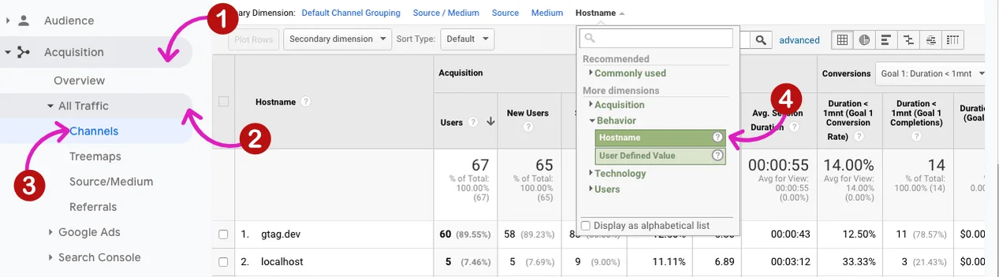

The report should only contain relate to “hostnames”. Pay attention to the traffic coming from spam bots (in case of (not set) value).

Spambots leave fake data on Google Analytics account without actually visiting your website. 

Fix [the hostname issue using 2 steps](https://gtag.dev/google-analytics-tutorial/#step-4-configure-view-level-settings):

* Exclude all hits from known bots and spiders in view settings.
* Add an include filter on your hostname(s).

---

## Page Title Issue
This issue looks like:

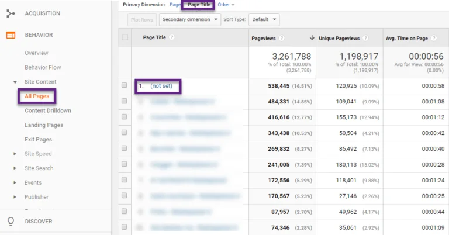

You can view the page title issue on Behaviour menu.

Fix the problem using 2 steps:

* An error with the `<title>` tag in the head of your page or no `<title>` tag at all. Pay attention in there and fix it accordingly. 
* Adding [the secondary dimension](https://online-metrics.com/secondary-dimensions/) “Page” to the (not set) value on “Page Title”.
* The GA tag position was in above the `<title>` tag of your pages. Move the GA code to under the `<title>` tag.

> This is an urgent issue on SEO and site experience.

---

## Source, Medium, Campaign and Ad Content Issue

These labels are automatically recorded by Google or tagged with custom UTM parameters.

The (not set) will appear because these traffic sources did not have campaign or content information. Check your Source and Medium labels on:

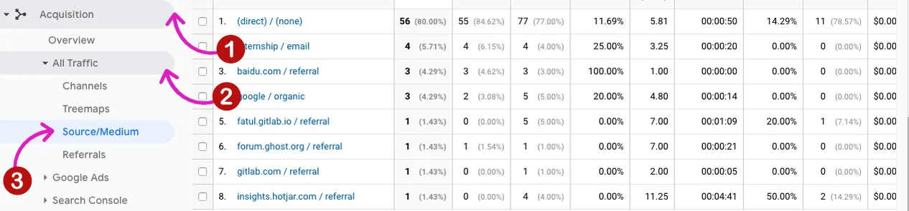

View the Campaign and Ad Content labels with:

How to fix the issue?

* Make sure that all tagged links are formatted (and spelt) correctly. 
* Use [the URL builder from Google](https://ga-dev-tools.appspot.com/campaign-url-builder/) include source, medium and campaign. 

---

## Organic Keyword Issue
Google is not showing for privacy reasons. That's why you see the not-set or not-provided label.

View the Organic Keyword using:

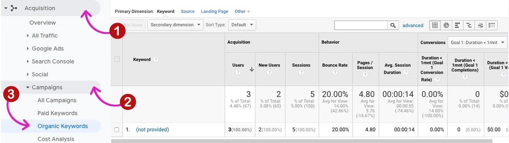

In short, the traffic coming from an odd search engine or you’ve manually tagged something as Organic and not supplied a keyword.

It makes the traffic coming without the keyword. 

Fix the issue using the “utm_term” field from [the URL builder](https://ga-dev-tools.appspot.com/campaign-url-builder/).

---

## Paid Keywords Issue
Go to the Paid Keywords label issue on:

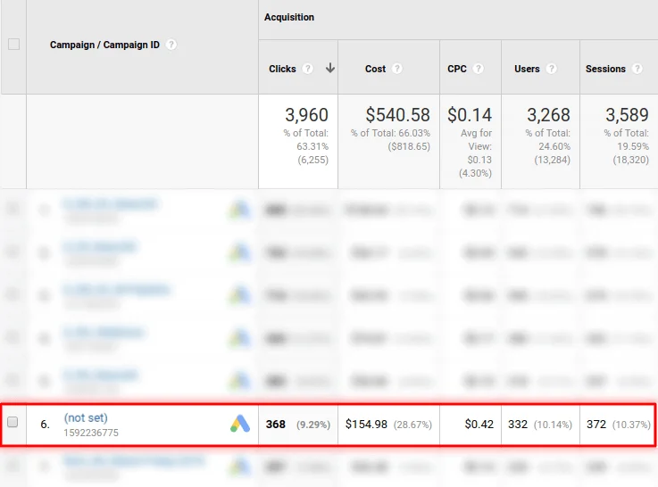

There are configured correctly in your Paid Search traffic such as:

* Improper integration of Google Ads and Google Analytics
* The automatic signature feature in Google Ads being turned off. When a visitor clicks on an ad message, the Google Click Identifier (GCI) value is added to the target URL. Google Analytics saves it as a new site cookies file on the website’s domain.
* Void clicks. Google Ads understands these as clicks made by bots or malware, or double or triple clicks with no use for the advertiser.
* Redirects. While redirecting from one URL to another, gclid might get lost. As a result, you’ll see (not set).
* Syntax and gclid problems such as the register changes in the URL, website cuts the gclid parameter because it has more than 100 symbols, the website settings forbid processing of the request.

Fix this issue with:

* Make sure the accounts are linked to your Google Analytics view.
* Make sure the auto-tagging is enabled. If you are using manual tagging, passing the keyword through the utm_term parameter.

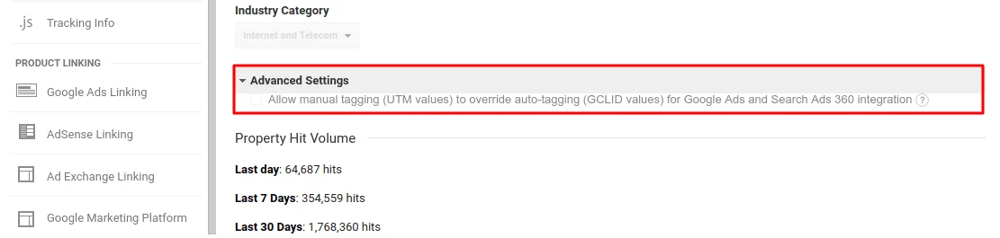

---

## Browser and Browser Version Issue
Google Analytics will detect the user agent when the visitor comes. The user agent contains information about the device you are using as well as which browser and browser version. 

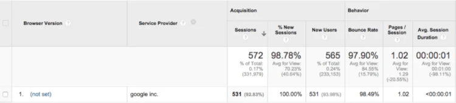

Sometimes, Google can't identify user agents because:

* Deleted cookies
* JavaScript disabled in the user’s browser
* Couldn’t detect the location based on IP or couldn’t detect the IP at all
* Variety of blockers (AdBlocker, etc.)

That's why (not set) show up.

How to fix?

* Exclude hits from known bots and spiders is checked in View Settings.
* Add the secondary dimension to know the providers and manually exclude with view filters. 

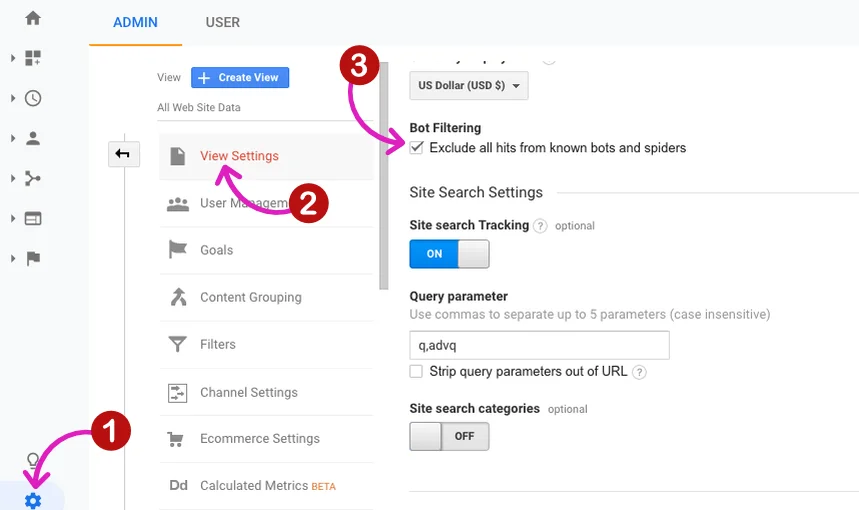

---

## Geo Location Issue
Google Analytic identify the location of users from their IP address, but this information isn’t always available. 

Hence the Google Analytic limit, sometimes you can see not-set label on Audience >> Geo >> Location.

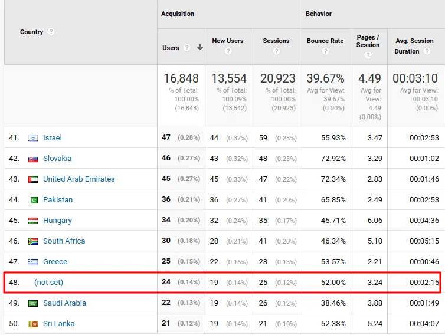

The reason why this issue come is, The IP address or service provider may not be shared by the visitor. Google will identify as spam or bots and sometimes display the traffic as a (not set) label. 

The network issue come from this issue too. As the behaviour of this group doesn’t deviate, you don't need to further investigate this.

How to fix?

Go to transactions/goal completions/pageviews to recheck this issue.

---

## Reverse Goal Path Issue
Find this issue on Conversions >> Goals >> Reverse Goal Path.

The reverse goal path report shows goal completion locations and the three previous pages viewed.

This issue based on your goal settings. If your goal needs less than 3 steps to complete, (not set) appears for sure and it's fine.

> Remember, “not set” shows up when there is no data to show. If someone visits the site and completes a goal right away (#1 in the example below), previous steps 2 and 3 would be “not set.”

That's how to fix the not-set label. Sometimes you can avoid the not-set reports by:

* More thorough campaign tagging
* Event tracking and spam blocking

But other times, it is an inherent part of the reports, such as in the reverse goal path.