Schema Markup (Schema.org) is the latest Google structure data. You almost found this, but aren't understand about. Google using it to make easier how to crawling and indexing the website.

FYI, Schema replaces Open Graph. According to Moz.com:

>  Open Graph is a type of markup used by Facebook to parse out information like what image and description to display. Schema provides a more detailed list of options than Open Graph. They can be used together, but Open Graph cannot be used in place of Schema.

The difference between Schema dan Open Grap is in SERP (Google Search Engine Results Page) display. Check this out:

For 2006 ago:


For 2016 ago:

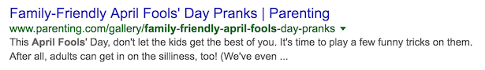

This revolution affects on Google user behaviours. 

<div class="toc-master">
  <div class="toc-articles">
    <h3>Table of Content</h3>
    <ol>
      <li><a href="#how-important-is-the-use-of-schemaorg-markup">How important is the use of Schema.org markup</a></li>
      <li><a href="#how-does-schemaorg-help-a-new-website">How does Schema.org help a new website</a></li>
      <li><a href="#how-schemaorg-affect-seo-result">How Schema.org affect SEO Result</a></li>
      <li><a href="#how-do-i-use-schema-for-local-seo">How do I use Schema for local SEO</a></li>
      <li><a href="#how-to-add-rich-snippets-to-wordpress">How to add rich snippets to WordPress</a></li>
      <li><a href="#how-do-i-check-if-the-website-uses-schemaorg">How do I check if the website uses schema.org</a></li>
    </ol>
  </div>
</div>

------

## **How important is the use of Schema.org markup?**

Schema.org is a better structure data than Open Graph. Google using Schema.org to get website information in detail. You can see the difference the both through data structure script. 

Schema.org script:

```
{
 "@context": "https://schema.org",
 "@type": "NewsArticle",
 "mainEntityOfPage": {
 "@type": "WebPage",
 "@id": "https://google.com/article"
 },
 "headline": "Article headline",
 "image": [
 "https://example.com/photos/1x1/photo.jpg",
 "https://example.com/photos/4x3/photo.jpg",
 "https://example.com/photos/16x9/photo.jpg"
 ],
 "datePublished": "2015-02-05T08:00:00+08:00",
 "dateModified": "2015-02-05T09:20:00+08:00",
 "author": {
 "@type": "Person",
 "name": "John Doe"
 },
 "publisher": {
 "@type": "Organization",
 "name": "Google",
 "logo": {
 "@type": "ImageObject",
 "url": "https://google.com/logo.jpg"
 }
 },
 "description": "A most wonderful article"
}
```

This script will show the content preview below:


And then, move to Open Graph script:

```
<meta property="og:audio" content="http://example.com/bond/theme.mp3" />
<meta property="og:description" 
 content="Sean Connery found fame and fortune as the
 suave, sophisticated British agent, James Bond." />
<meta property="og:determiner" content="the" />
<meta property="og:locale" content="en_GB" />
<meta property="og:locale:alternate" content="fr_FR" />
<meta property="og:locale:alternate" content="es_ES" />
<meta property="og:site_name" content="IMDb" />
<meta property="og:video" content="http://example.com/bond/trailer.swf" />
```

The structure data above will show the content preview like this:


So, what the difference both?

Schema.org make better rich snippets for Google user. They are displaying a more informative in Google search result. 

Nowadays, there are a hundred rich snippets displayed on the search result. 

What are the rich snippets?

Rich snippets are structured data visualization within a search result (SERP). You will find it in the Google search. Rich snippets will be displaying data from Scheme markup.

Google has developed a hundred rich snippets features. Many of them are very familiar but [Mangools](https://mangools.com/blog/google-rich-snippets-guide/) display 28 of them and make it into some categorization.

- Sponsored features
- Local business features
- Knowledge features
- Media features
- Vertical enhancement of organic results (rich results)
- Search query features

In fact, rich snippets are increasing the click-through rate.

ConversionXL said that search results with more extensive rich snippets (like those created using Schema) will have a better click-through rate.

According to Google:

```
Clickthrough rate (CTR) is a ratio showing how often people who see your ad end up clicking it. Clickthrough rate (CTR) can be used to gauge how well your keywords and ads are performing.
```

A study from 2014 found, if the article in position number one, the CTR was 56%. You can see the fact below:


Today, Google updating [the rich snippet algorithm](https://www.searchenginejournal.com/google-featured-snippets-update/319553/). It's happen to make better the search result. The rich snippets is a reward for publishers that provides useful content at the moment.

Google improve their systems by updating the new algorithm:

**Information that is regularly updated**
It will appear on the blog post that contains a piece of regular basis information, such as next full moon, the winner of a reality TV show, or upcoming holidays.

Out of update:


New algorithm:


**Information that changes with passing time**
This content used for a content-based event. The page needs to be updated by different substances.

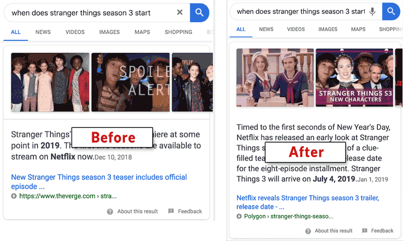

**Current events**
Google will appear the more useful information for visitors on the below of rich snippet.


The goal of the new algorithm is to remove featured snippets content that is out of date and no longer useful.

------

## **How does Schema.org help a new website?**

The new website needs more effort in Google result. Schema.org is one of them.

As you know above, Google using Schema.org to get website information in detail. Google will be crawling and indexing the website faster.

If Google is faster when crawling and indexing, a visitor will be finding your website faster too.

Google Bot will be using website data from Schema.org as:

```
Rich Snippets + Rich Cards + Voice Search + machine learning = Increases organic traffic to the website. 
```

You can see the result example below:


[Ahrefs](https://ahrefs.com/blog/featured-snippets-study/) found a fact about a new website. 

You have a 0.42% probability being the top on Google result. The reason is, the featured snippets only display 30.9% of the top result.


Google took some information from SERP feature, as an Answer Box. It's sound good for the new website, right? 

If you didn’t already rank anywhere on the front page of Google, make sure your content contains topic from the top 30 of words trigger featured snippets.


Based on [A.J. Ghergich](https://moz.com/blog/what-we-learned-analyzing-featured-snippets), adding the questions, prepositions, comparisons, paragraph, table, list, etc within content will increase the probability as a featured snippet


Here the live-preview:


How about backlink? 

The fact is, Google doesn’t seem to be featuring “the strongest” page in the top 10. 


As long as you have a great conten, everything will be ok. So don't worry even though you are the new website and have a low backlink :)

------

## **How Schema.org affect SEO Result?**

ConversionXL said that search results with more extensive rich snippets have a better click-through rate.

When the page gets as many organic search clicks, more people are visiting your site. It's an important signal for Google. It's mean the page is relevant and awesome for the visitor.

Schema.org create better rich snippets because Google took the page important information from the pages. Rand Fishkin has highly opinion about it. He guesses:

```
If a page is ranking in position 3 but gets a higher than expected CTR, Google may decide to rank that page higher because tons of people are interested in that result.
```

[Ahrefs](https://ahrefs.com/blog/featured-snippets-study/) have a great deal about it. 

They found, featured snippet is stealing clicks from the #1 ranking result. 

What is the reason?

Featured snippets displayed clearly, catch the eye, and superpowers to get the user-attention. Because of that, they will drive more clicks.


As you can see above:

- When there’s a featured snippet at the #1 position, it only gets ~8.6% of clicks (on average), while the page below get ~19.6% of clicks (on average).
- In the regular condition. When the page no featured snippet and on #1 ranking page, it will get ~26% of all clicks.

If this condition mostly happen at your website, Google may be [increase your rank](https://moz.com/blog/does-organic-ctr-impact-seo-rankings-new-data) in the search result because people are more interested on your website.

------

## **How do I use Schema for local SEO?**

As you can see, Google provides rich snipped for local business. Use [Google My Business](https://www.google.com/intl/id_en/business) to make your local business visible in Google Search.

Google my Business (GMB) is a specific tool for Local Busines. You can update Business Profile, build a website, and engage with customers within. GMB will display business info, photos, reviews, and more insights.


GMB is free for everyone. You just sign in with google account and add your business. GMB can access on mobile, tablet, and desktop.

Follow this way:

Go to https://business.google.com. Sign in or signup use Google account.


Click add single location. Choose to Add single location in the dropdown menu.

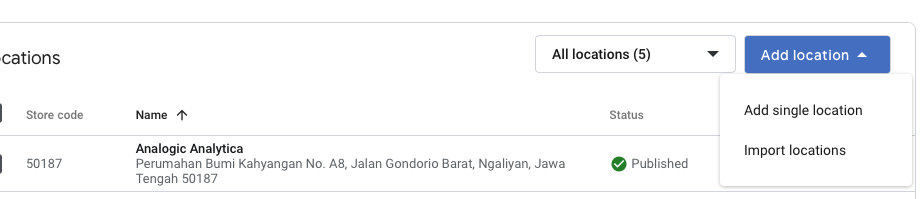

Type your business name and Click Next


Choose Yes if you want customer comes to your business listing. Choose no, if not. 

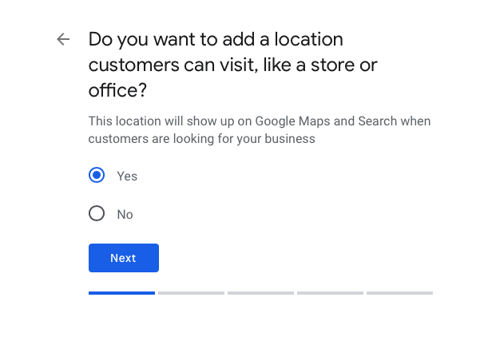

Type your business address and click next


Find your business address on the map. Drag and zoom the map. If you are done, click Save.

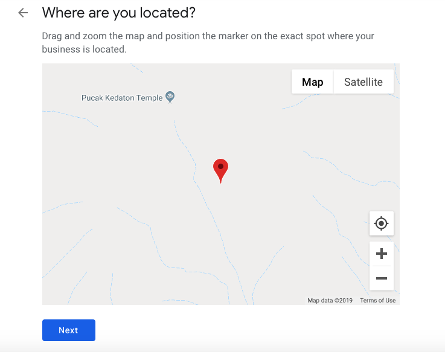

Choose Yes if you can serve the customer outside the business listing. Choose No, if not.

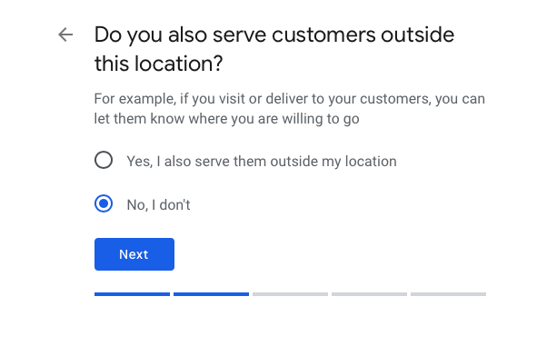

Choose the business category that fits your business category. Click Next.


Write your business contact details like phone number and website URL (optional). Next.


Click Finish and lets verifying the business listing.

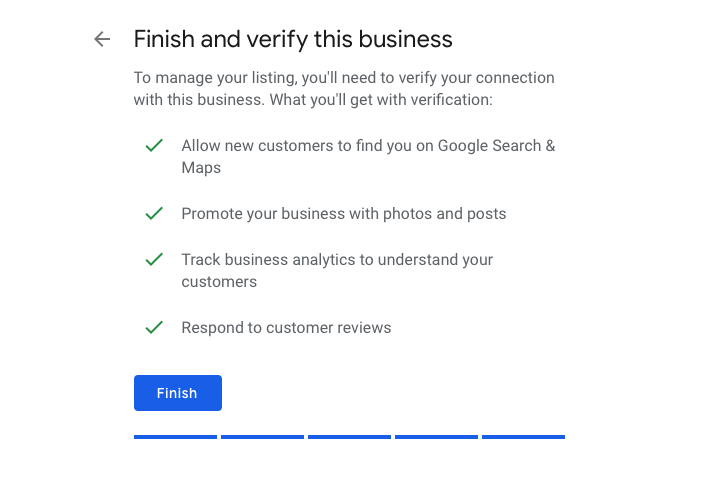

There are 3 verification method. I choose Mail Verifcation. So, I type contact name that receives the postcard with code verification. The postcard will arrive at least 4 days. Click Mail.

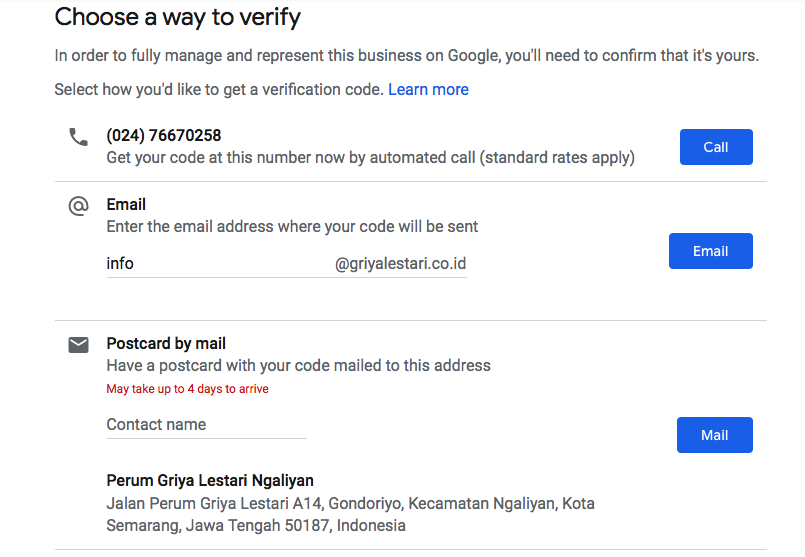

Click Continue.

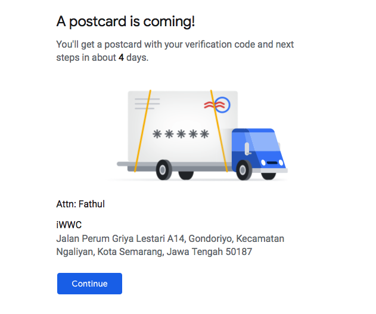

Wait for a few days. If the postcard arrives, insert the postcard code within Google Business.

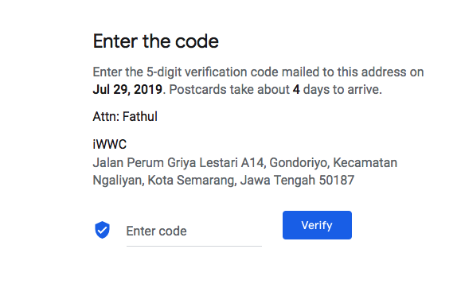

The postcard code that you receive will be like this:


Sometimes, the postcard don not come to your address. This happens because there is something wrong with your business address. If it happens to you, go to the GMB [Verification Code Issue](https://support.google.com/business/contact/verification_code_issues). Google teams will ask you to write some information and upload any document about your business.

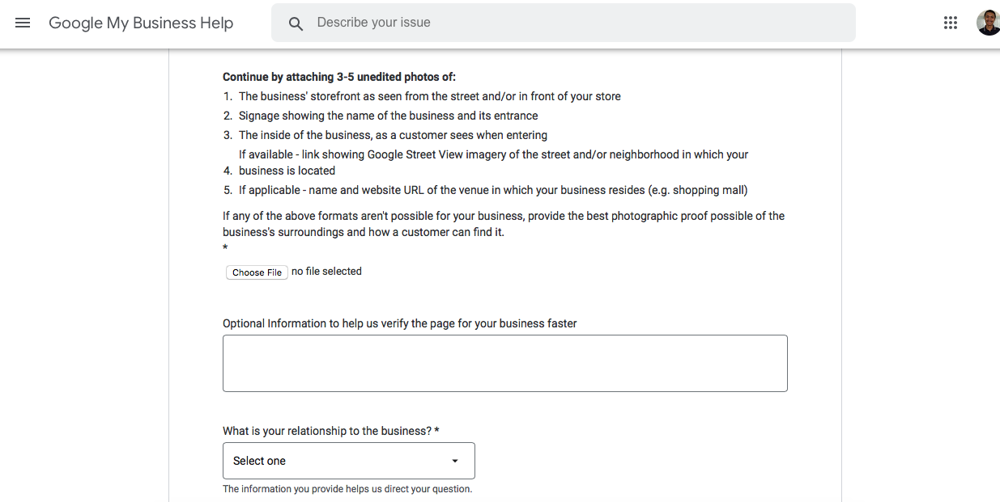

------

## **How to add rich snippets to WordPress?**

There are 2 ways to add within Wordpress. 

1. Install Insert Headers and Footers Plugin


- Go to Plugins.
- Click Add new
- Type Insert Headers and Footers within the search field
- Install and activate.

If installing process is done, it's time to insert the script in the plugin. Follow this way:


- Back to Settings
- Click the Insert Headers and Footers
- Copy the Scheme Markup in [Search Gallery](https://developers.google.com/search/docs/guides/search-gallery)
- Find the markup type. There are 28 markups. Setup the markup as well as.
- Test the markup validation in the [Structured Data Testing Tool](https://search.google.com/structured-data/testing-tool). Fix the error markup.
- Copy and paste the script in Header to the Insert Headers and Footers plugin.
- Put the script in the Scripts in Header
- Save. Done.

\2. WordPress SEO Plugin – Rank Math

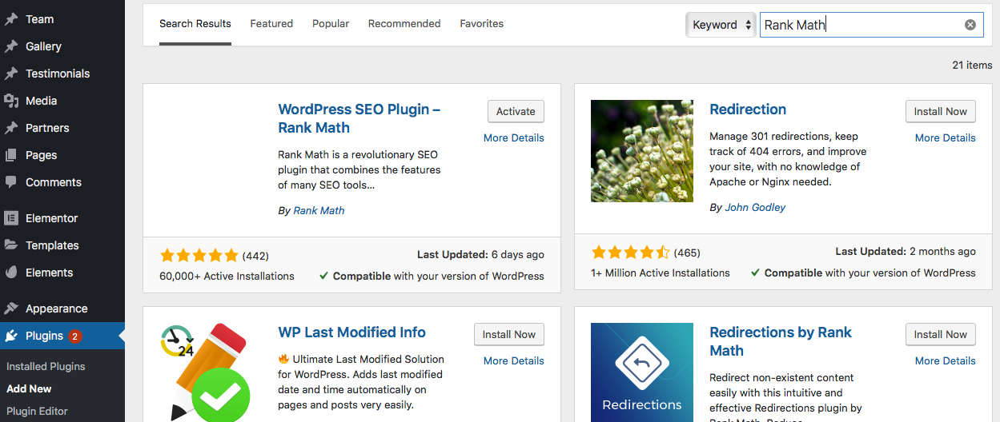

- Go to Plugins 
- Click Add new
- Type Rank Math in the search field
- Install and activate.

Make sure the process is done. You need to set up the Rich snipped within post or page as you need.

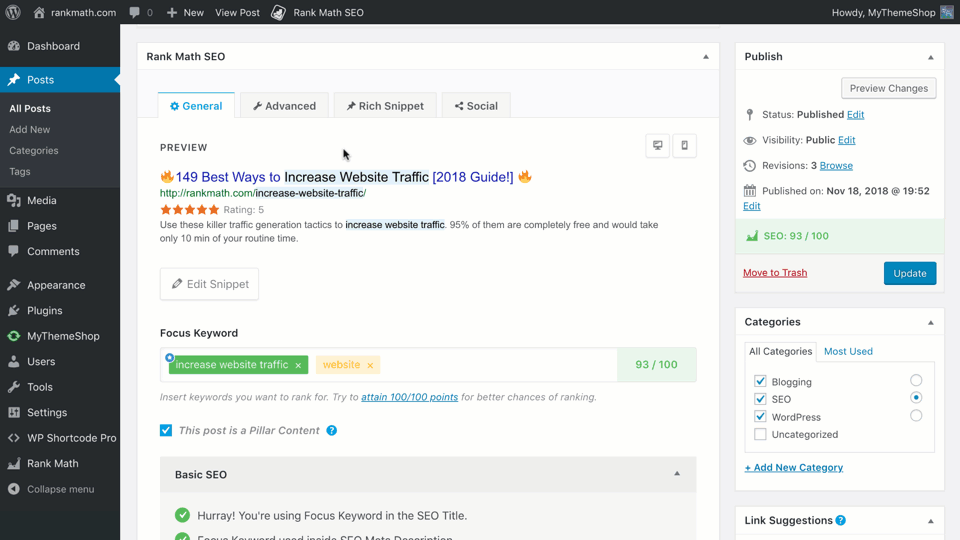

- Open the pages or post. 
- Scroll down. Find the SEO Rank Math
- Click Rich snipped.
- Choose and set up rich snipped
- Save the page if the setup is done

------

## **How do I check if the website uses schema.org?**

Use Google structured data testing tools.

- Go to [Google Testing Tool](https://search.google.com/structured-data/testing-tool)
- Type your page URL into the field
- Click Run test
- There are 2 columns (left and right). The left column contains structured data script. The right column displays the result. If the error has found, you can view how to fix the problem too.

We need to learn so hard about the Schema markup. It is not just JS script only. We will understand how Google appearing a page from structured data.