What do you want about SEO Content? How many time do you need to learn? 

The SEO content looks like:

<iframe width="100%" height="500px" src="https://www.youtube.com/embed/nORRgU8sGdE" frameborder="0" allow="accelerometer; autoplay; encrypted-media; gyroscope; picture-in-picture" allowfullscreen="allowfullscreen" style="margin-bottom: 20px;"></iframe>

The video told about how to put salt in the salad. It's the simple things you can do. But Joseph's needs over 4 minutes to do and using the complex mechanics' process. 

That's the SEO Content. 

They work for:

* Boost the web page become the top rankings
* Increase the audience engagement score
* Create a positive user experience as long as the audience in visit

Because of that, everybody who wants to produce SEO article writing needs the content hack. Lets get started!

  <h3 alt="table of content">Table of content</h3>
	<ol>
		<li><a href="#understand-the-algorithm">Understand the algorithm</a></li>
    <li><a href="#avoid-low-quality">Avoid low-quality</a></li>
    <ul>
      <li><a href="#step-01-create-content-structure">Create content structure</a></li>
      <li><a href="#step-02-find-the-valuable-link-reference">Find the valuable link reference</a></li>
      <li><a href="#step-03-make-something-even-better">Make something even better</a></li>
    </ul>
    <li><a href="#the-freshness-content">The freshness content</a></li>
    <ul>
      <li><a href="#step-01-look-for-pages-google-loves-and-never">Look for pages Google loves and never</a></li>
      <li><a href="#step-02-makeover-title-tag-and-meta-description-copy">Makeover title tag and meta description copy</a></li>
      <li><a href="#step-03-add-the-valuable-and-freshness-topic">Add the valuable and freshness topic</a></li>
      <li><a href="#step-04-update-schedule">Update schedule</a></li>
    </ul>
    <li><a href="#useful-and-valuable-content">Useful and valuable content</a></li>
    <ul>
      <li><a href="#method-01-interesting-to-read">Interesting to read</a></li>
      <li><a href="#method-02-solves-a-problem">Solves a problem</a></li>
    </ul>
	</ol>
  

------

## Understand the algorithm

The algorithm is how [Google retrieve data](https://www.searchenginejournal.com/google-algorithm-history/) from the search index and instantly deliver the best possible results for every single query.

[Google algorithm](https://www.searchenginejournal.com/google-algorithm-history/) has a complex system. Fortunately, they classify in some algorithm category that significantly impacts the SERPs:

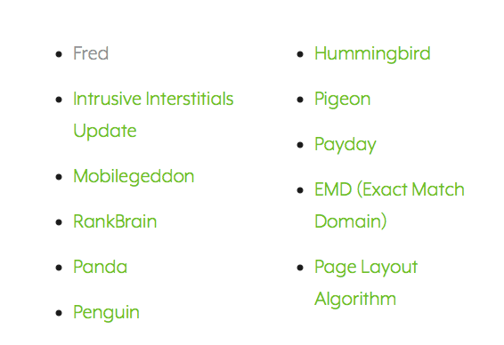

Google changes its algorithm almost 9 per day or [3,234 updates in 2018](https://moz.com/google-algorithm-change). This change is minor or even more major update such as Panda and Penguin that affects search results in significant ways. 

Because of that, tracking the Google algorithm it is tired. You can keep update with learning [google factors checklist](https://blog.searchmetrics.com/us/the-2014-rank-correlation-analysis-and-seo-ranking-factors-for-google-u-s/). At 2014, Google rank factor looks like:

That google rank comes from analyzing the top 30 Google rankings for 10,000 keywords (approximately 300,000 URLs) with information-oriented search terms.

How is Google ranking or Google Algorithm impact the SEO Content?

------

## Avoid low-quality

You will fight with Google Panda. No, you can't attack, just go along with them as long as produce the content.

[Google Panda](https://www.searchenginejournal.com/google-algorithm-history/panda-update/#close) developed to reduce the prevalence of low-quality, thin content in the search results, and to reward unique, compelling content. 

On February 24 2011, Google launched a pretty big algorithmic improvement in the search ranking and impacts 11.8% of queries.

According to [SearchEngineJournal](https://www.searchenginejournal.com/google-algorithm-history/panda-update/#close):

This moment makes SEO content marketing become smart. They have to create high-quality content and increase the conversion too. 

The key success is unique and valuable. Create unique and valuable content with research adequately and spend time writing the best blog post. 

[iPrice](https://iprice.co.id/trend/insights/e-wallet-terbaik-di-indonesia/) did do well and show Google Panda power.

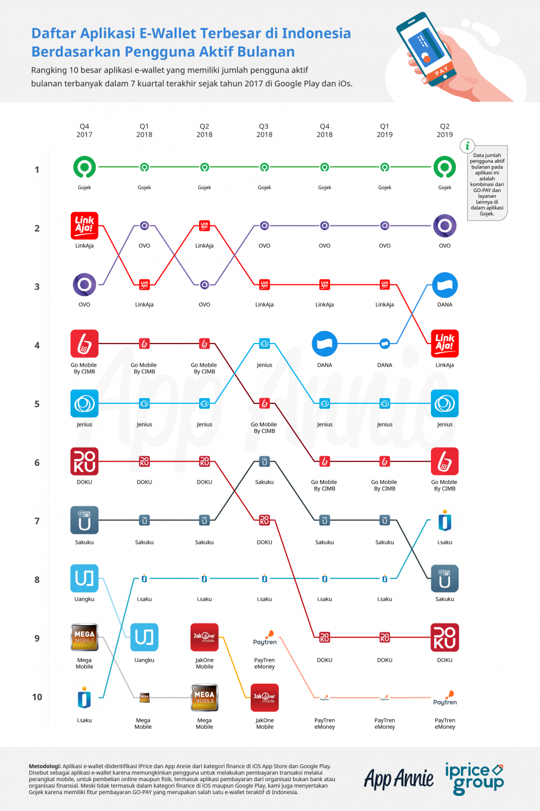

Their content got 9 backlinks with 3 high-quality DR site.

Another story comes from Backlinko. Backlinko was in the #1 top rank Google with "the best SEO checklist" query.

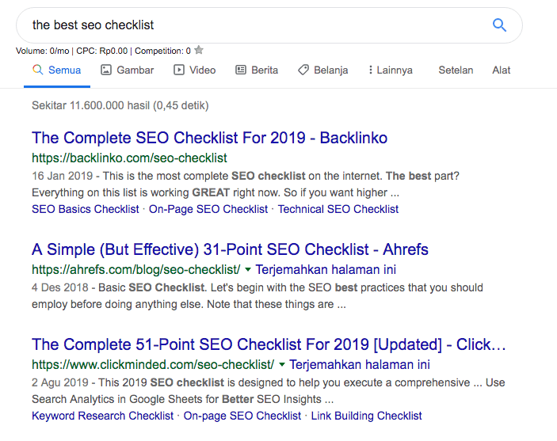

How to create high-quality SEO Content? Use the [Skyscraper Technique](https://backlinko.com/skyscraper-technique). With this technique, Backlinko getting 110% new sessions.

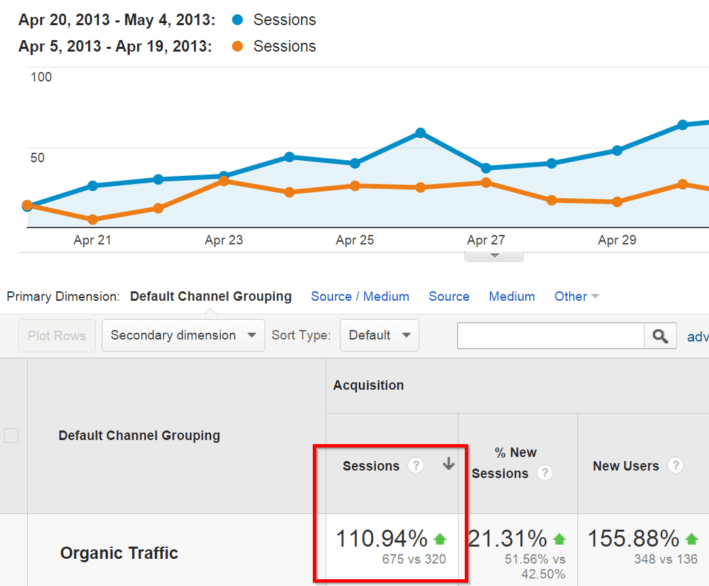

The point of Skyscraper is to make the content:

- Longer or more
- More up-to-date
- Better readable and designed
- More valuable

And there are 3 steps to create content like that:

### Step 01: Create content structure

This step is so important. [Content structure](https://iamahmedkhalifa.com/blog/content-structures/) is a way to make the audience enjoy the content. [SiteGuru.co](https://www.siteguru.co/seo-academy/page-structure-and-headings) has a basic content structure sample.

But that structure is for SEO. I think we need an artsy content structure. Here we go.

Open [LSIGraph](https://lsigraph.com/)

Type your target keyword or content topic into the search box

Click Generate

The result will appear.

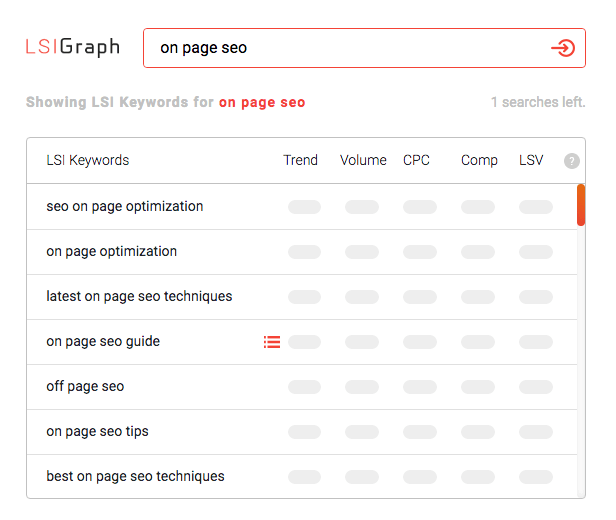

Copy the keyword and put into your note apps. In this case, I use Evernote. Makes the keyword position you like. Choose only the keywords as needed. 

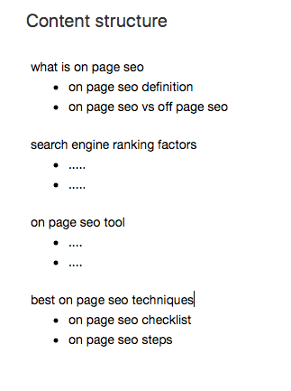

The content structure is available to modify. Here is my default structure.

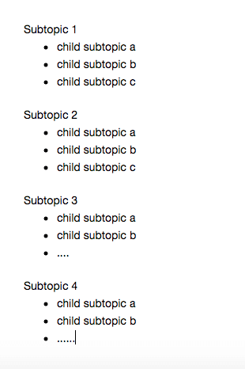

Add the new child or subtopic if you need.

### Step 02: Find the valuable link reference

The structure was done. Next, find the link reference as the content substance. 

There is 2 way how to create the content substance.

#### The headline

Some people call the [magic headline](https://harrisonamy.com/41-classic-copywriting-headline-templates/). That's work to getting audience attention. Get attention is the first step in the A.I.D.A. model (awareness, interest, desire and action).

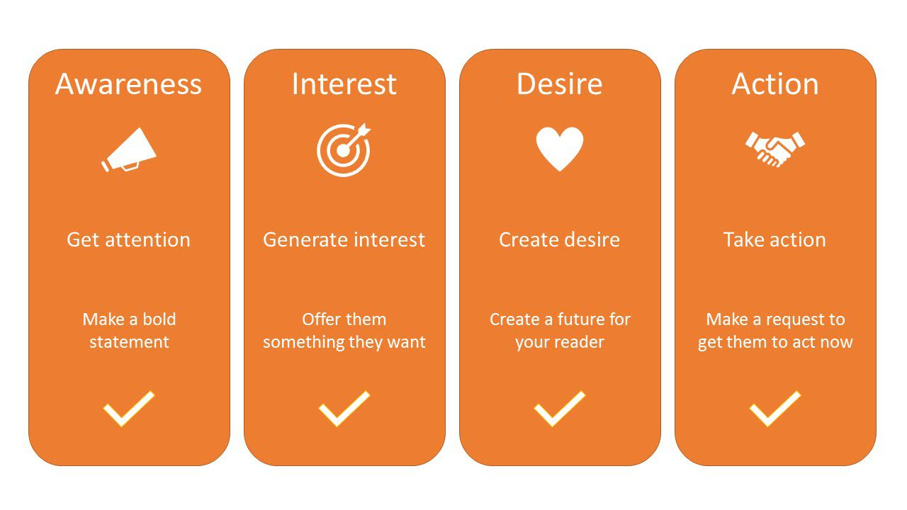

[A.I.D.A](https://www.optimonk.com/timeless-copywriting-examples/) is a visitor magnet to grab attention and interrupt their typical routine of clicking from one site to the next. 

Sometimes magnetic headlines are hard to do. It's because the fact 8 out of 10 people will read headline copy, but [only 2 out of 10 will read the rest](https://www.copyblogger.com/magnetic-headlines/).

In the "How to Write Magnetic Headlines" E-Book, CopyBlogger said:

Every element of compelling copy has just one purpose — to get the next sentence read. And then the sentence after that, and so on, all the way down to your call to action. So it’s fairly obvious that if people stop at the headline, you’re already dead in the water.

The headline is a promise to readers. 

Create a clear sentence. The point is, what the benefit the reader will get in exchange for their valuable time.

Creat the magic headline with the classic [copywriting headline templates](https://bloggingx.com/google-freshness/).

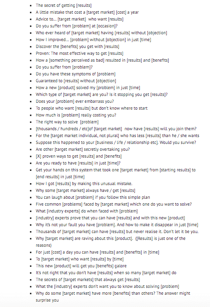

OR get the [50+ popup headlines](https://www.optimonk.com/timeless-copywriting-examples/).

If the headline sample isn't enough for you, try to other ways. Open your browser and go to:

HubSpot blog [topic generator](http://www.hubspot.com/blog-topic-generator):

Portent's [Content Idea Generator](https://www.portent.com/tools/title-maker):

The final touch, measure the headline score you create in [nTopic](http://ntopic.org). Type your Blog post URL and target keyword. 

#### A valuable reference

Find the most shareable content with [Buzzsumo](https://app.buzzsumo.com/research/content). Type the target keyword or topic in the search box. Open the list appear one by one. 

Take the sentence, description, or fact, even the data statistic on the page you needed. Don't copy all the content directly. Get the important things there, not all in.

### Step 03: Make something even better

The points are more quantity and in-depth content. Create content as a king.

Don't write 500 or even 300 words. Instead, write in-depth articles of 2000 words or more. The fact is, [content length](http://web.archive.org/web/20130210144859/http://blog.serpiq.com:80/how-important-is-content-length-why-data-driven-seo-trumps-guru-opinions/) affects rankings.

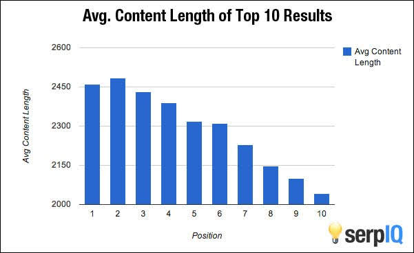

Even more, [Neil Patel](https://neilpatel.com/blog/the-on-page-seo-cheat-sheet/) writes around 5,000 words with in-depth content. If the words more than 2000 or even 5000 words will help us to link building because there are simply more areas to redirect to. 

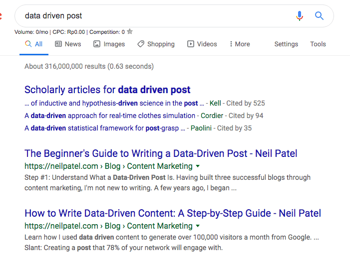

Move to in-depth content. How do you make sure about that? I choose [Grammarly](https://www.grammarly.com/). You can adjust the Goals as needed.

The result will appear looks like:

You can see the result in real-time. Grammarly also provides various checking such as:

- Writing issues. Contains technical writing issues using AI
- Send to proofreader. Invite the third writing expert as human checking
- Plagiarism. Make sure the content is original

The result gets my attention is about the redundant score, unique words, and readability score. These are a way to make sure my content is easy to read, unique, and valuable.

------

## The freshness content

Will [boost your traffic](https://bloggingx.com/google-freshness/) by +57.02% in 2 months.

Google puts the [freshness content](https://www.authorityhacker.com/google-freshness/) very seriously. In April 2012, freshness was one of the algorithm ranking factors that affected [35% of search queries](https://www.briggsby.com/methods-for-evaluating-freshness/).

[Amit Singhal](https://search.googleblog.com/2011/11/giving-you-fresher-more-recent-search.html) said:

Different searches have different freshness needs. This algorithmic improvement is designed to better understand how to differentiate between these kinds of searches and the level of freshness you need, and make sure you get the most up to the minute answers.

But don't do the faking change. It isn't affected in SERPs. 

Google may [ignore small changes](http://appft.uspto.gov/netacgi/nph-Parser?Sect1=PTO2&Sect2=HITOFF&u=%2Fnetahtml%2FPTO%2Fsearch-adv.html&r=1&p=1&f=G&l=50&d=PG01&S1=20110258185.PGNR.&OS=dn/20110258185&RS=DN/20110258185) completely whereas the amount of change influences freshness.

The fact is different. In 2015 Moz changed the publishing date of 16 blog posts on their site. [This experiment increase 66%](https://moz.com/blog/case-study-can-you-fake-blog-post-freshness-) in their organic traffic in only four weeks, without any content changes!

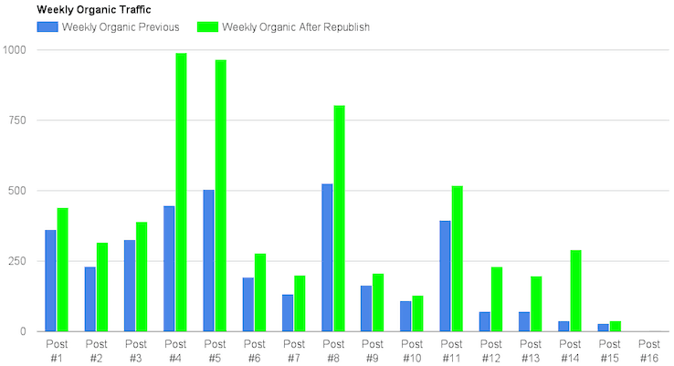

This is because of the old [QDF algorithm](https://www.searchenginejournal.com/google-algorithm-history/freshness-update/). Nowadays, have a change.

The algorithm works to determine a topic become “hot.” 

It means, If news sites or blog posts are actively writing about X, users are more likely to want the information about X. 

The model will affect billions of search queries in Google search. This is how Google monitors global enthusiasm about a topic.

The trigger for you is, your content should have keywords actively discussed so Google may be seen content as new.

Moreover, Google also updates the [rich snippet algorithm](#INTERNAL_LINK#/post/5) to providing the search result is useful and up to date. 

Google explains:

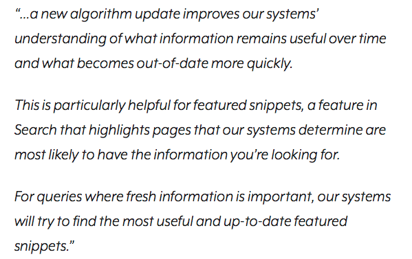

They have many factors to judge content is fresh or not. Here's for nowadays:

- Content change
- Good user engagement
- Fresh backlinks
- Published date / Last modified date
- Presence of keywords that signal freshness

[Akshay Hallur](https://bloggingx.com/google-freshness/) has a content outline to keep your content fresh.

Need more guidance? Try out the [Neil Patel model](https://neilpatel.com/blog/how-to-rank-old-content/):

### Step 01: Look for pages Google loves and never

Open the [Google Console](#INTERNAL_LINK#/post/7). Sign in with your Google account. Point to your domain in the dropdown menu.

Clicking on “date” and then “compare.”

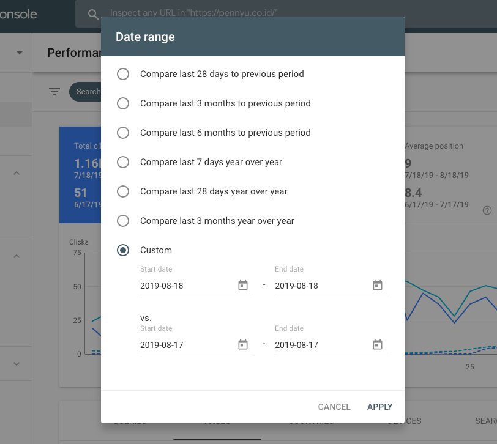

You can access data for a much longer period. You can go back up to 16 months. Select your older date period first (should be roughly from a year ago) and then select today’s date period.

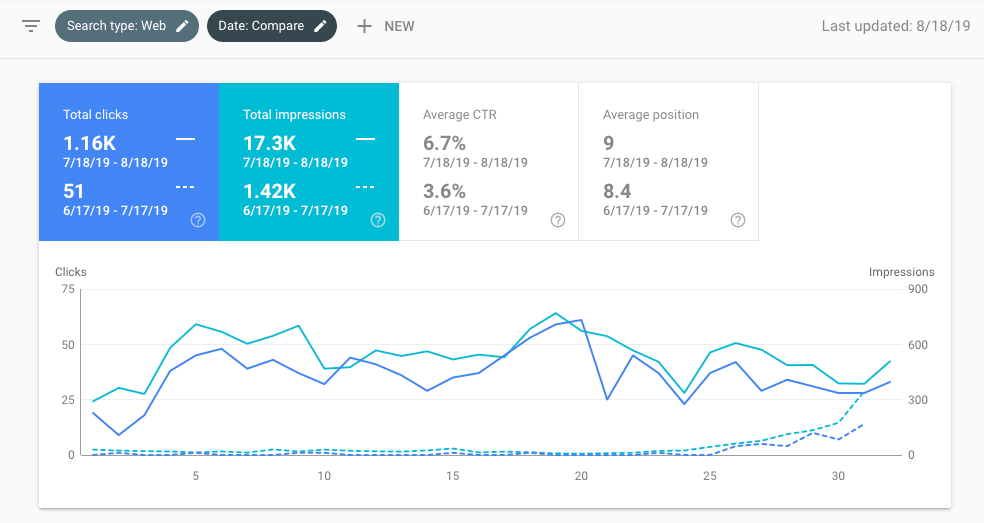

[Google Console](https://search.google.com/search-console/about) makes a better set of data before you focused on updating old content. 

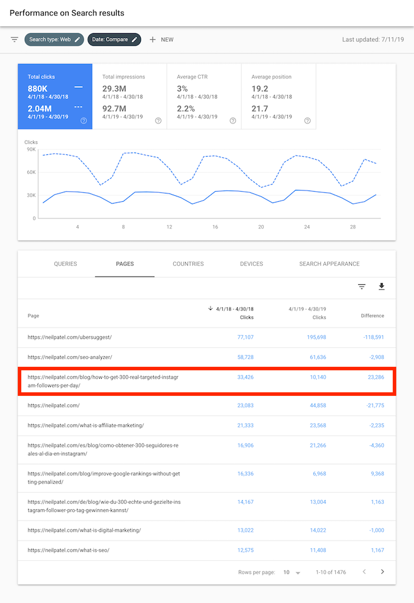

As you can see, the articles in red line get a ton of traffic but have less now. It means you should update the content. 

Back the Google Console and find the content Google never love. Scroll down and look for pages that have a high impression count but never got any real clicks. Sort the CTR column in ascending order (lowest percentage at the top, the highest percentage at the bottom).

The pages at the top are the most potential. It means, Google is ranking you but aren’t getting too many clicks.

### Step 02: Makeover title tag and meta description copy

Boost your page ranking using user behaviour. That's the biggest factors in Google’s algorithm.

It's why optimizing the title tags and meta description are a must. One of them is changing the word in title and meta desc. You can use the word below to increase clicks.

### Step 03: Add the valuable and freshness topic

Make sure your content information is relevant, the pictures are up to date, and any multimedia within is still playable.

About the content value, you need to open the various tools. 

Go to [Google Console](https://search.google.com/search-console/about). Find the keywords aren't in top 5 or have a high impression volume.

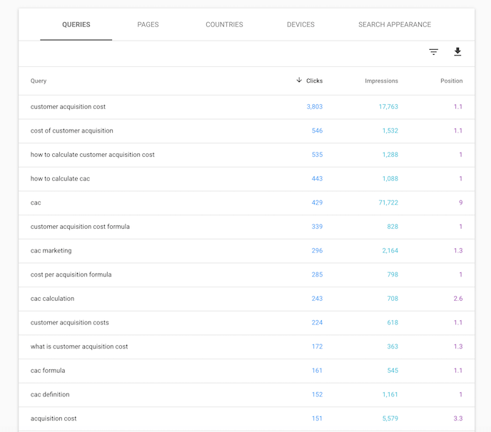

Adjust the query into your existing content. Make sure the query and content are relevant. The query will be additional information.

If the query is already in top 5, open the [Ubersuggest](https://neilpatel.com/ubersuggest/).

Type your head keyword in the search box.

Click the search button

Open the Keyword ideas

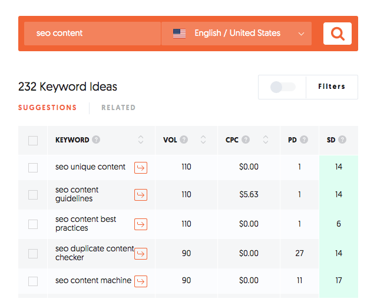

Pay attention to all of the long-tail variations. Next, your duty is adjusting the article and include any of the long-tail phrases Ubersuggest within the content. 

Inject the long-tail into content is easier because you already rank for the head-keyword before.

### Step 04: Update schedule

If your time is available, publish content daily and make sure it's helpful for your target audience. If the time is gone, then publish two times a week with helpful tips content quality for the audience.

This method will ensure your web pages are fresh and attract [fresh crawls](http://riszkynurseno.blogspot.com/2011/05/how-it-works-robot-google-on-internet.html) from Google’s spider.

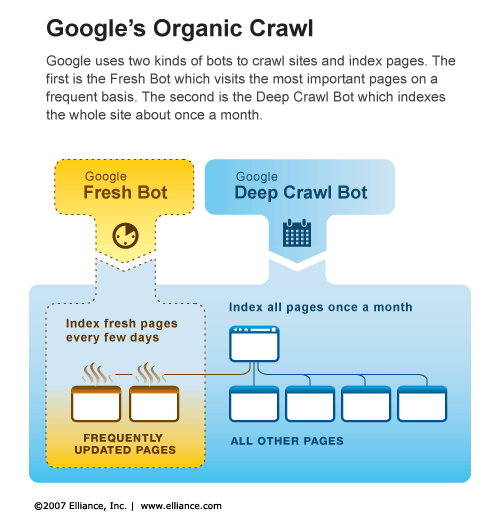

Or you can use this schedule:

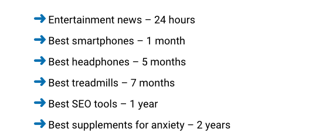

If that is so hard for you to find the shelf life of your content. Follow this way:

- Take note of 5 popular keywords in your niche
- Type keywords in the Google search and look at the result of the top 5 rank
- Look at the timestamps of your competitors content
- If most of the top-ranking pages are updated in a time span of fewer than 5 months, it is your update schedule.

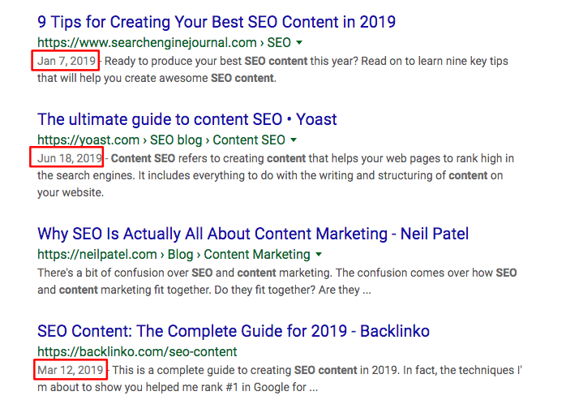

After that, make sure at least 20% of the content is changed.

------

## Useful and valuable content

In short, understanding the context and provide what the audience looking with a precise answer.

That is Google is today.

The goal of Google search is to connect the audience with useful information as quickly as possible. Because of that, Google has a specific way how to [keep search relevant and useful](https://blog.google/products/search/how-we-keep-google-search-relevant-and-useful/).

The latest thing from Google is 3 features.

- Featured snippets. The highlight results that are likely to contain what you’re looking for.
- Knowledge Panels. Help you find key facts about an individual or other topics in the world
- Predictive features like Autocomplete. Help you navigate Search more quickly.

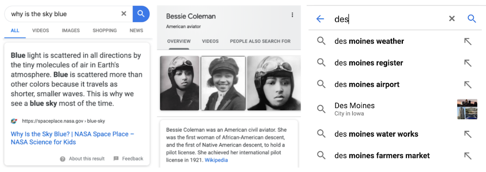

As well as Google, [HubSpot](http://offers.hubspot.com/driving-content-success-in-2014) found the nearly three-fourths of consumers prefer to research companies and businesses through articles, instead of annoying advertisements.

The fact is, the content will drive traffic and grow your business. 

Be a part of content marketing, SEO Content has so potential to build trust with leads and customers. It sounds good to establish a [positive brand reputation](https://www.lyfemarketing.com/blog/why-is-content-marketing-important/).

In other hands, the audience (or your customer) need great content. In fact:

- 20% of the time that internet users spend online is spent just reading the content.
- 68% of people like to spend time reading about the brands they find interesting.
- 80% of internet users like to learn about companies through the custom content they provide.

If you catch this point, make sure you produce the various content style to drives traffic, build trust, and establish a positive brand reputation. 

Create useful or valuable content for the audience. It means:

### Method 01: Interesting to read

What is the content looks like? 

You may consider the content with [visuality attribute](https://www.outbrain.com/blog/visual-content-psychology/). The reason is:

- Content with visuals gets 94% more views, and readers are 80% more likely to read the information in the first place if visuals are involved.
- Humans process images 60,000 times faster than texts, allowing for quick and efficient retention of information.
- Add a picture within the information and you'll remember 65% as long as three days later. If not, you're likely to [remember only 10%](http://www.brainrules.net/vision).
- Articles with images [get 94% more total views](https://www.jeffbullas.com/6-powerful-reasons-why-you-should-include-images-in-your-marketing-infographic/) than text-only posts.

How do I create content like it?

#### Infographic

Do you remember the purpose of this post? Yeah, this post is for link builder. So I will show the reason is.

This is Onblastblog.com. They got 109 backlinks with their infographic content.

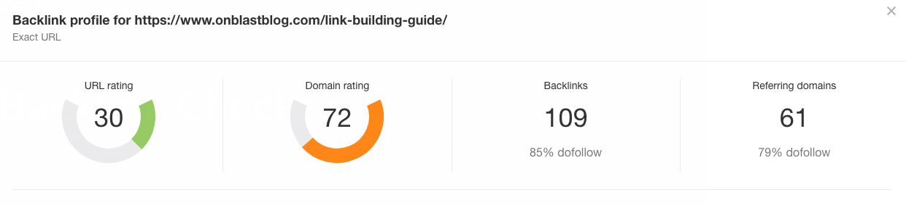

99signals.com follows what the Onblastblog.com do. They produce the infographic content and get the hundreds backlink.

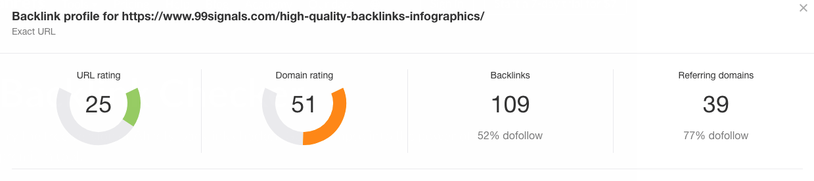

Infographics are better content to [collect the backlink](https://backlinko.com/link-building). Mostly this is a way for getting hundred to thousands backlink.

How to produce [high-quality infographic](https://moz.com/blog/how-to-build-links-with-infographics)?

Do the research. This is a fundamental step. Collect the information as the main content on your infographic.

Develop the design concept. Not all design match for infographic even more for your audience. Because of that, consider to answer this question:

Create a wireframe. Before you design the infographic, create a wireframe first. Wireframe contains lines, boxes, text, buttons, and other [basic components](https://id.pinterest.com/pin/277464027016388276/?autologin=true). 

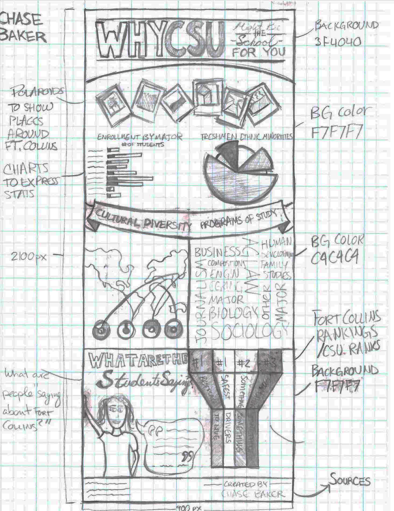

If you don't familiar drawing in the paper, use these apps:

[Justinmind](https://www.justinmind.com/free-wireframing-tool):

[Wireframe](https://wireframe.cc/): 

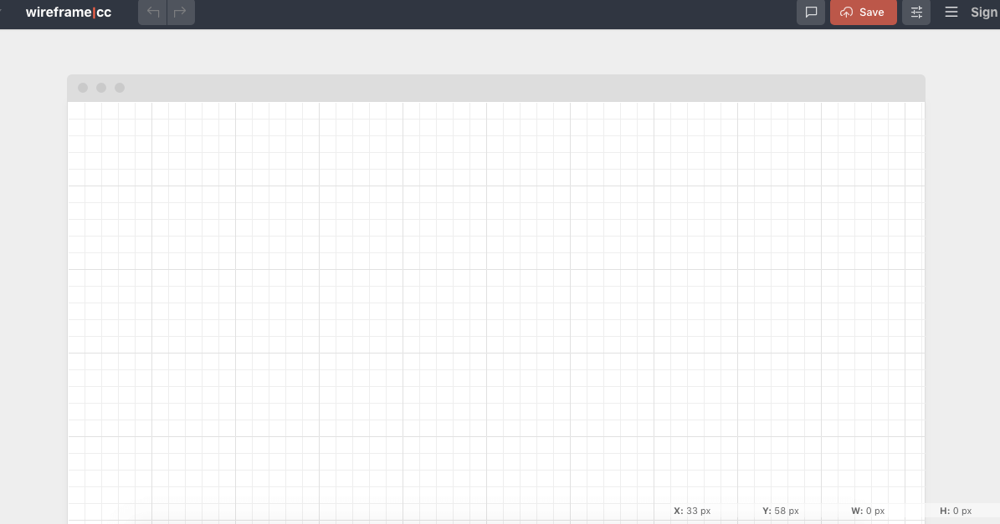

[Mockflow](https://www.mockflow.com/): 

The wireframe is an optional step. If you think is wasting time, skip it. 

Move to Canva.

This is an awesome tool to design everything. Go to [Canva.com](https://www.canva.com). 
Sign In with your favourite account.

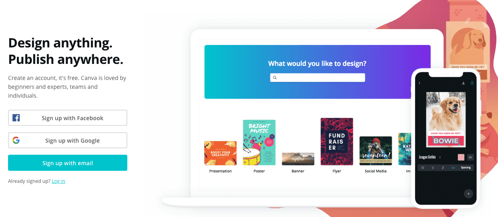

Click the infographic. The screen will appear in the design room. Drag the template from left to the right.

The final touch, download your design in the top right button.

### Method 02: Solves a problem

The basic motivation of people move is to solve the problem. They looking for how to fix the problem on web content.

- 77% of [Internet users](https://www.impactbnd.com/blogging-statistics-55-reasons-blogging-creates-55-more-traffic) read the blog post.
- 79% of [online shoppers](https://blog.hubspot.com/blog/tabid/6307/bid/32985/20-Revealing-Stats-Charts-and-Graphs-Every-Marketer-Should-Know.aspx) spend 50% of their shopping time researching products online.

The [digitaltrends.com](https://www.digitaltrends.com/computing/what-to-do-if-your-macbook-charger-isnt-working/) come as a top rank in problem solves keyword, "*how to fix MacBook charger*".

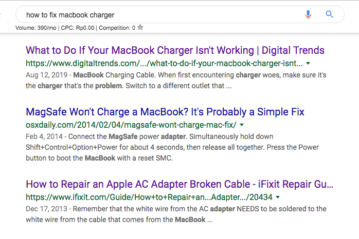

Even more, they are in the top 3 ranks in Google result for the keyword alike.

When I check the digitaltrends.com post, especially on "MacBook charger not working? Here’s what to do" post, I found the content contains:

- 1140 words
- Grammarly score 97

It means this content is [in-depth and well-written](https://blog.hubspot.com/marketing/seo-social-media-study). Hubspot analyzed their content and found:

- Articles with 2,250-2,500 words bring in the most search traffic
- Content with over 2,500 words is shared the most on social networks and also earns the most backlinks

But you shouldn't write the content with 2000 words. The [long blog article](https://neilpatel.com/blog/long-blog-articles/) depends on the industries.

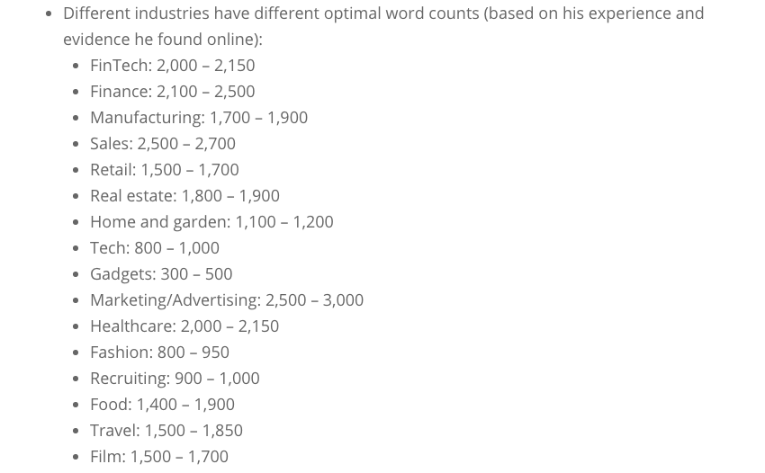

SEO content marketing is hard. It is not a single time. You need to monitoring and improve monthly. This is a begin, not a final touch.