There is [3 million](https://www.worldometers.info/blogs/) blog post per day. These have attractive, uniques, and more creative idea inside. The goal of this all is being the number one in Google result.

Nevertheless, become the number one is hard. 

When you open the browser and search "On-page SEO", you will found the digested countless tips and tricks for improving the blog post.


I know, you’ve heard enough about meta tags, keyword density, and all about them. Therefore, I will share the most simple, informative, actionable tips about On-page SEO. Check this out:

<div class="toc-master">
<div class="toc-articles">
  <h3>Table of Content <span class="toc-span-scroll">scroll see details</span></h3>
	<ol>
		<li><a href="#allows-disallow-and-sitemap-crawling">Allows, disallow, and sitemap crawling</a></li>
    <ul>
      <li><a href="#method-01-yoast-seo">Yoast SEO</a></li>
      <li><a href="#method-02-all-in-one-seo-pack">All in One SEO Pack</a></li>
      <li><a href="#method-03-ftp">FTP</a></li>
    </ul>
    <li><a href="#schema-markup">Schema markup</a></li>
    <ul>
      <li><a href="#method-01-rank-math">Rank Math</a></li>
      <li><a href="#method-02-manual">Manual Headers and Footers</a></li>
    </ul>
    <li><a href="#https---ssl">HTTPS - SSL</a></li>
    <ul>
      <li><a href="#step-01-cloudflare">Cloudflare</a></li>
      <li><a href="#step-02-put-the-nameserver-to-the-registrar">Nameserver to the registrar</a></li>
      <li><a href="#step-03-wordpress-domain-setting">Wordpress domain setting</a></li>
      <li><a href="#step-04-google-analytics">Google Analytics</a></li>
    </ul>
    <li><a href="#www-or-non-www">WWW or non-WWW</a></li>
    <ul>
      <li><a href="#method-01-cloudflare">Cloudflare</a></li>
      <li><a href="#method-02-the-htaccess">.htaccess</a></li>
    </ul>
    <li><a href="#boost-page-speed">Boost page speed</a></li>
    <ul>
      <li><a href="#step-01-tools">Tools</a></li>
      <li><a href="#step-02-fixed-the-problems">Fixed the problems</a></li>
    </ul>
    <li><a href="#mobile-friendly-responsive">Mobile-friendly (responsive)</a></li>
    <li><a href="#serp-audit">SERP Audit</a></li>
	</ol>
  </div>
</div>

------

## **Allows, disallow, and sitemap crawling**

It's a part of [robots.txt](https://moz.com/learn/seo/robotstxt).

The basic format at robots.txt is:

```
User-agent: [user-agent name]
Disallow: [URL string not to be crawled]
```

Robots.txt will send the crawl instructions to user agents (web-crawling software) about can or cannot crawl parts of a website. 

These crawl instructions are specified by “disallowing” or “allowing”. So make sure the robots.txt can crawl your page using the robots.txt format:

```
User-agent: * 
Allow: /
```

This crawl instruction will notify the web-crawling to catch whatever in your website. But, this format is so general. You need something specific too.

Go to the next step.

Allowing the web crawling to crawl all of your website folders it's harmful. The reason is, they can access your data privacy in the website such as user data, transaction data, etc.

So you need a more specific robots.txt format to disallowing the web crawling access your personal or sensitive data. 

Here's the example:

```
Disallow: /wp-content/plugins/
Disallow: /wp-admin/
```

This format is compatible with [WordPress robots.txt](https://www.wpbeginner.com/wp-tutorials/how-to-optimize-your-wordpress-robots-txt-for-seo/) only.

If you have installed the "Allow and disallow" robots.txt, it's time to set the sitemap in robots.txt. 

See the sample below:

```
User-Agent: *
Allow: /wp-content/uploads/
Disallow: /wp-content/plugins/
Disallow: /wp-admin/
Sitemap: https://example.com/sitemap_index.xml
```

The robots.txt format above is compatible with [WordPress robots.txt](https://www.wpbeginner.com/wp-tutorials/how-to-optimize-your-wordpress-robots-txt-for-seo/) only.

If you still confuse about the robots.txt format, you can try to imitate from other website similar ones.

Here's the way:

```
example.com/robots.txt
```

Replace the example.com with the website target. Make sure the folder is compatible with yours.

If you have done, insert the robots.txt to your website. Follow this way!

### Method 01: Yoast SEO

Point the cursor at Plugins
Click Add New
Type Yoast SEO in the field
Click Install Now and Activate


Go to SEO, click Tools

Click File editor and click Create robots.txt file


Insert your robots.txt script. 
Save it. It's done.


### Method 02. All in One SEO Pack

Point the cursor at Plugins
Click Add New
Type All in One SEO Pack in the field
Click Install Now and Activate


Click All in One SEO then Feature Manager
Find Robots.txt. Click Activate

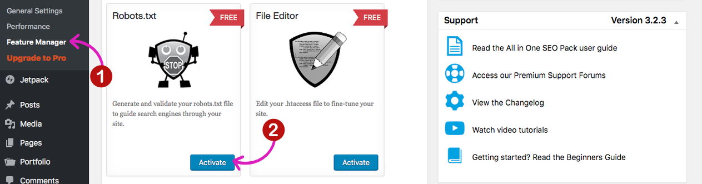

Go to Robots.txt in the menu

Set the robots.txt script


Click save robots.txt file.
Finish!

### Method 03. FTP

Go to your root domain via FileZilla
Find the robots.txt in the public_html


Click View / Edit
Put your robots.txt script here
Save

If you don’t see robots.txt file, then you likely don’t have a robots.txt file. Create one and go ahead. 
Click on the right mouse and click Create new file.
Enter the robots.txt name's
You can see the robots.txt
Click View / Edit
Put your robots.txt script here
Save.

Next, it's time to test your robots.txt. 
Go to [Robots Testing Tools](https://www.google.com/webmasters/tools/robots-testing-tool)

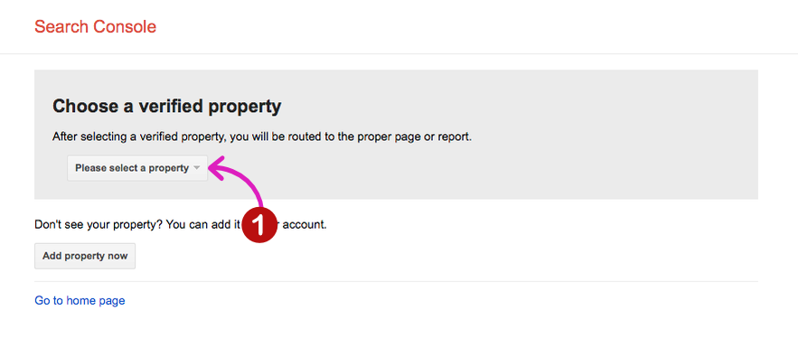

Choose a verified property on the dropdown menu


The robots.txt testing will appears

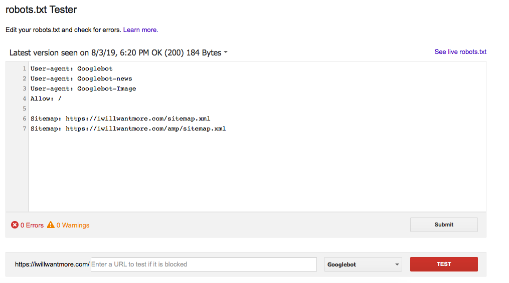

There are 2 options:

- Put the code. Put your script in the field and submit
- URL test. Type robots.txt URL. Choose the web crawl robot in the dropdown menu. Click Test

Generally, there are 3 script types in the robots txt such as allowing, disallowing, and sitemap script. This is the robots.txt basic script:

```
Sitemap: https://example.com/sitemap.xml
User-agent: *
Allow: /
User-agent: Mediapartners-Google
Allow: /
User-agent: Googlebot-Mobile
Allow: /
Disallow: /cgi-bin
Disallow: /wp-admin
Disallow: /wp-includes
Disallow: /wp-content
```

------

## **Schema markup**

It's how stealing CTR from the top web page in the Google result.

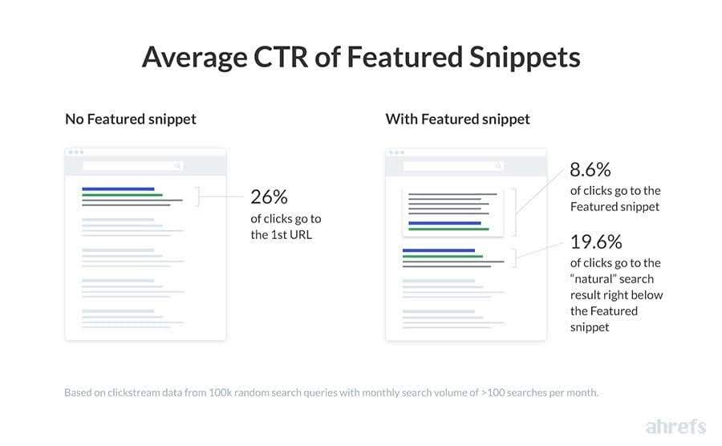

Schema markup is the latest Google algorithm. That makes Google crawling and indexing the website easier. The Schema markup looks like this:

```
{
 "@context": "https://schema.org",
 "@type": "NewsArticle",
 "mainEntityOfPage": {
 "@type": "WebPage",
 "@id": "https://google.com/article"
 },
 "headline": "Article headline",
 "image": [
 "https://example.com/photos/1x1/photo.jpg",
 "https://example.com/photos/4x3/photo.jpg",
 "https://example.com/photos/16x9/photo.jpg"
 ],
 "datePublished": "2015-02-05T08:00:00+08:00",
 "dateModified": "2015-02-05T09:20:00+08:00",
 "author": {
 "@type": "Person",
 "name": "John Doe"
 },
 "publisher": {
 "@type": "Organization",
 "name": "Google",
 "logo": {
 "@type": "ImageObject",
 "url": "https://google.com/logo.jpg"
 }
 },
 "description": "A most wonderful article"
}
```

In the Google result, the script will be like this:


The script above will appear as a rich snippet and increase your web page CTR in the Google result. 

Use the schema markup in the site with 2 methods.

### Method 01: Rank Math

Go to Plugins
Click Add new
Type Rank Math in the search box
Install and Activate

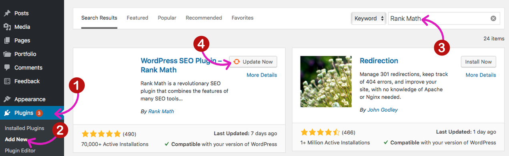

Next step, add The scheme markup in the page or post.
Go to page or post
Click Add new
Scroll down and find the Rich Snipped
Click it and add a rich snippet type you want to be


### Method 02: Manual

Use the Insert Headers and Footers plugin. Follow this step:

Go to Plugins
Click Add new
Type the Insert Headers and Footers in the search box
Install and Activate

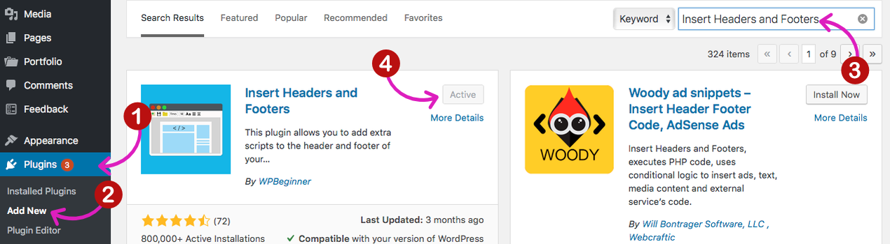

Put the [Schema markup](#INTERNAL_LINK#/post/5) on the plugin. Here we go:
Go to Settings
Click Insert Headers and Footers
Put the [schema markup type](https://developers.google.com/search/docs/guides/search-gallery) in the box
Click Save

Nowadays, there are over 28 schema markup type. You can use more than one markup and choose which matching with your content.

------

## **HTTPS - SSL**

An [SSL certificate](https://www.namecheap.com/support/knowledgebase/article.aspx/9800/38/advantages-of-having-an-ssl-certificate) will protect sensitive information such as logins, passwords, account details and cardholders information.

Google makes SSL as a top priority. At 06/08/2014, [Google](https://webmasters.googleblog.com/2014/08/https-as-ranking-signal.html) was announced that:

 ...Installing an SSL certificate on your website will increase the ranking position.

The website with SSL certificate looks like this:

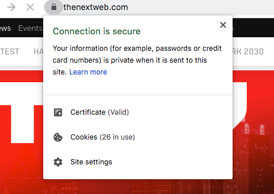

On other hands, a website without SSL certificate looks like this:


If you haven't installed an [SSL certificate](https://blog.whmcs.com/133552/how-ssl-certificates-can-affect-seo-and-google-rankings) on your site, website visitors will see a warning in the address bar saying 'Not Secure!' overlaid with a red X for all pages that don't have HTTPS set up correctly. 

Let's install the SSL using Cloudflare.

### Step 01. Cloudflare

Go to Cloudflare.com
Signup using your email and set the password too.
Click Add a Site


Type your URL and click Add site

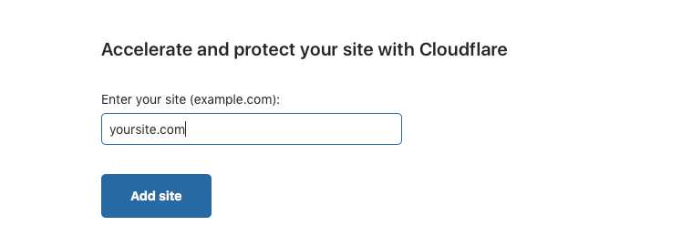

Select a plan and click Confirm plan


Your DNS records will come up

Scroll down and click Confirm (or Continue)


Copy the nameserver: `albert.ns.cloudflare.com` and `grace.ns.cloudflare.com`

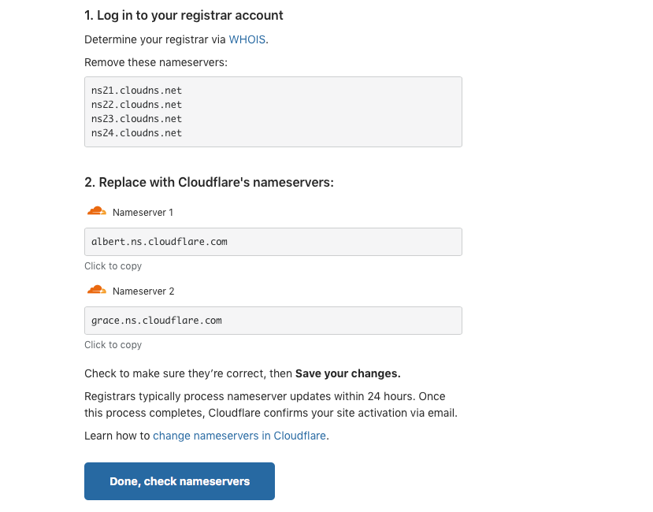

### Step 02. Put the nameserver to the registrar

Move to your domain registrar dashboard. Log in and open the nameserver. 
Change the nameserver and put with:

```
albert.ns.cloudflare.com
grace.ns.cloudflare.com
```

Save the setting.


Back to Cloudflare dashboard.
Click Done, check nameserver.


If the screen close, come back to your Cloudflare dashboard and click Re-check now

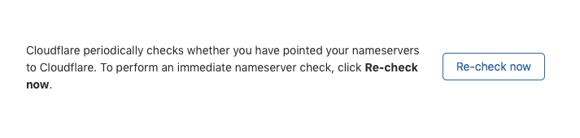

Cloudflare will send an email confirmation if your site is connected. If the site was connected, go to Crypto menu on Cloudflare

In the SSL dropdown menu, click Full


Scroll down and find the "Always Use HTTPS". Swift On.

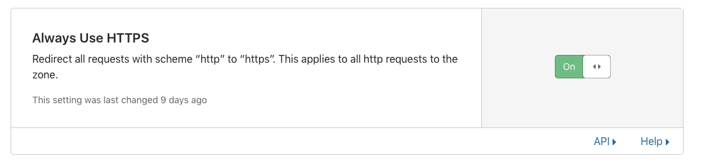

Scroll down to Automatic HTTPS Rewrites. Swift On too. This set up will rewrite all of your HTTP url become HTTPS. Please edit your custom url using HTTPS before.

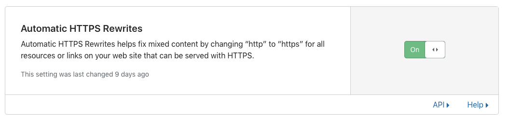

You will get the Cloudflare Universal SSL. And **that's FREE SSL.**

### Step 03. Wordpress domain setting

Go to your Wordpress Admin
Login
Click Settings on the left menu
Click General
Edit the "HTTP" to "HTTPS" in the WordPress Address (URL) and Site Address (URL) box.

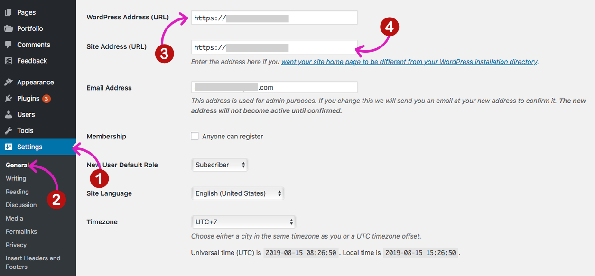

And then, click Save changes

### Step 04. Google Analytics

When your site has an SSL, the [Google Analytics](https://mythemeshop.com/blog/lets-encrypt-free-ssl/) won't monitor your traffic source. It's because your site default URL is HTTP, not SSL. So you have to change the default URL to HTTPS.

Go to your Google Analytics dashboard
Click Admin
Click Property Settings

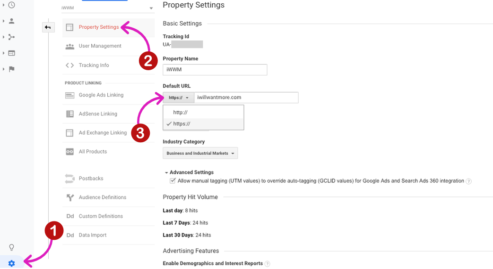

Change the default URL to HTTPS

------

## **WWW or non-WWW**

Choose one version of your domain as the "true canonical" and then 301 redirect the others at the server level.

That's will help Google to crawl and identify your page. 

According to [CognitiveSEO](https://cognitiveseo.com/blog/20422/www-vs-non-www-seo):

... remove WWW makes easy to implementation CDN, flexible DNS options, and limiting cookies to one place.

It means, your site will speed up moreover! [Moz](https://cognitiveseo.com/blog/20422/www-vs-non-www-seo) has the evidence about. They test a separate page load test version (WWW and non-WWW) and show the result:

A page with WWW


A page non-WWW

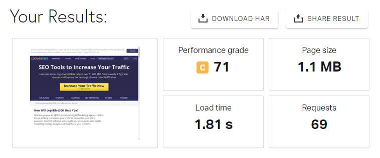

The different load speed happens because your internal storage (PC or Laptop) only save the one CDN host. When you load the separate domain, it will be saving as a new site.

Is it clear? 

In the next step, set your site with one of WWW or non-WWW version. Here is to do:

### Method 01: Cloudflare

I love Cloudflare. So I suggest it as the first.

Open your Cloudflare account
Click your domain you wanna setup


Click Page rules
Click Create Page Rules


Type the domain version you want to change
Click Add a settings

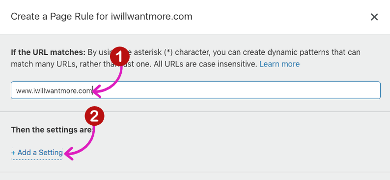

Choose the Forwarding URL in the dropdown menu
Select 301 - Permanent redirect in the Select status code dropdown menu
Type the domain destination in the available box

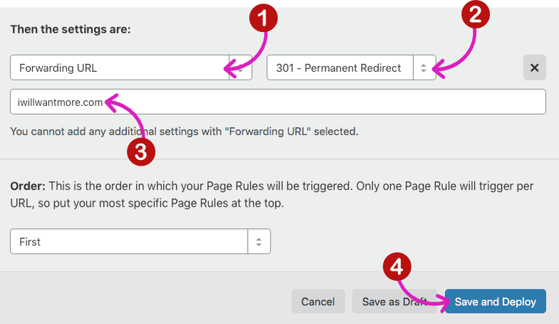

Click Save and Deploy

### Method 02: The .htaccess

Open your FTP software (FileZilla)
Go to Public_html folder
Find and Open the .htaccess file
Put this script:

```
RewriteEngine On
RewriteCond %{HTTP_HOST} ^www.yourdomain.com [NC]
RewriteRule ^(.*)$ http://yourdomain.com/$1 [L,R=301]
```

Save and Done.

------

## **Boost page speed**

A single second delay in the page response time can [reduce yield 7% in conversions](https://neilpatel.com/blog/the-on-page-seo-cheat-sheet/).

In the Google result, page speed affects rankings. 

The reason is, loading time is one of page abandonment factor. The slower loading time will increase the abandonment.

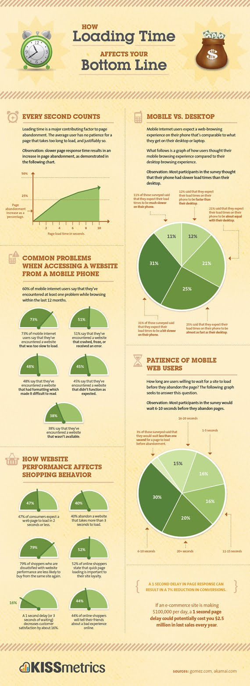

Because of that, pay attention to the page speed like this:

### Step 01. Tools

Use various tools to [audit page speed](#INTERNAL_LINK#/post/4) such as:

- [Pingdom’s](http://tools.pingdom.com/fpt/) speed test tool 
- [WhichLoadsFaster.info](http://whichloadsfaster.zomdir.com/) 
- [PageSpeed Insight](https://developers.google.com/speed/pagespeed/insights/?hl=USA)
- Chrome Developer Tool

### Step 02: Fixed the problems

There are some problems you will find in page speed audit. Maybe like this:

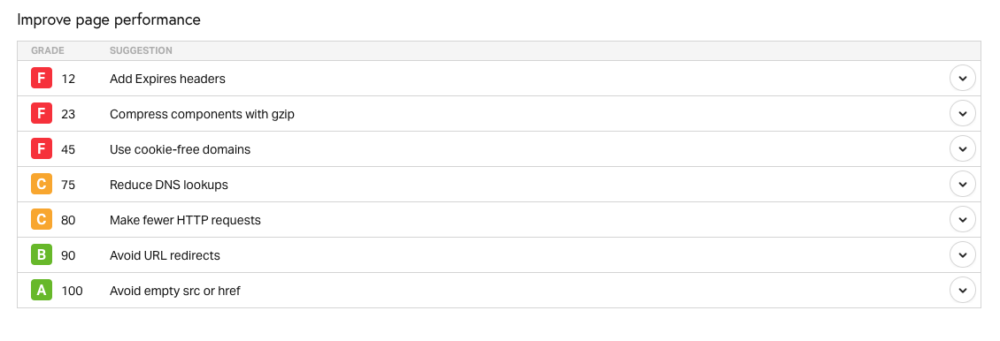

The page audit tools show the difference a page result but this problem is always shown:

- [Add Expires headers](https://catswhocode.com/add-expires-headers/)
- Compress components with [gzip](https://kinsta.com/knowledgebase/enable-gzip-compression/)
- Use [cookie-free domains](https://www.keycdn.com/support/how-to-use-cookie-free-domains)
- Reduce [DNS lookups](https://www.keycdn.com/support/reduce-dns-lookups)
- Make fewer [HTTP requests](https://premium.wpmudev.org/blog/reduce-https-requests/)

The how-to boost page speed is complex and needs longly words to describe. So I gave you an active link in the list above. In the next moment, I will create more comprehensive a how-to article about that.

------

## **Mobile-friendly (responsive)**

There are [5 billion people have mobile devices](https://www.pewresearch.org/global/2019/02/05/smartphone-ownership-is-growing-rapidly-around-the-world-but-not-always-equally), and over half of these connections are smartphones.

The fact is, smartphone ownership is growing fast. Statista shows that the total number of [smartphone ownership worldwide](https://www.statista.com/statistics/274774/forecast-of-mobile-phone-users-worldwide/) in 2020 goes to 4.78 billion.

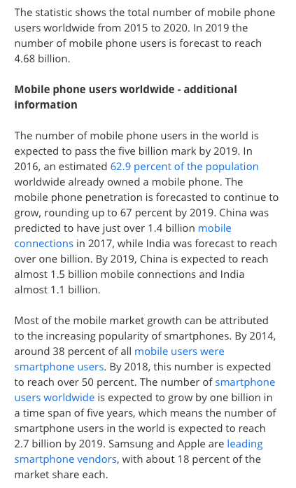

And this is the most important for you:

- Over 4.33 billion people were active internet users as of July 2019
- At least 52.7 percent of the global smartphone ownership access the internet from their mobile phone.
- Over 49.73 percent of [web page views worldwide](https://www.statista.com/statistics/306528/share-of-mobile-internet-traffic-in-global-regions/) from mobile devices excluding tablets

That's why mobile-friendly (responsive) is a must.

------

## **SERP Audit**

It's crucial for SEO.

For content marketing, SERP is the first step before you produce awesome content. In here SERP works to evaluate whats your target keyword is relevant and the possibility to outrank your competitors.

If the content has published, SERP is a means to optimize the page and spy your competitor. At this moment, SERP became an entry point. That's because stealing the top-ranking need multiple analysis such as content quality, backlink, the related keyword (LSI keyword), etc. 

In the Google result, [SERP](https://blog.hubspot.com/marketing/serp) shows over 28 features. It's an example:

Rich Snippets:

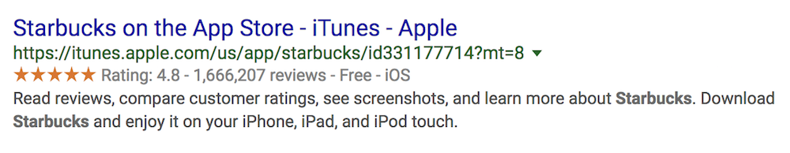

Paid Results:


Universal Results:


Local SERP:

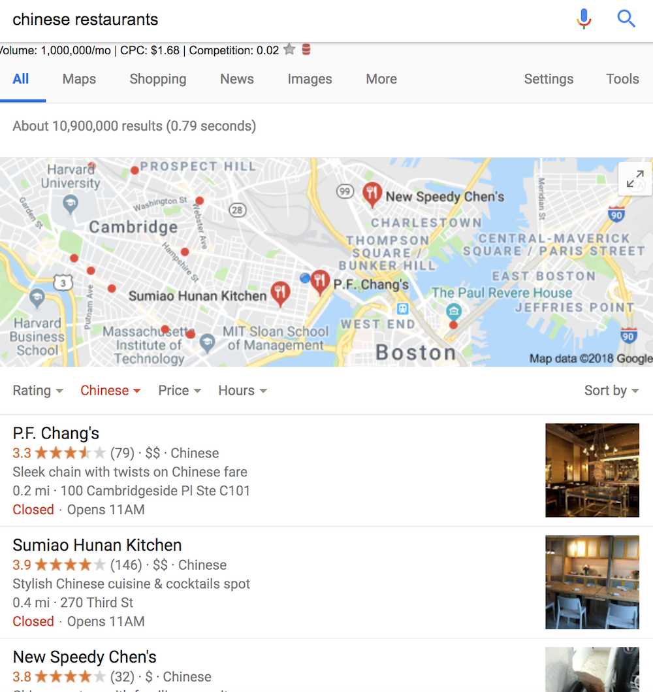

Vertical Search:


Knowledge Graph data:

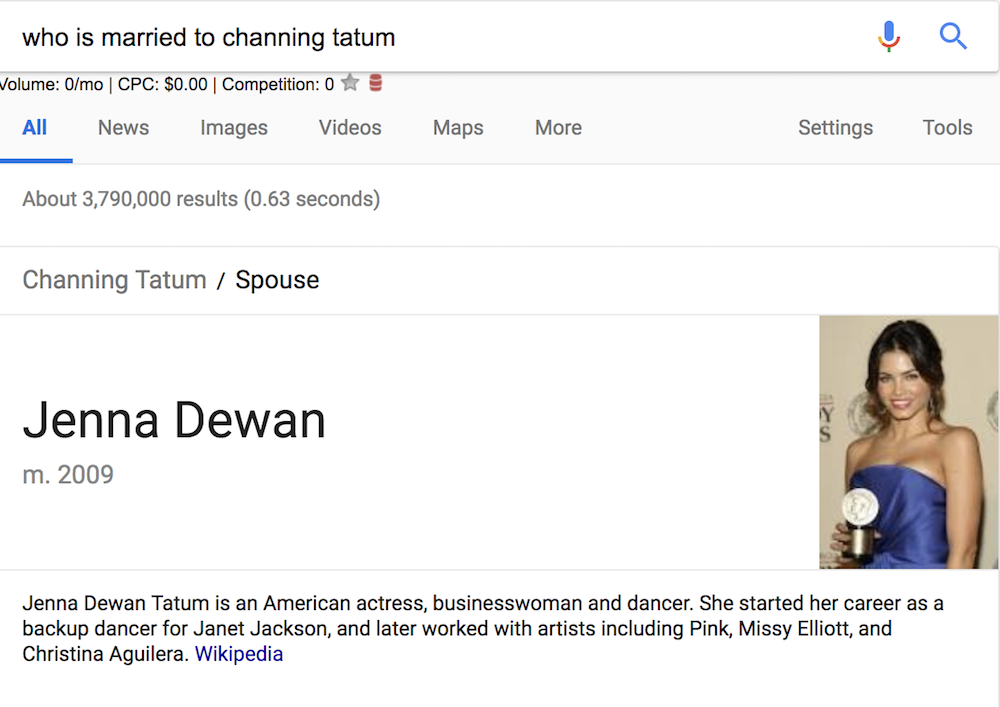

SERP is a part of Schema markup. As you know, schema markup is Google ways to understand the page and appear it results as SERP features.

The headline about SERP is:

- Stealing the CTR from the Google result top-rank
- Appear as eye-catching content in Google result and make your site more visible than the top-rank
- Increasing new site rank in Search result even though has a low-quality backlink

Because of that, you have to do the [SERP audit](https://www.mobidea.com/academy/serp-analysis/) now.

------

## **Final touch**

This article contains at least 6 on-page SEO subtopic. There are over 70 subtopics. 

I will share it in the next moment.