What is the eCommerce SEO? Is your ways to increase online store visibility at the SERPs. I already split the tutorial of eCommerce SEO without blackhat SEO into 5 steps.

Lets get started!

Goes to Jakarta, I got the [Gibby](https://www.gibby.id) invitation to visit its HeadQuarter. I meet with Gibby teams and discuss SEO, especially how to increase Gibby organic search.

I have arrived in Jakarta at 09:20 ICT. And then drives with [Go-Jek](https://www.gojek.com/) to [Gibby](https://loophaus.id). 

By our discussion, I discover what the startup needs to grow up its organic search. 

[Organic search](https://www.wordstream.com/organic-search) or natural search refers to unpaid search results. This strategy works with search query, links and domain authority and other organic ranking factors. That is all have to relevance by the user.

IMG: flow 

As the SEO nerd, put the website audit, SEO plan and content marketing strategy in my blog are a great deal. The article will be more awesome if there is an SEO case study within. 

Ah, I'm a lucky person. The SEO issue dropped to inbox yesterday afternoon.

Here is the preview:

Case 1:
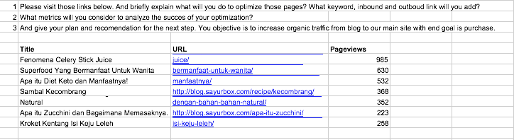

Case 2:


Case 3:


The point of this case is:

* SEO Analysis
* SEO Strategy
* SEO Content Writing

I have a personal opinion to fix the issue and boost marketing. I am so grateful this moment comes. Check this out the see the details.

<div class="toc-master">
  <div class="toc-articles">
    <h3>Table of Content <span class="toc-span-scroll">scroll see details</span></h3>
    <ol>
      <li><a href="#website-performance-audit">Website Performance Audit</a></li>
      <ul>
        <li><a href="#secure-connection">Secure Connection</a></li>
        <li><a href="#meta-description">Meta Description</a></li>
        <li><a href="#text-html-ratio">Text-HTML Ratio</a></li>
        <li><a href="#javascript-and-css-minified">JavaScript and CSS Minified</a></li>
      </ul>
      <li><a href="#step-up-visibility-in-serps">Step Up Visibility in SERPs</a></li>
      <ul>
        <li><a href="#featured-snippet">Featured Snippet</a></li>
        <li><a href="#featured-snippets-types">Featured Snippets Types</a></li>
        <li><a href="#featured-snippets-optimization">Featured Snippets Optimization</a></li>
      </ul>
      <li><a href="#seo-content-writing-guidelines">SEO Content Writing Guidelines</a></li>
      <ul>
        <li><a href="#what-is-google-beneficial-purpose">What is Google Beneficial Purpose?</a></li>
        <li><a href="http://localhost:8000/ecommerce-seo/#what-is-google-definition-of-ymyl">What is Google Definition of YMYL?</a></li>
        <li><a href="#what-is-page-quality-rating-by-e-a-t">What is Page Quality Rating by E-A-T?</a></li>
      </ul>
      <li><a href="#google-content-algorithm">Google Content Algorithm</a></li>
      <ul>
        <li><a href="#what-is-rankbrain-algorithm">What is RankBrain Algorithm?</a></li>
        <li><a href="#optimize-content-for-rankbrain">Optimize Content for RankBrain</a></li>
      </ul>
      <li><a href="#inbound-link-optimise">Inbound Link Optimise</a></li>
      <ul>
        <li><a href="#guest-blogging">Guest blogging</a></li>
        <li><a href="#share-request">Share request</a></li>
        <li><a href="#link-request">Link request</a></li>
        <li><a href="#partnerships">Partnerships</a></li>
      </ul>
      <li><a href="#final-touch">Final Touch</a></li>
    </ol>
  </div>
</div>

---

## Website Performance Audit
The simple point of SEO there is 3 point:

* Technical SEO
* On-Page SEO
* Off-Page SEO

Been successful in [technical SEO](https://gtag.dev/basic-on-page-seo/) will help the page more visible in SERPs. That way makes Google easy to understand the content topic and its quality.

The impact is about [crawling and indexing](https://gtag.dev/indexing-algorithms/). 

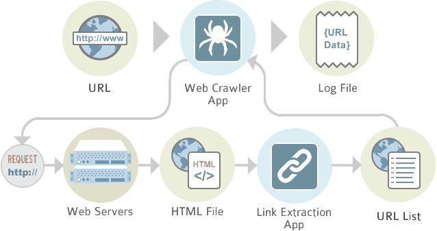

The domain which needs to optimise is:
* Main domain: `sayurbox.com` 
* Subdomain: `blog.sayurbox.com`.

I will focus on audit the main domain and simple tips for another. 

What is the problem? How to fix this issue?

### Secure Connection

If you dive in the `blog.sayurbox.com`, the first thing you can meet is domain. Unfortunately, the domain connection does not secure.


This issue appears within all of `blog.sayurbox.com`. As a comparison, the secure connection protocol looks like this:


Why the secure protocol is urgent?

Google said security is a top priority. They invest so many things to make [industry-leading security](https://webmasters.googleblog.com/2014/08/https-as-ranking-signal.html) in their service. 

And the next, Google will make the Internet safer more broadly. The basic secure protocol tips by Google is:


The simple implementation of the secure protocol is using Cloudflare. Connect your domain with [Cloudflare SSL](https://gtag.dev/basic-on-page-seo/#https---ssl) and order or upload SSL.

Order or upload SSL:
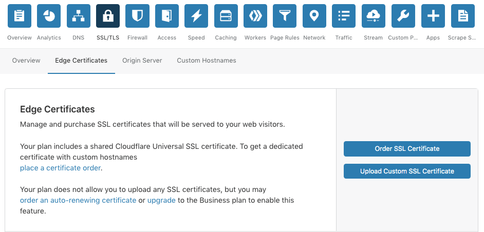

Encryption mode:


Redirect HTTP to HTTPS:
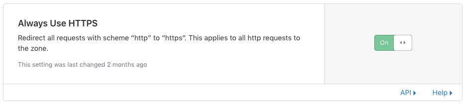

Scroll down and discover automatic HTTPS rewrites option. Turn on.

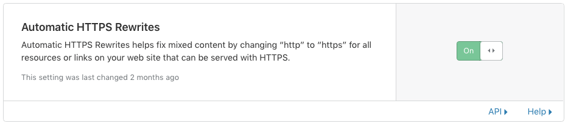

### Meta Description
Discover 37 pages don't have meta descriptions.


The meta description tag is the summarize a web page’s content. That looks like this:


The basic role of this meta tag that Google often display up to 160 characters long in search results. 

You have to know, the [meta description](https://searchengineland.com/write-meta-description-gets-clickthroughs-207922) is the most important for improving click-through rate in SERPs.

> More people click your page in SERP, the better our site will rank in Google.

Except for Meta Description, there are three main features in a SERP.


This all three feature are a factor for a user’s decision to click through. Thus, write better meta descriptions to be like this:

* Research targeted keywords and place it in your meta descriptions.
* Relevant to the content on each page
* Never use the same meta description across your whole site.
* Show benefits and urgency.
* Define the users benefit for click and show the page (valuable and emotion).

### Text-HTML Ratio
A good text to HTML ratio is from 25 to 70 percent. Unfortunotely, `blog.sayurbox.com` has error about.

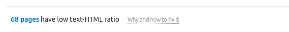

What is a Text to HTML Ratio?

The compare between the amount of text and HTML code on your page. It does not a direct ranking factor for search engines but indirectly results in higher search rankings.

You can improve code to text ratio using these tips:

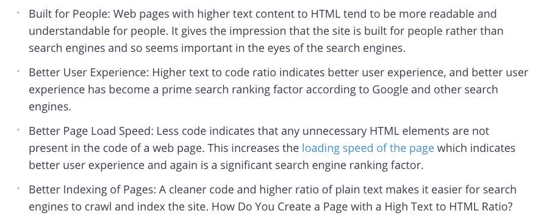

Before you fix this issue, check the code to text ratio using [free tools](https://www.duplichecker.com/code-to-text-ratio-checker.php). Type your domain address and you get the result.


### JavaScript and CSS Minified  
Minified the JS and CSS is a part of speed up the page. You can see it on [Google PageSpeed Insights Free Tool](https://developers.google.com/speed/pagespeed/insights). 

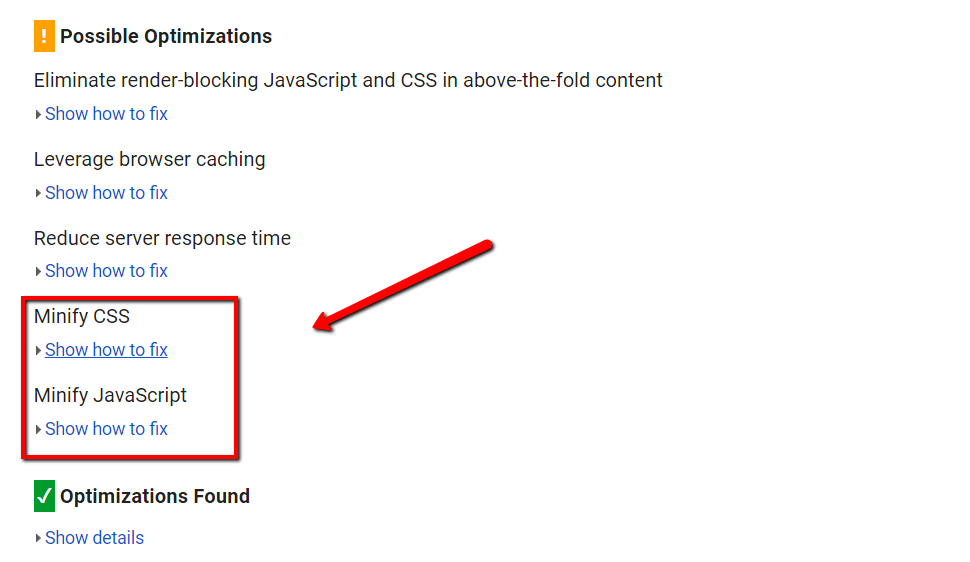

This result indicates the CSS and JavaScript code is slowing your web speed. I found this issue on `blog.sayurbox.com`.


When I recheck the page, the issue comes from the mobile version. 


How to fix this problem? Make these jobs done using [CSS Minifier](https://cssminifier.com/) and [JSCompress](https://jscompress.com/).

Copy and put your CSS and JS within each tool. Ensure the code issue in speed test result only. 


Code minification works to deleting characters that don't serve any function other than improving readability.

---

## Step Up Visibility in SERPs
SEO is the technique to make your site more visible in the organic search. Make the SEO works is hard and need a long-term project. 

Based on 5 million [Google search result study case](https://backlinko.com/google-ctr-stats) found that the #1 result in SERPs has an average CTR of 31.7%.


This study supported by other research from [Advanced Web Ranking](https://www.advancedwebranking.com/ctrstudy/). It founds that CTR on the 2nd page is extremely low.

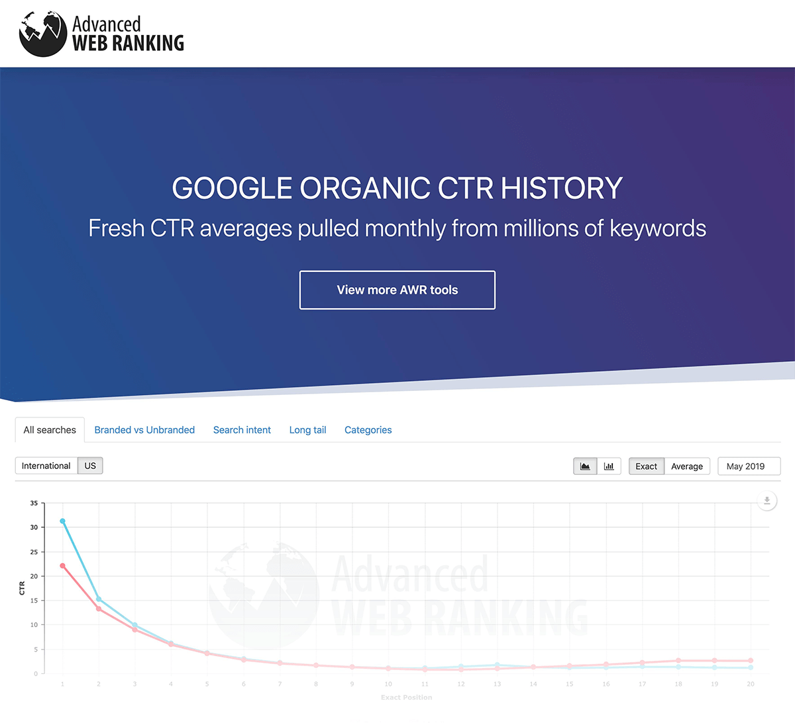

To make clear about the CTR, here is the full CTR breakdown based on Google’s first-page organic results:


Nowadays, Google has a new update with the #1 result in SERPs. Everyone can steal the CTR from the #1 rank using various new Google Feature.


That's the result of `pizza vegetarian`. Do you see the #1 rank? The page or something else? Yes, that all are the Google Feature. Scroll down and you can discover the # 1-page rank.


Being the number #1 in Google today needs more creative. Create useful content does not enough. You have to understand the New Google Feature.

### Featured Snippet
I got the `sayurbox.com` organic keywords trend by all time.

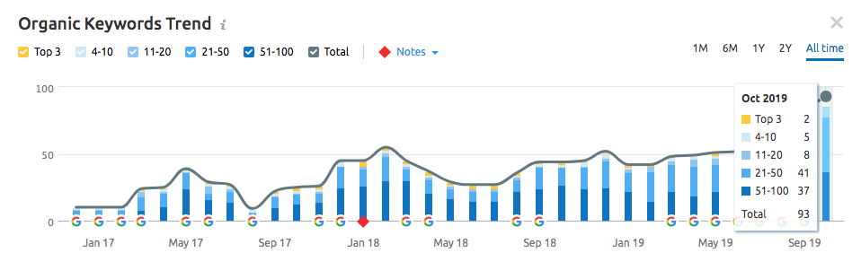

As you can see, `sayurbox.com` has 93 keywords on Google result. Unfortunately, 7 keywords only on the top 10 ranks.   

Based on this data, `sayurbox.com` can be a the top 0 rank on Google result. They need optimise the Google Featured Snippet. What is this?

Short selections of text at the top of Google’s search results (zero position) to answer a searcher’s query. 


What is the importance of Snippets for SEO?

This feature will get more clicks from the organic search results. The fact is, content with a featured snippet gets a 2X higher [click-through rate](https://neilpatel.com/blog/rank-google-featured-snippets/).

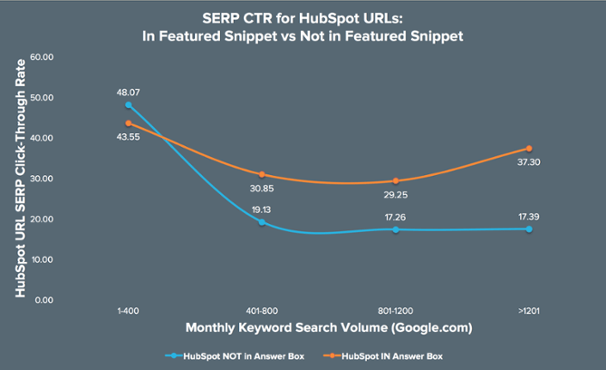

According to Search Engine Land, the content kind of gets approximately [8% of all clicks](https://backlinko.com/hub/seo/featured-snippets) as well.


It means, your organic click-through-rate will boost seriously with a featured snippet.

### Featured Snippets Types
The types of [featured snippets](https://backlinko.com/hub/seo/featured-snippets) consist of definitions, tables, steps and lists.

#### The Definition Box
This snippet contains a definition or description text box. The boxes are designed to answer “what is” queries.

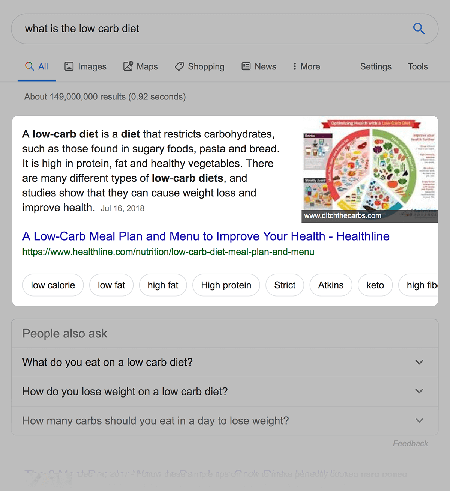

The average definition of this snippet is between 40-60 words.


#### The Table

The featured pulls data from a page and displays as a table.

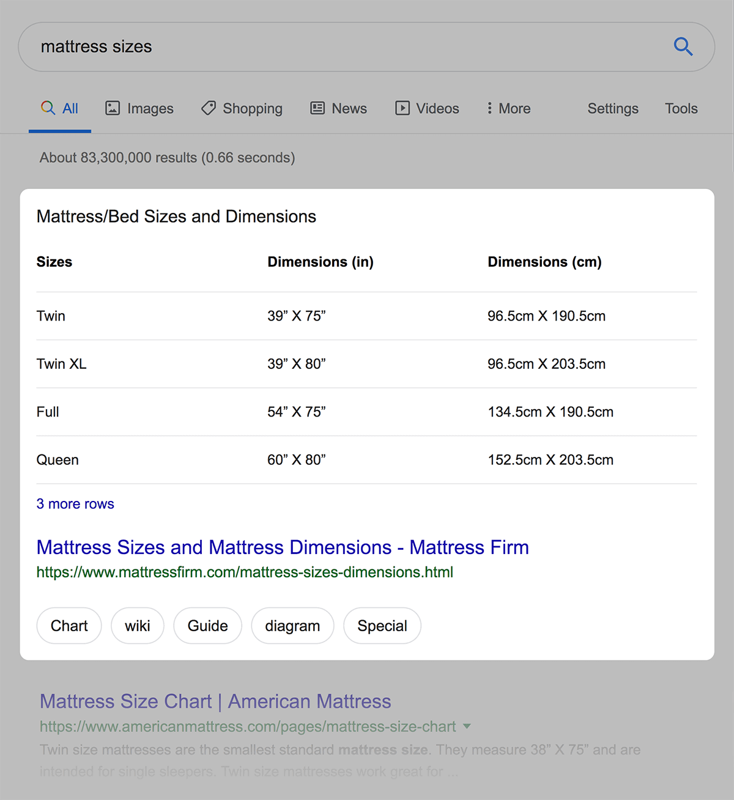

#### The Ordered List

Ordered Lists are used to present the queries that need a set of steps.

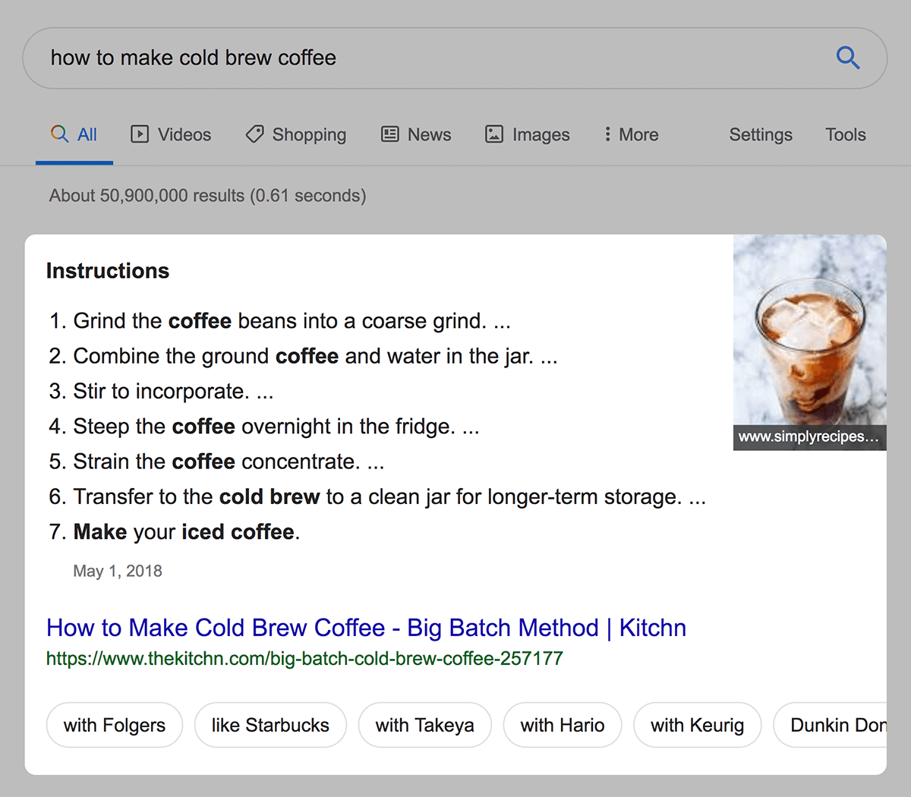

Google sometimes displays it in a specific order contains a preview image and horizontal list display.

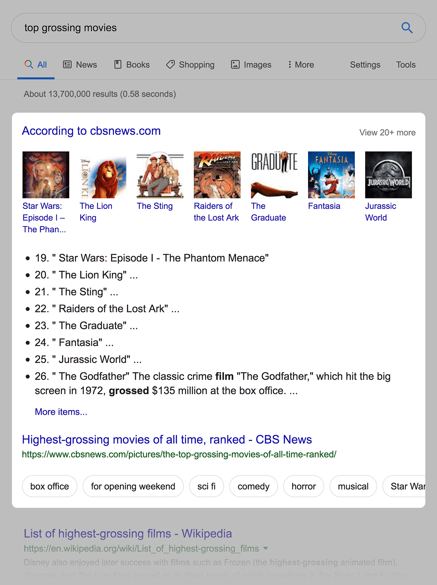

#### The Unordered List
In another condition, Google presents a list of items without a particular order. This feature displays a simple list, without any information.

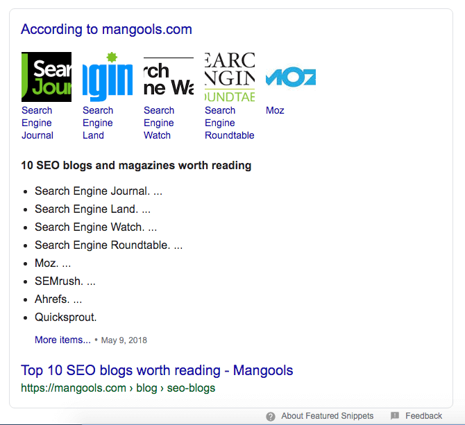

Based on the snippet types, how to optimise it?

### Featured Snippets Optimization
These tips hope your page will be chosen by Google as Featured Snippet. Here is how to being like that.

#### The Definition

Write down a short (40-60 word) to define an object. Create the definition on "What is X" directly.


The result of this look:


> Ensure the definition does not opinion. Google doesn’t want it. Write the definition without any emotion like a dictionary entry.

By `sayurbox.com`, create the content based on the related keyword of a healthy lifestyle. 

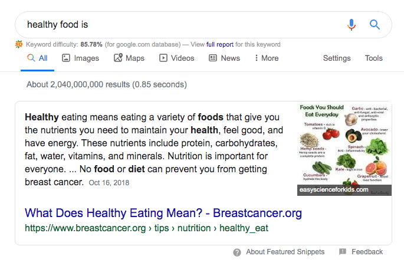

#### The Table

This content took from table content within a page. TO make it clear, Google is essentially scraping tables that already exist.


This snippet took by the same table.


In technically, use the `<tr>` tag to present the data in a table. This way will make Google easy to “reading” table.

The trigger is, create the content with the data table inside. Ensure do the keyword research as the main topic of your content.

#### Ordered List

The most important of this feature is, design your layout as the specific steps or lists of items. See the technically:


To make Google understand easier, include the special text like “Step #1” or “1.” in the subheading. 


The key success of this optimization is your page (and site) has authority. This condition will be rank your single page for dozens of featured snippets.

Based on the `sayurbox.com` niche, make the page being authority needs effort, especially about [SEO Content Guidelines](https://gtag.dev/seo-content-marketing/). 

For the first, you can increase the page quality first. Follow the next step below.

---

## SEO Content Writing Guidelines
By 2015, Google released how Google looks at web pages and how to differentiate between [high-quality and low-quality content](https://static.googleusercontent.com/media/guidelines.raterhub.com/id//searchqualityevaluatorguidelines.pdf). These guidelines contain three golden keys:

* Beneficial Purpose
* E-A-T (Expertise, Authoritativeness, Trustworthiness), or Page Quality
* YMYL (Your Money or Your Life)

### What is Google Beneficial Purpose?
The beneficial purpose is the reason why the page was created. Google hopes that pages are created to be helpful for users. 

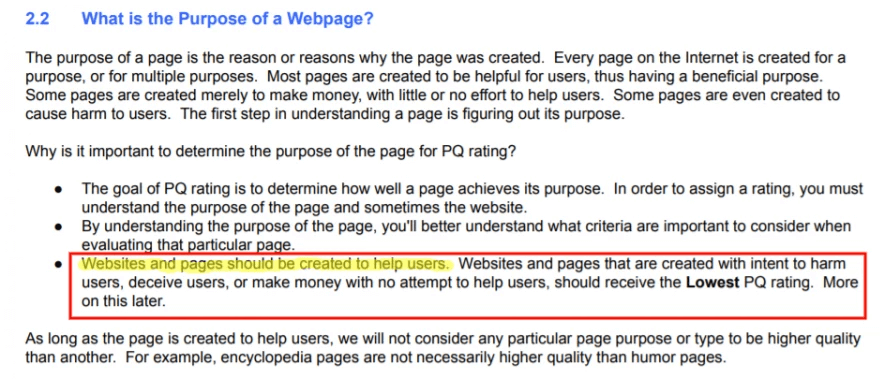

The most important of beneficial purpose for page quality is:

* The goal of page quality is how well a page achieves its purpose. You must understand the purpose of why and who is the page created for.
* By understanding the purpose, you'll better understand what is most important for the reader.
* Websites and pages should be created to help users and do not create to harm users, deceive users, or make money with no attempt to help users.

The page with beneficial purpose has the valuable content consist of:

* Information about a topic.
* Personal or social information.
* Pictures, videos, or other forms of media.
* Express an opinion or point of view.
* Entertain.
* Sell products or services.
* Allow users to post questions for other users to answer.
* Allow users to share files or to download software.

Beneficial purpose grows the page quality because your site and content have a user-focused purpose and give the benefits them in some way.

### What is Google Definition of YMYL?
Your Money or Your Life (YMYL) is the type of information directly impact the reader’s happiness, health, safety, or financial stability. And then, `sayurbox.com` is a part of this role.

Because of that, Google takes this content so seriously. The content must be created by experts with relevant expertise.

The example of YMYL topics:

#### News and current events
News contains important topics such as international events, business, politics, science, technology, etc. Keep in mind that not all news articles are necessarily considered YMYL (e.g., sports, entertainment, and everyday lifestyle topics are generally not YMYL). 

#### Civics, government, and law
The content consists of information important to maintaining an informed citizenry, such as information about voting, government agencies, public institutions, social services, and legal issues (e.g., divorce, child custody, adoption, creating a will, etc.).

#### Finance
The content defines financial advice or information regarding investments, taxes, retirement planning, loans, banking, or insurance, particularly webpages that allow people to make purchases or transfer money online.

#### Shopping
Provides information about or services related to research or purchase of goods/services, particularly webpages that allow people to make purchases online.

#### Health and safety
`Sayurbox.com` is a part of this topic. The content will advise or share information about medical issues, drugs, hospitals, emergency preparedness, how dangerous activity is, etc.

#### Groups of people
Claims related to groups of people, including but not limited to those grouped based on race or ethnic origin, religion, disability, age, nationality, veteran status, sexual orientation, gender or gender identity.

#### Other
There are many other topics related to big decisions or important aspects of people’s lives, such as fitness and nutrition, housing information, choosing a college, finding a job, etc. Sometimes `Sayurbox.com` is a part of this topic.

Google will evaluate the YMYL using a page qualifies as YMYL content. These pages need to contain the highest levels of E-A-T, which we will get into right.

### What is Page Quality Rating by E-A-T?

E-A-T is an acronym of Expertise, Authoritativeness, Trustworthiness (or Page Quality). 

The first step of page quality rating is to understand the purpose of why the page created. The page will get low-quality if no attempt to help users, spread hate and deceive users.

Keep in mind that you need to make the page with high E-A-T pages even gossip websites, fashion websites, humour websites, forum and Q&A pages, etc. 

Some topics require less formal expertise. Because of that, many people write extremely detailed, helpful reviews of products or restaurants. As the personal experience, sometimes you meet many people share tips and life experiences on forums, blogs, etc. 

Google might consider these people as an expert in topics where they have life experience. 

> If the person creating the content has the type and amount of life experience to make him or her an “expert” on the topic, Google will value this “everyday expertise” and not penalize the person/webpage/website for not having “formal” education or training in the field.

---

## Google Content Algorithm

The basic guideline of adding an inbound link is how Google read the content. Keyword density and similar tricks don't have a role today. 

Why have the game rules changed?

Google was never seen [15% of the keywords](https://www.cnet.com/news/google-search-scratches-its-brain-500-million-times-a-day/) that people typed in the search engine, previously unread or unheard queries. 


This kind of query sometimes is familiar, but it's not easy to for Google Search to understand the user intent.

Before RankBrain, Google would scan pages to see the exact keyword means. Unfortunately, these keywords were brand new. The impact is, Google had no clue what the searcher wants.

Take the example, you looking “the grey console developed by Sony”. Google will send back the results with a look at the pages contains the terms “grey”, “console”, “developed” and “Sony”.


Nowadays, RankBrain actually understands what you want and provides a 100% accurate results.


### What is RankBrain Algorithm?
RankBrain is an [Artificial Intelligence](https://www.searchenginejournal.com/optimize-content-google-rankbrain/163401/) which uses machine learning and AI. This algorithm uses to predict meaning, relevancy and displays the best matching results for the searcher, even for previously unknown, and new search requests.

RankBrain tries to figure out what the searcher means by matching never-before-seen keywords.

According to Google, how to learn [the meaning behind words](https://opensource.googleblog.com/2013/08/learning-meaning-behind-words.html) (keywords) is called word2vec.

Word2vec works to distributed the result of text representations to capture similarities among concepts. Pay attention to an example in capital and country concept.


By example, Paris and France are the same concepts as Berlin and Germany (capital and country), and not the same as Madrid and Italy.

This model arises automatically in training without any supervised information. The patterns like this will come up not only places similar countries but gets more another pattern as well.

Because of this, Word2vec provides knowledge representation and extraction, machine translation, question answering, conversational systems and many others for the searcher satisfaction.

Word2vec directly changes Google behaviour as well. In a few years ago 100% of Google’s algorithm was hand-coded. Google engineers team develop the algorithm.

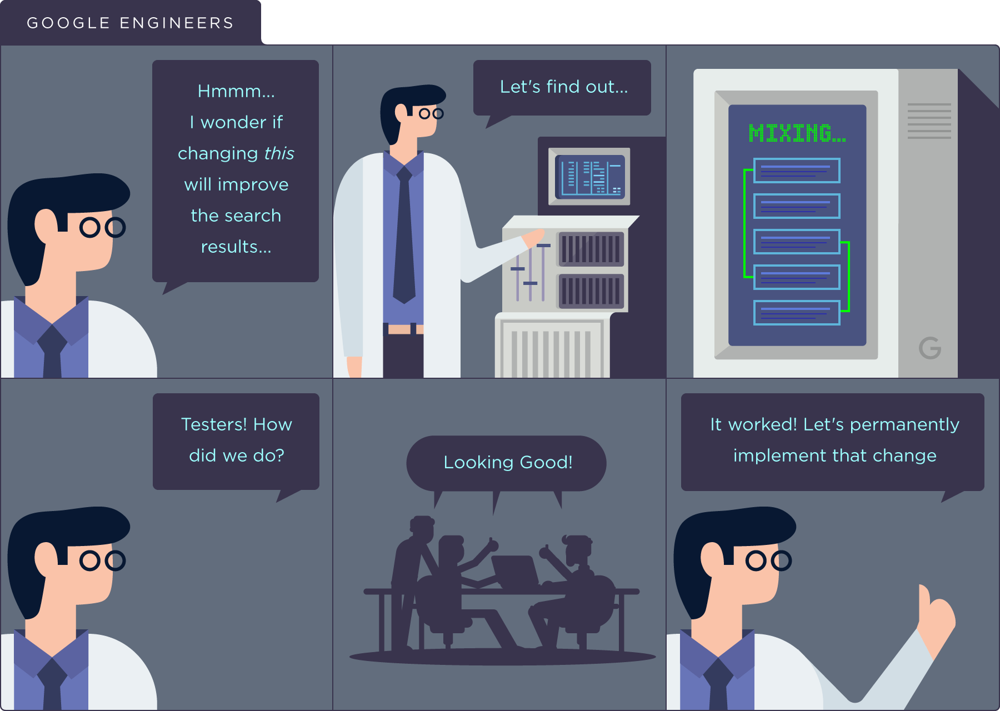

RankBrain is different.  

Word2vec will increase or decrease the importance of backlinks, content freshness, content length, domain authority etc by using artificial intelligence. 


If the searcher types a new keyword or queries on the Google search then Google asked a group of Google Engineers and RankBrain to identify the best page for.

Based on this algorithm, what is the impact on SEO Content?

### Optimize Content for RankBrain

The main topic of RankBrain is how the searcher interacts with the search results. As specifically about the 4 signals of user experience (UX signals).

* Organic Click-Through-Rate
* Dwell Time
* Bounce Rate
* Pogo-sticking

By this fact, you can optimize the content using various tricks like this:

#### Long-tail keywords are dead
In a few years ago, you create hundreds of different pages. That is a way how you optimized a different keyword by each page.

Google ranks each of them for their respective long-tail keywords.


RankBrain is different. They understand that these terms are the same thing. 


#### Optimize Medium Tail Keywords

Medium Long-Tail gets more search volume. Pay attention to `Paleo Diet` as an example.


You can optimize the page using a medium tail keyword (don't forget to produce the awesome content).

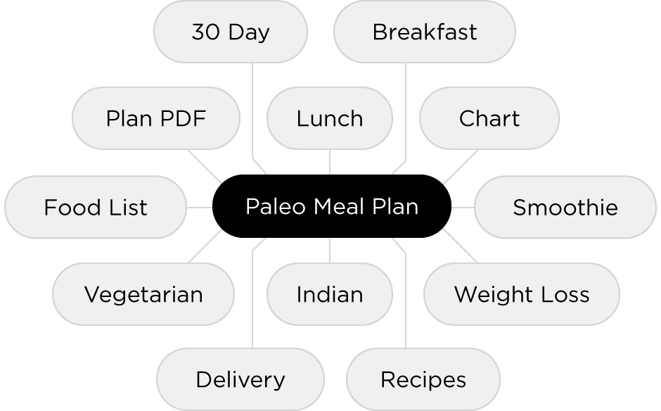

Why do you need this model?

Medium tail keyword got top 5 ranks in organic search. Based on this case, RankBrain understands that the page is about: “SEO Tools”, “SEO software”, “keyword research tools” etc.


According to SEMrush, this single page ranks for 1,800 different keywords.

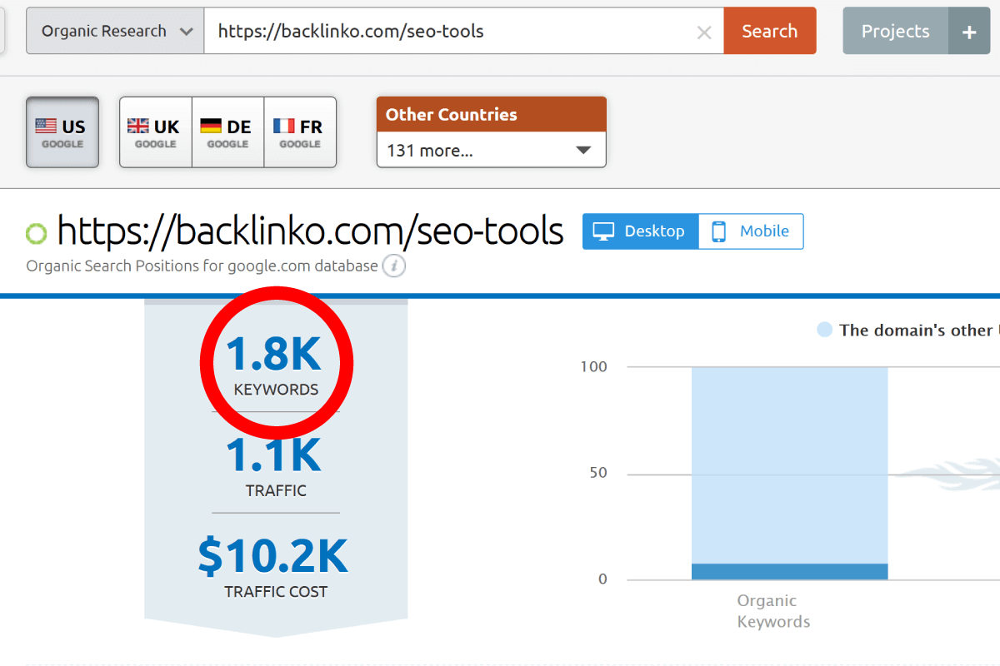

#### Push the Content on Top

The searcher comes from Google search and wants to get the answer of question soon. But you present the big image.

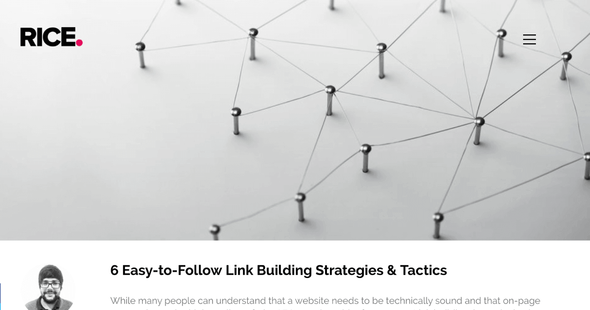

That so sucks and wasting time. The searcher needs to scroll down to get the answer.

Instead, push the first sentence of your content front-and-centre:


#### Short Intros (5-10 Sentences MAX)

Your content intro is where 90% of your readers decide to stay or go.

And you need to know that the searches already know what the topic they want. You remove a massive intro.

Instead, create a valuable intro for the searcher when they read more. Ensure you make the searcher is in the right place.

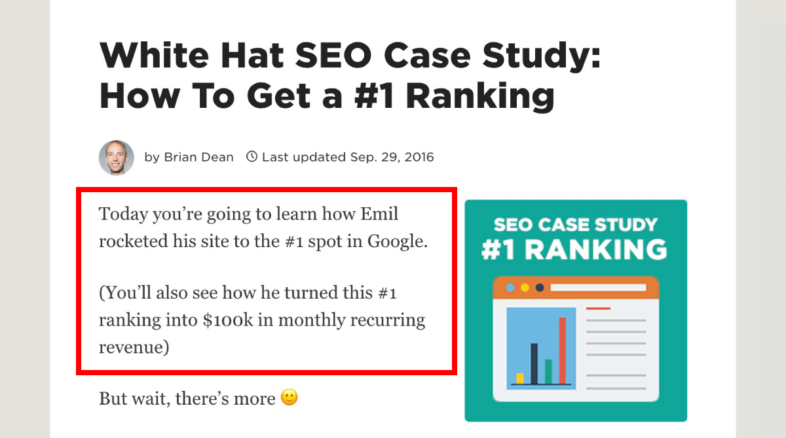

#### In-Depth Content

The in-depth content can fully answer a searcher’s query. And that will make a searcher satisfy.

How?

For example, someone looking for about `how to run a marathon` and the top 1 rank is the content with 300 words. What does the searcher will do?

Leave the page and back to Google search result. They looking for something better. 

That is your time. Show up your in-depth content as an alternative. This comprehensive content is the answer of searcher wants.

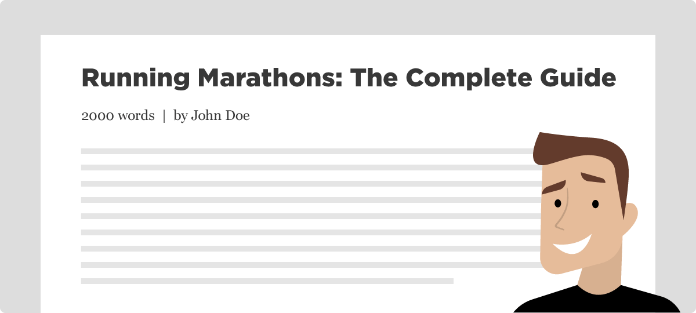

Ensure your in-depth content at least 2,000 words. 

---
## Inbound Link Optimise

A good inbound link is:

* Comes from an authoritative website
* Has related content with

Inbound link or you mostly knew it as a backlink will make the site more impressive than before. The right backlinks can do two great things, that is:

* Drive traffic to the site. If someone posts a backlink to your website, their readers might click on it. The benefit for you is referral traffic. 
* Increase the rank in search. Backlinks tell search engines that your website is an authority. Because of it, the more backlinks you earn from high-quality, high-authority sites make your website better in search engine results pages (SERPs).

Based on that, look at the type of inbound link, especially about blogger outreach:

Why do using blogger outreach?

This guide makes a traffic blog [grow 326,070 visitors per month](https://backlinko.com/blogger-outreach).


Blogger outreach has 4 types:

### Guest blogging
Find blogs on your target list who accept guest posts. You can check the sign of it on “write for us” page.

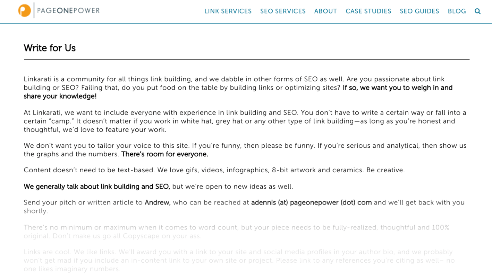

After discovering the acceptable guest post, send the email script as your pitch to the owner.

```
Hi [Name],
I have a guest post idea that I think your readers will love.

It’s called: [title].

Considering that [content type] tends to perform well on [blog name], I think it might be a good fit.

Want me to send you an outline?

Thanks,
[Your Name]
```

### Share request
This is a way to share your content with the influencer audience.

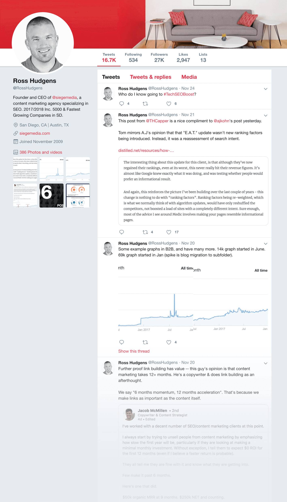

Ensure what the influencer post type: industry news, a case study, or a guide.

After you found it, mention your matching content to the influencer. Send this script within.

```
Hi [Name],

I just published [brief description of your content].

Considering you [something that ties together your content with their interests], I thought you might want to check it out:

[URL]

I hope you enjoy it.

Thanks,
[Your Name]
```

### Link request
Don't ask someone to link to you be like this.


Instead, figure out what is the content type that love by the owner. Create more awesome content as the content reference.

Try this email script.

```
Hi [Name],

I was checking out some content about [Topic] today, and I came across your post: [Post Title].

I recently published [brief description of your content]: [URL].

It might make a nice addition under the “[Section Title]” of your post.

Either way, I hope you enjoy the post. And have an awesome week.

Thanks,
[Your Name]
```

### Partnerships
Partnership depends on the type of partnership you’re looking for.

Before reaching out the owner, figure out the specifics about your ask.
Identify what do you want to do by the audience.

Put this script into your email with additional editing by your need.

```
Hi [Name],

I wanted to see if you’d be interested in [partnership type].

[The benefit they’d get from teaming up with you]

If you’re interested, the next step would be [next step]

Either way, I’m a big fan of your work and I appreciate you considering it.

Thanks,
[Your Name]
```

---

## Final Touch

I've made done to define how to grow organic search for eCommerce. Maybe you meet the new insight or existing concept about. 

Sometimes you need to keep the old model to send up your page on Google search top before the ideas come up.

This organic search plan might be can do by everyone, not me. The important things are, focus on the organic concept. Don't do grey or even black hat. That will make your site takedown by Google in the next updates. 

What the searcher wants is the first!