The impact of the Google Algorithm for SEO is real. August 1st is the nightmare for the health & medical blog niche. What is the matter? This article covers 11 Algorithm that effects for every single site.

Google reshuffles the ranking of health & medical page on the search engine result (SERP). That's the day of [the international reshuffle of rankings](https://medium.com/webranking/medic-update-our-analysis-on-the-new-google-quality-algorithm-e0704dc63b0c). Especially for a [YMYL blog](https://static.googleusercontent.com/media/guidelines.raterhub.com/en//searchqualityevaluatorguidelines.pdf). 

[Sistrix](https://www.sistrix.com/blog/google-with-core-algorithm-update/) shares some of the sites which loss the traffic because of this update. 

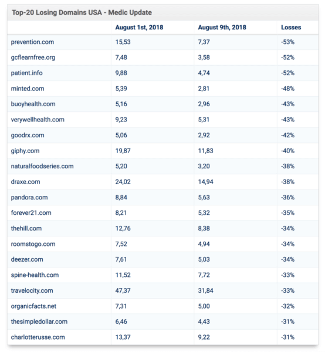

[RankRanger](https://www.rankranger.com/) too has a nice dataset about this. They saw the organic visibility change.

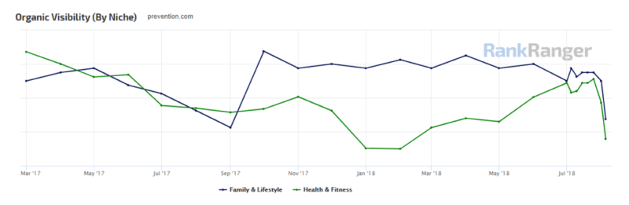

As you know, that's a site across the Family & Lifecycle niche (blue) and the Health & Fitness niche (green).

The big question comes up. What's the matter all of this?

Google said that this update was a “broad core algorithm update”. You know, they did like this several times per year. It isn't the first. 

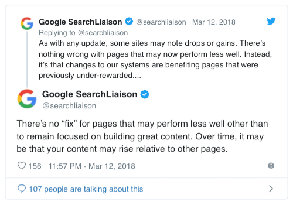

Pay attention to the "focused on building great content". Yeah, that's [Google mission](https://about.google). Everyone knew.

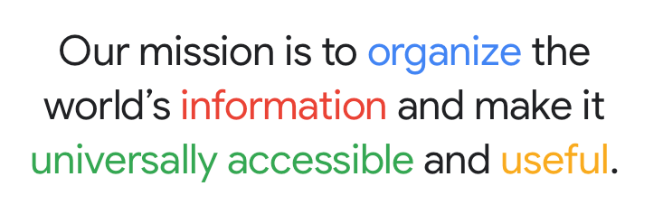

Whatever you do on your website, don't step out from it.

> Focus on building great content. 

It looks like simple things. But need a lot of time to learn in-depth.

Based on the Google mission, the Google algorithm born. Nowadays, there are 11 algorithms. Here are the details and how to be the winner:

  

    <h3>Table of Content</h3>
    <ol>
      <li><a href="#what-is-google-panda">Google Panda?</a></li>
      <li><a href="#what-is-the-google-penguin-update">Google Penguin Update?</a></li>
      <li><a href="#google-fred-update">Google Fred Update</a></li>
      <li><a href="#google-page-layout-algorithm">Google Page Layout Algorithm</a></li>
      <li><a href="#exact-match-domain-algorithm">Exact Match Domain Algorithm</a></li>
      <li><a href="#google-payday-loan-algorithm">Google Payday Loan Algorithm</a></li>
      <li><a href="#google-pigeon-update">Google Pigeon Update</a></li>
      <li><a href="#google-hummingbird-update">Google Hummingbird Update</a></li>
      <li><a href="#pop-up-ads-algorithm-update">Pop-up Ads Algorithm Update</a></li>
      <li><a href="#mobilegeddon-algorithm">Mobilegeddon Algorithm</a></li>
      <li><a href="#google-rankbrain-algorithm">Google RankBrain Algorithm</a></li>
    </ol>
  

---

## What is Google Panda? 
It is how [Google reduce](https://www.searchenginejournal.com/google-algorithm-history/panda-update/) the prevalence of low-quality, thin content in the search results, and to reward unique & compelling content.

The main idea of this algorithm is to provide a positive experience for the user (visitor). Because of that, [Google updates](https://googleblog.blogspot.com/2011/02/finding-more-high-quality-sites-in.html) the Google Panda Algorithm on February 23, 2011 being:

On other hands, Google will kick the site has:

* More intrusive ads
* Inflated word counts 
* Low editorial standards 
* Repetitive phrasing
* Poor research
* Didn’t come across as helpful or trustworthy

In short, Google Panda aims to find high-quality sites easier. And the first step is reducing rankings the low-quality site.

How do you know the site has high-quality content? What is the ranking signal? Singhal released 23 questions how to know the site has [high-quality content](https://webmasters.googleblog.com/2011/05/more-guidance-on-building-high-quality.html).

The result of the 23 questions is increasing the quality and uniqueness. 

Felix Tarcomnicu published the case study of how to [become a winner against Google Panda](https://blog.monitorbacklinks.com/seo/recover-google-panda-penalty/).

He found that [Google Panda takes down](https://monitorbacklinks.com/blog/seo/recover-google-panda-penalty) the website with various problems. 

* Low quality and thin pages. 
* Duplicate content. 
* Websites with bad user experience. 
* External links to bad websites. 
* Sites with too many advertisements.
* Content farm sites. 
* Poor grammar and spelling. 
* Too many broken links.

---

## What is the Google Penguin update? 
Google Penguin designed to tackle the increasing practice of manipulating search results (and rankings).

Yeah, that's the black hat [link building techniques](https://www.searchenginejournal.com/google-algorithm-history/penguin-update). 

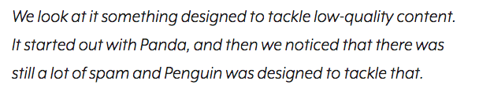

Penguin algorithm is Google ways to gain greater control over and reduce the effectiveness of, several black hats spamming techniques.

The question is, why is the link building so important? Even more, somebody takes the spamming or black hats as their solution.

The reason is, 72% of SEOs believe backlinks are a significant [ranking factor](https://www.link-assistant.com/news/link-building-survey-2017.html). Furthermore, Google needs something to assign the trust and authority of pages. 

And link pages is the part of [rank factors](https://www.wordstream.com/blog/ws/2015/04/30/seo-basics).

Unfortunately, some people manipulate the link building using black hat techniques. They are over pay attention to link-quantity and hope to be the number one. Along with it all, Google knows what a cheater did and fixes the issue as soon as possible.

Google knows the [future of the search engine](http://infolab.stanford.edu/~backrub/google.html) since Google go up. The Penguin algorithm is one of the ways to tackle the black hat techniques.

How to prevent black hat backlinks?

If your team did manipulate before, please stop it. 

Sometimes, you got the black hat backlinks even when you didn't do. For your information, there are over [45 black hat backlinks kind](https://cognitiveseo.com/blog/12169/44-black-hat-seo-techniques/) existing nowadays. Need a lot of time to make sure your website is clear from the backlink. Here's how to know quickly.

* Monitor the backlinks to track the quality of the link. 
* Disavow black hat backlinks. 
* Black hat backlinks characters. 
* Link removal outreach. 
* Assessing link quality. 
* Presumed high-quality sites. 
* Promotional links. 

---

## Google Fred Update 
This Algorithm designed to penalize sites that were [prioritizing monetization over user experience](https://www.wordstream.com/blog/ws/2017/08/24/google-fred-update).

You know, the aggressive monetization is a sucks things for the visitor. They come for the content, not ads.

Barry Schwartz found that [100 websites Google Fred affects](https://www.seroundtable.com/google-fred-update-ad-heavy-low-value-23538.html).

The website he studied has similar characteristics, have aggressive advertising placement. 
Fred will hit the site with terrible advertising, mostly the portal sites, like that.

Furthermore, Fred also targets [poor-quality backlinks](https://blog.statcounter.com/2017/03/googles-fred-algorithm-update-5-steps-to-take-now/). It means the source backlinks of sites have poor domain authority, out-of-date or broken or downright unnatural links. 

On the other hands, you need a commitment, financial power, and along time to produce the top-quality content. So the greatest challenge is on your face. This is the most important point at Googe Fred:

* Focus on quality. 
* Thorough site audit. 

---

## Google Page Layout Algorithm
It is the extension of Google Fred.

> Tackle the website too many static advertisements above the fold. 

This algorithm only attacking the website had an excess of ads and makes the [user experience](https://www.searchenginejournal.com/google-algorithm-history/page-layout/#close) weak.

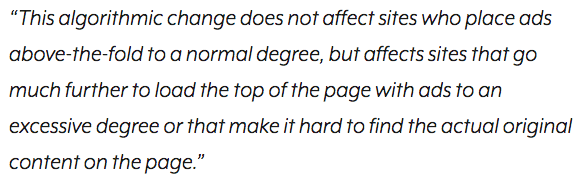

As an additional, Page Layout Algorithm push the webmaster to re-think their web design because take effect in user experience.

Take an example from the [WebmasterWorld forum](https://www.webmasterworld.com/google/4643972.htm). They found that the Page Layout Algorithm takes down the site traffic up to 40 per cent.

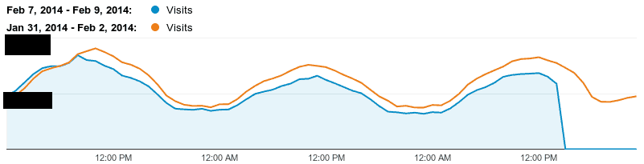

In this case, the Page Layout Algorithm is not the only one of the reason. People won’t visit a site when feeling disgusted with ads. The visitor will get frustrated, close the browser tab, and open the new site address that makes more comfortable.

The next question is, how to dissociate the site from this algorithm? 

Answer: Re-design your page layout.  

---

## Exact Match Domain Algorithm 
Exact Match Domain [(EMD)](https://www.searchenginejournal.com/google-algorithm-history/emd-update/) targets sites with a combination of spammy tactics. 

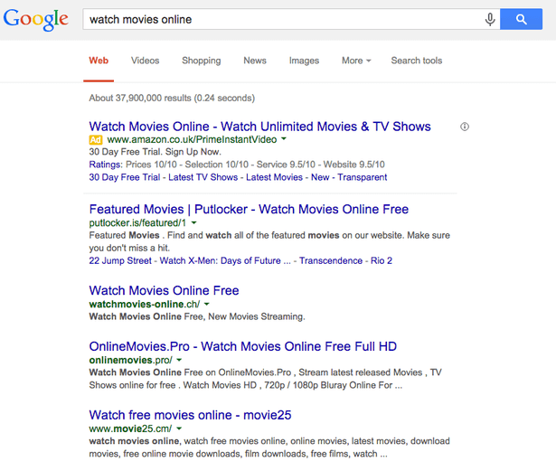

Google reducing low-quality “exact-match” domains in search results using EMD.

This algorithm will work to match domains had poor quality with thin content. Generally, some people buy the domain by matching the keyword target phrases. 

<iframe width="100%" height="400px" src="https://www.youtube.com/embed/rAWFv43qubI" frameborder="0" allow="accelerometer; autoplay; encrypted-media; gyroscope; picture-in-picture" allowfullscreen style="margin-bottom: 20px;"></iframe>

The weakness is, their content is extremely thin with little to no value for the visitor. 

You know, they think that this is the best way to be a winner SERP. It was extremely easy to do. But it's the wrong way. 

As a note, this Algo (Algorithm) doesn't work on sites with stronger brand recognition and high-quality content.

Dr Peter J. Meyers had [the graph of EMDs](https://moz.com/blog/are-exact-match-domains-in-decline). The result is, EMDs are weakening.

*(This graph is based only on .com domains).*

As an additional, Peter J. Meyers also researched PMD (Partial-match domains). The example of PMD is:

* buywidgetshere.com
* webuywidgets.com
* buywidgets.example.com
* www.buy-widgets.com

All of that domain took for the keyword phrase “buy widgets”. And, here's the result of Meyers also research.

You can see, PMDs accounted for slightly more of the mix than EMDs, but here the pattern is much clearer. After the Penguin update, the domain ranking of PMD has only continued to fall.

So how to get off form EMD or PMD?

Based on econsultancy.com case study, here's the [key success on EMD or PMD](https://econsultancy.com/do-exact-match-domains-still-work-as-an-seo-tactic/):

* Quality content
* Uniqueness concept 
* Quality link acquisition 
* Target keyword relevance

---

## Google Payday Loan Algorithm 
Targeted the spammy queries mostly associated with super high-interest loans, payday loans, porn, gambling and drugs, pharmaceuticals, casinos, financial areas (mortgages and insurance), and other heavily spammed.

[The Payday Loan](https://www.sistrix.com/ask-sistrix/google-updates-and-algorithm-changes/google-payday-loan-update/) does not aim at the content or the backlinks of a website. Instead, it will be targeting search requests and markets where there is an excessive advent of spam or [illegal SEO-techniques](https://www.searchenginejournal.com/google-algorithm-history/payday-loan-update).

For a fact, [Payday Loan kicks down](https://moz.com/ugc/case-study-payday-loan-penalty-and-the-road-to-recovery) the [Peachy](https://www.peachy.co.uk/) 8,000 to 10,000 visits per week organic traffic to 2,000 organic visits.

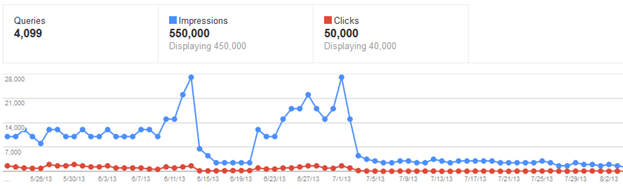

The reason for the penalty is they attempt to manipulate search engines such as website directories, article marketing, paid links thin content, keyword stuffing, duplicate content.

According to Bruce Clay, you need to focus on [content quality](https://www.linkedin.com/in/bruce-clay-143449/) which provides value to the searcher. Instead of the grey/black hat, create and promote quality content, avoid transactional link building, optimize sites for user intent, and you’ll be solid.

Steven Macdonald has [advanced SEO strategies](https://moz.com/ugc/category/advanced-seo) to get out at the Payday penalty. And the secret is, focus on three key areas.

Here are the details of its areas to-do list: 

* Links. Analyzed the low-quality links pointing towards the site.
* Content. Replace poorly written and thin content.
* Usability. Re-design poor user experience. Make sure the site build for humans, not search engine machine.

The result of this fix strategies is great. Organic traffic comes back.

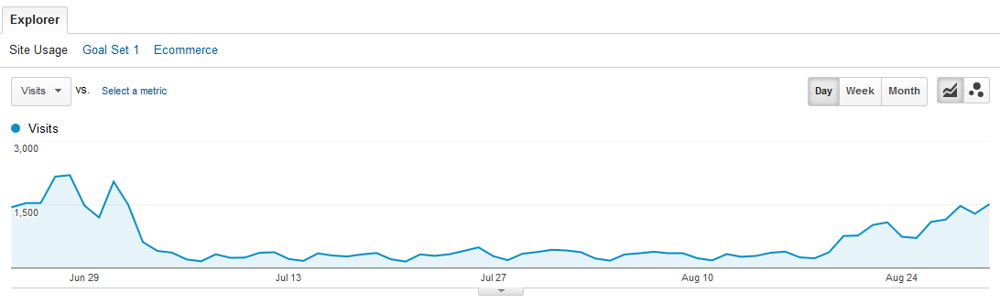

To get a great result like that, follow this guidance:

* Removing low-quality links. 
* High quality and engaging content. 
* Improve the user experience. 
* Reconsideration request. 

---

## Google Pigeon Update
Serve the most relevant and useful results based on the local sources by favouring those within a certain radius and relevancy of a user’s search.

The impact of this Algo is, increase or decrease in KPIs like leads and conversions (Get Directions or Call Now). 

According to [Sam Hollingsworth](https://www.searchenginejournal.com/author/sam-hollingsworth/):

> The goal of [Pigeon](https://www.searchenginejournal.com/google-algorithm-history/pigeon-update/) was to let local search resemble traditional organic search as much as possible, while also behaving similarly.

Based on this goal, Pigeon changes [the local pack](https://moz.com/learn/seo/google-pigeon) with 10 or seven businesses to 3-pack only.

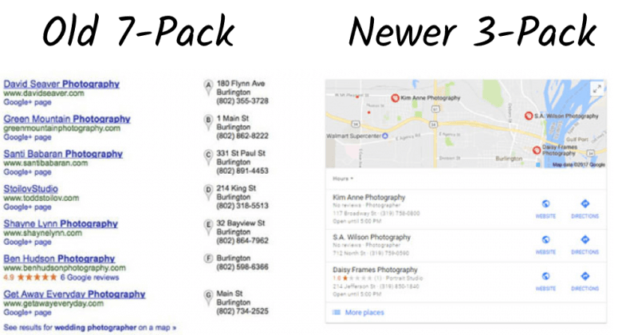

Google makes the integration between local ranking signals and consumer-driven local directories (Yelp, Home Advisor, and more) to improve their SERP result.

According to [Moz.com](https://moz.com/learn/seo/google-pigeon), you have an opportunity on Google Pigeon:

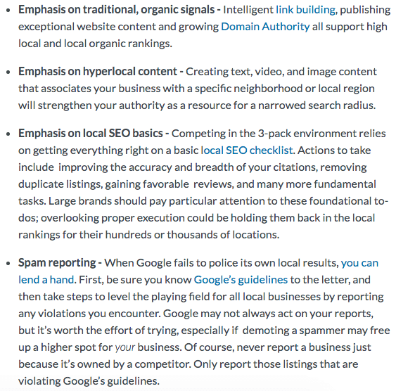

In details, let's take a time to-do the [Optimization of Peagon Techniques](https://searchengineland.com/not-local-seo-post-pigeon-era-216875):

* Focusing on target neighbourhood searches. 
* Optimize directory placement.  
* Create content marketing and link-earning. 

---

## Google Hummingbird Update
Understanding the context of what you looking for and send back the precise answer. 

Analyze the intent of searchers queries and matching them. That's is how [Hummingbird works](https://www.searchenginejournal.com/google-algorithm-history/hummingbird-update/).

To understand the searchers' queries and send back the answers, Hummingbird using semantic search and the knowledge graph.

The knowledge graph is not an actual graph. This is a part of [SERP features](https://moz.com/learn/seo/serp-features) to provide quick, answers queries about people, places and things.

See the knowledge graph of chocolate chip cookies here:

You can see, the knowledge graph providing an answer box with a recipe, a right-hand knowledge panel featuring nutritional facts about this dessert, and suggestions for related search subjects.

[The knowledge graph](https://www.wordstream.com/blog/ws/2014/06/23/google-hummingbird) also makes search quicker, easier and more intuitive.

As the user, they want the answer right now and don’t need the top 1,000 Google results. 

How does google know the answers of searchers' queries? It's time to learn a [Semantic search](https://www.wordstream.com/blog/ws/2014/06/23/google-hummingbird).

Semantic search focusing on user intent and how the subject of a search relates to other information (contextual relevance).

Dan Shewan gave the [example of Semantic search](https://www.wordstream.com/blog/ws/2014/06/23/google-hummingbird). The user type term `Weather` and Google will analyze the query being like this:

* `Weather` is the subject of the search
* The desire for a local forecast is the user’s intent
* The difference between a weather forecast and an explanation of meteorological concepts is the context

Google’s algorithm cannot be sure of what User want. They appearing a range of results using the local forecast (tracks user location) analytics, crawl the Weather Channel, grab the Wikipedia page content, and collect the other relevant information.

Nowadays, Google using structured data like schema and new technologies (such as Natural Language Processing, Artificial Intelligence, Voice Recognition Technology, and Internet of Things) to read retrieve and publish data based on user intent.

As the SEOs, how to take benefit from Hummingbird? 

Hummingbird makes you produce the content more effective. Answering the User query, no more. Short and clear. So, follow this way:

* Diversify the length of content. 
* Create visual content. 
* Use topic-appropriate language. 
* Implement schema microdata. 

---

## Pop-up Ads Algorithm Update 
Tackling [intrusive pop-up ads](https://www.searchenginejournal.com/7-tips-using-pop-ups-without-harming-seo/198221/) along with other intrusive interstitials that diminish mobile user experience.

The penalty specifically targets spammy interstitials like pop-ups, overlays, and modals that difficult to dismiss. Indirectly, that makes diminish your users’ experience. 

Here's the [example of interstitials](https://webmasters.googleblog.com/2016/08/helping-users-easily-access-content-on.html) that make content less accessible (sourced by Google).

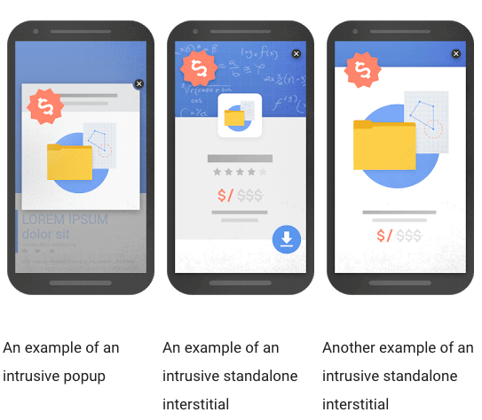

Don't implement the interstitials ads with these criteria:

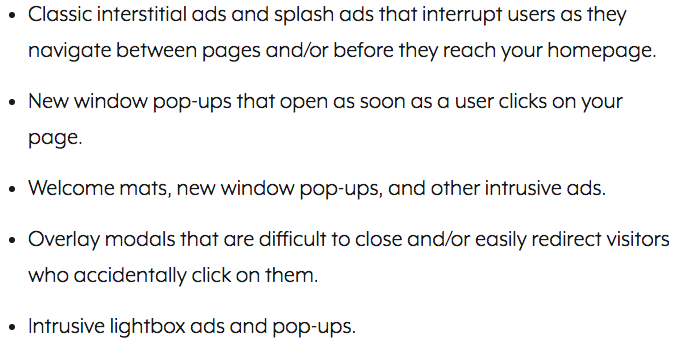

Privy.com had the kinds of pop-ups can cause frustrating user experiences.

What are the [mobile pop-ups acceptable](https://www.privy.com/blog/2016/12/google-seo-change-for-mobile-popups-in-2017#targetText=A%20mobile%20pop%20up%20that,original%20content%20underneath%20the%20fold) by Google? Ben Jabbawy (Founder of Privy) suggest to displays the pop-ups take up less than 30% of the phone screen, and can easily be closed, both of which make it easier for mobile users.

The result of Pop-up Ads Algorithm is, Google always provide the best user experience. So take consideration to follow this guidance list:

* Using non-intrusive interstitials. 
* Switch to timed pop-ups. 
* Take care in “Gray area” interstitials. 
* Use permitted pop-ups cautiously. 
* Use intrusive ads on the desktop.
* Restrict pop-ups. 

---

## Mobilegeddon Algorithm  
The reward for legible and usable pages in mobile search rankings.  

This Algorithm impacts:

* Search rankings on mobile devices only
* Search results in all languages globally 
* Applies to individual pages, not entire websites

Google creates the Mobilegeddon Algorithm by user behaviour and trends in the market. It's a part of user experience improvement. 

You must know, 70% of page 1 results were already [mobile-friendly](https://twitter.com/dr_pete/status/589785870556729344) by April 19. This data makes Google have a strong reason to pivot and adapt to consumer behaviour.

Hence this update wasn’t about organic search but a response to consumer behaviour. 

According to Takaki Makino and [Doantam Phan](https://webmasters.googleblog.com/2015/04/rolling-out-mobile-friendly-update.html):

> If the site pages aren’t mobile-friendly, the mobile traffic from Google Search may be a significant decrease. But once your site becomes mobile-friendly, the pages will automatically re-process (i.e., crawl and index).

Even so, the search query is still a very strong signal. It's mean:

> If a page with high-quality content is not mobile-friendly, it could still rank high.

The good news comes. 

Google announcing that [mobile-first indexing](https://webmasters.googleblog.com/2019/05/mobile-first-indexing-by-default-for.html) will auto-enable for all new websites starting July 1, 2019.

In short, new websites seen at the same content on both mobile and desktop devices by users and search engines.

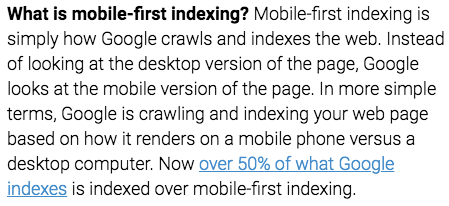

How about the old website? Or a website that existing before July 1, 2019?

Google has special guidance:

Based on all of that, what have to do now?

* Make sure page is [mobile-friendly](https://webmasters.googleblog.com/2015/04/rolling-out-mobile-friendly-update.html). 
* Check the mobile usability report. 
* Makes site mobile-friendly, if not yet. 
* Expedite the new mobile-friendly site crawl. 

---

## Google RankBrain Algorithm 
This is [basic of RankBrain](https://www.searchenginejournal.com/google-algorithm-history/rankbrain/) works:

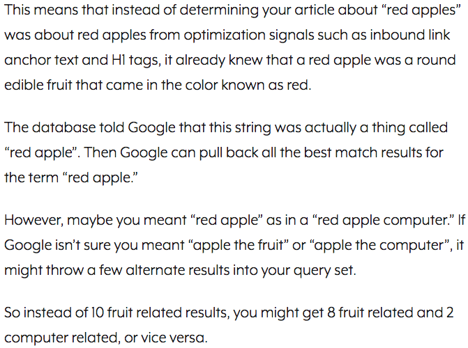

According to The [Definitive of RankBrain](https://backlinko.com/google-rankbrain-seo), this is Google’s third most important ranking signal.

In theory:

> RankBrain is a machine learning (AI) algorithm to sort the search results. It helps Google to process and understand search queries.

This algorithm will match never-before-seen keywords to keywords that Google has seen before. In the past, if you search “the grey console developed by Sony”, Google would look at the terms “grey”, “console”, “developed” and “Sony” on the page. 

Nowadays, Google learned that people who search for “grey console developed by Nintendo” means gaming consoles. Google will use that is as the pattern. 

When someone searches for “the grey console developed by Sony”, RankBrain send back similar results from the keyword already knew before (“grey console developed by Nintendo”).

In short, RankBraind will create a pattern based on the query, user behaviour, matching both with the user wants at the same time, and send back the result. 

You can see how RankBrain works at learning the [meaning behind words](https://opensource.googleblog.com/2013/08/learning-meaning-behind-words.html) post. 

This algorithm makes the pattern of (capital and country) and understands that Paris-France and Berlin-Germany have a similar pattern. While Madrid-Italy is not.

The most interesting part is many more patterns like this arise automatically in training. As a result, RankBrain has more potential as knowledge representation and extraction, machine translation, question answering, conversational systems, and many others. 

And then, let's learn to the difference of Google algorithm with and without RankBraind. Check this out.

Google’s algorithm without RankBrain:

Google’s algorithm with RankBrain:

How about the accuracy predicting? The stat shows that RankBrain outperformed brainy Google engineers.

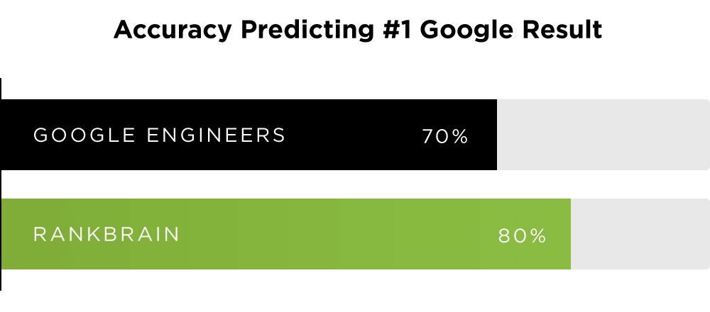

Make sure your website to stand out on Google RankBrain using this list:

* Ignore Long Tail Keywords. 
* Optimize medium tail keywords. 
* Title tags with emotion. 
* Add brackets and parentheses to the end of titles. 
* Use numbers (not list posts). 
* Optimize the bounce rate and dwell time content. 

What do you think about Google Algorithm? Yes, Google always updates their machine. When you follow the [Google mission](https://about.google), any change is'not worry for you. 

Don't cheat, don't use the grey or black hat SEO.