If you want to install Google Analytics on Wordpress, you only need 2 minutes. I've split into 5 simple steps. I add images (screenshot) to make clear and easy to understand.

Here's how:

Go to the [Google Analytics](https://marketingplatform.google.com/about/analytics/) URL  

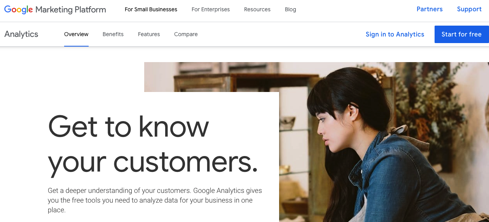

Login with your Google Account

Click Sign up


Type information about your website in the field provided

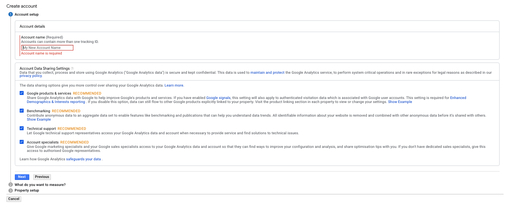

Click Get Tracking ID

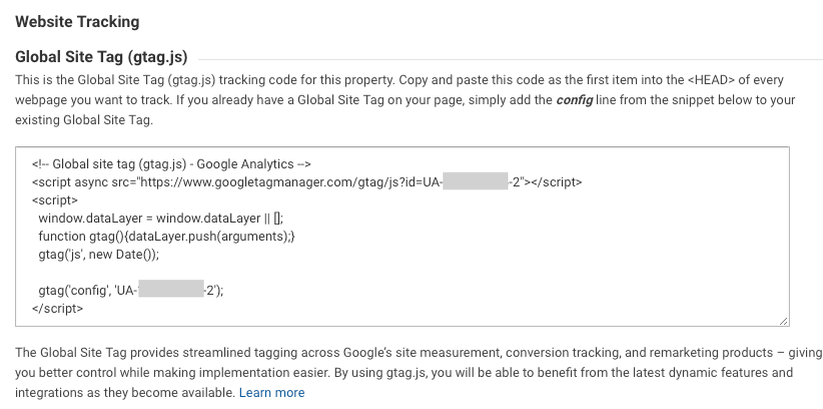

Copy Code that appears 

Now, enter the WordPress dashboard and log in.  Point the cursor to the Plugin menu, click Add New

Type "Insert Headers and Footers" in the search field


Click Install Now. Wait until the installation process is complete

Click Activate

Hover over the Settings menu

Click "Insert Headers and Footers"

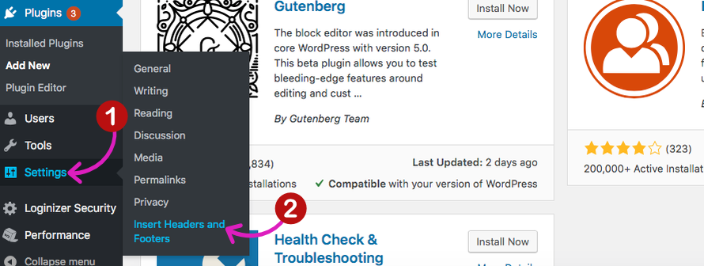

Enter the Code from Google Analytic in the Scripts in the Header box. Click Save.


How? Do you need 2 minutes? 

But, the article that you are reading now will not explain only how to install Google Analytics on Wordpress. However, more than that. I will explain more comprehensive Google Analytics.

Are you ready? Let's get started.

<div class="toc-master">
  <div class="toc-articles">
    <h3>Table of Content</h3>
    <ol>
      <li><a href="#step-1-set-up-analytics-tags-with-google-tag-manager">Set up analytics tags with Google Tag Manager</a></li>
      <li><a href="#step-2-set-up-organize-accounts">Set up Organize Accounts</a></li>
      <li><a href="#step-3-set-up-property-level">Set up Property-level</a></li>
      <li><a href="#step-4-configure-view-level-settings">Configure View-level settings</a></li>
      <ul>
        <li><a href="#part-1-add-filters">Add Filters</a></li>
        <li><a href="#part-2-exclude-url-query-parameters">Exclude URL Query Parameters</a></li>
        <li><a href="#part-3-activate-site-search">Activate Site Search</a></li>
      </ul>
      <li><a href="#step-5-set-up-goals-as-success-key-metrics">Set up Goals as Success Key Metrics</a></li>
    </ol>
  </div>
</div>

------

## **Step 1. Set up analytics tags with Google Tag Manager**

Before linking analytics tags with Google Tag Manager, do you know the difference between Google Analytics and Google Tag Manager? Here the main difference both: 

Google Analytics' display generating reports and website statistics, likes:

- How many people visited your website yesterday
- What country are they from
- How many pages they visited per session
- How many visitors bounced off your website (without performing any action)
- The most popular pages, etc.

Google Tag Manager allows to deploy various types of code (tags), reports, and statistics likes:

- Analytics tracking code
- Google Analytics event codes
- Google Ads conversion script and remarketing tags
- Google Ads Conversion Tag
- Google Ads Remarketing Tag
- Facebook Pixel code
- Crazyegg tracking code
- Inspectlet tracking code
- Any other custom HTML / Javascript code

According to [AnalyticsMania](https://www.analyticsmania.com/post/google-tag-manager-vs-google-analytics/#gref):

```
Google Tag Manager is a Toolbox, where you keep all your tools: a regular (Google Analytics), a hammer (Google Ads), etc.
```

It means:

Google Tag Manager does not replace Google Analytics. They help us to add Google Analytics tracking code (tag) to the website, deploy GA event code snippets and define rules easily. Even, when each GA event must fire. 

Here the result:


And then, here how to set up Google Analytics Tag and Google Tag Manager 

Create an account on the [Google Tag Manager](https://tagmanager.google.com/) 


Type the account setup

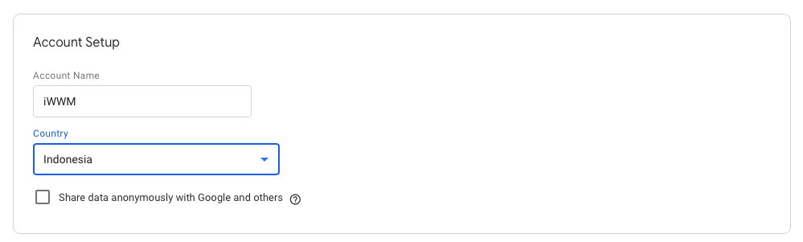

Set up a container. Type container names and select the type of content (Web, iOS, Android, or AMP)

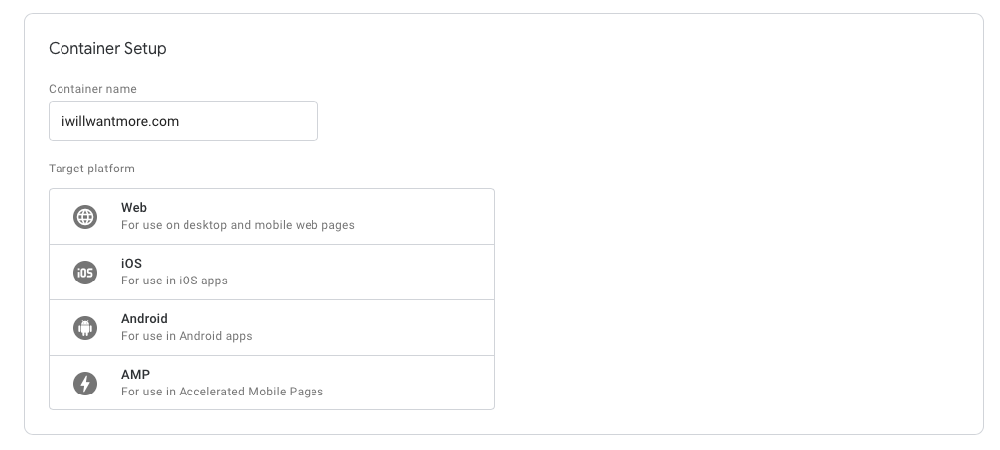

Click create, review the Terms of Service, and agree to those terms


We will redirect to this Installation code snippet

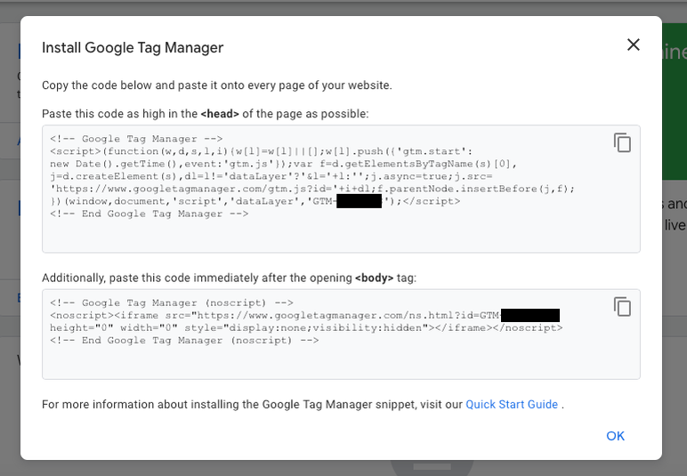

Put the two snippets of code using the Insert Headers and Footers Plugin (Wordpress only). If you have already entered Google Analytics Website Tracking, please take down it first.

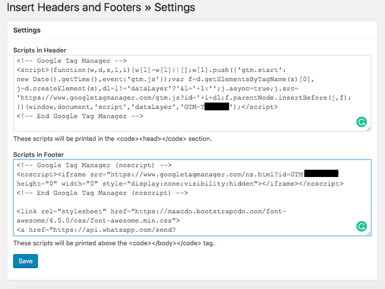

Sign in on the [GA page](https://analytics.google.com/analytics). 

Click Admin. Click Tracking info. Click Tracking Code

Copy the Tracking ID. Put this tracking code into the Google Tag Manager settings.

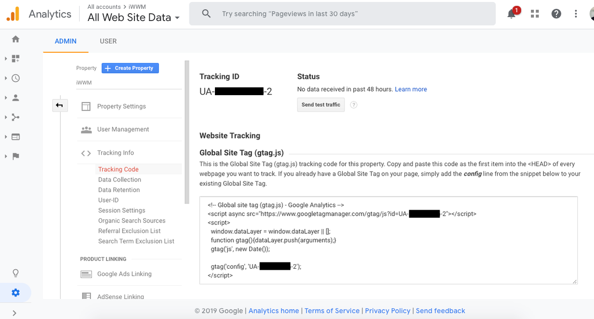

Back to [Google Tag Manager](https://tagmanager.google.com) dashboard. Add a new tag button. We will create a new website tag.


Set up two areas tags:

- Configuration. Where the data collected.
- Triggering. What type of data want to collect.

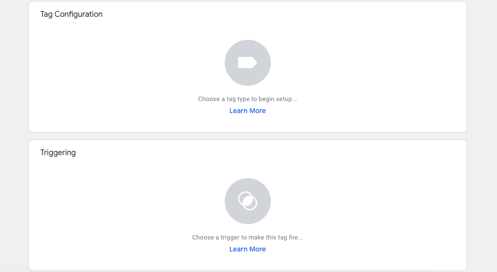

Click on the Tag Configuration button to choose the type of tag. Choose the "Universal Analytics" option.


Choose the type of data you want to track. Click Google Analytics Settings. Select New Variable ...

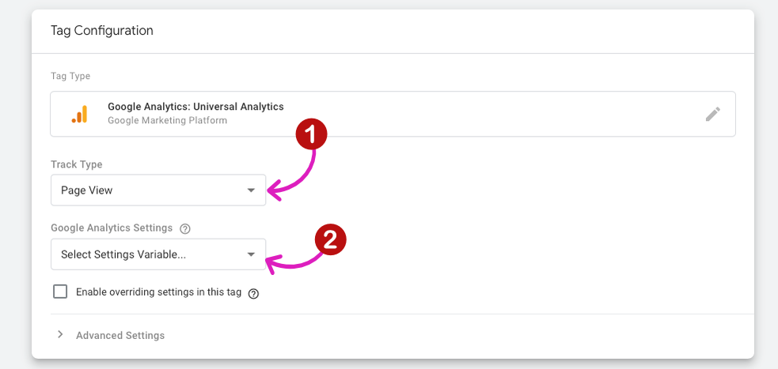

We'll then be taken to a new window. Put your Google Analytics tracking ID


Move on to triggering. Click on the Triggering button.

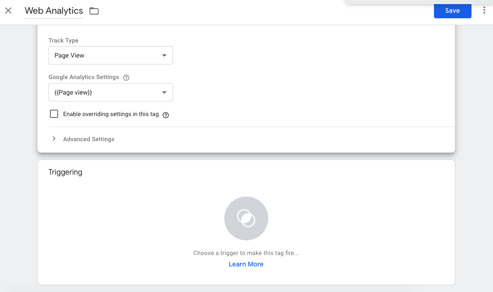

On the "Choose a trigger" page, click on All pages.

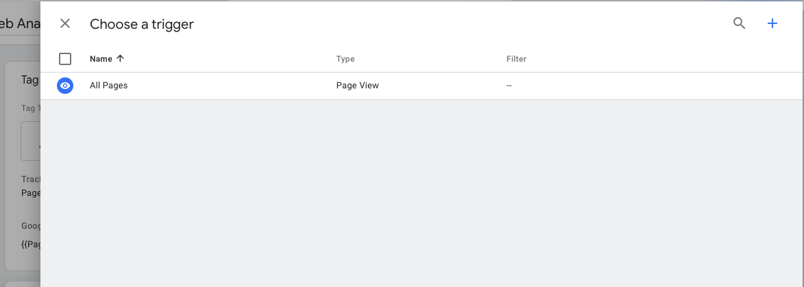

Your new tag set up should look something like this:

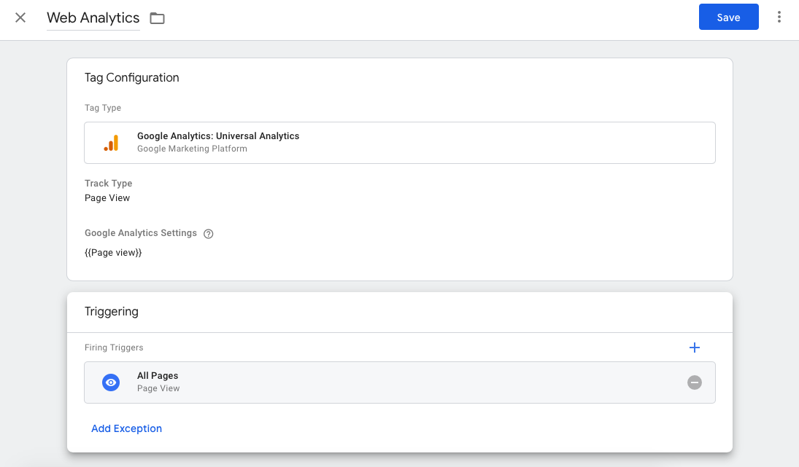

Click save.

In here you have finished setting up Google Analytics and Google Tag Manager.

------

## **Step 2. Set up Organize Accounts**

To optimize the Google Analytics Account, we learn about the Google Analytics Dashboard. For the first step, we learn about Organizing Accounts, Properties, and Views. As you can see, within the GA Dashboard there are three tiers: Account, Property, and View:

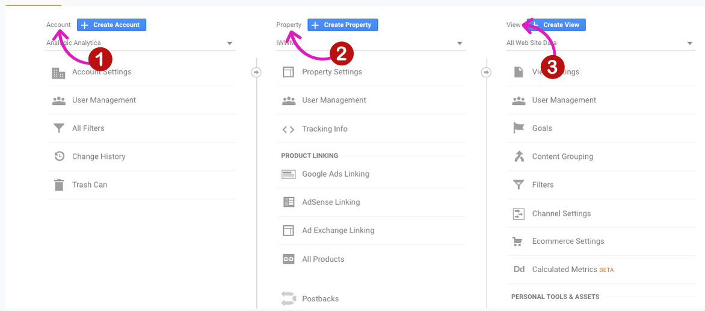

You need to know:

- You allow creating multiple Accounts into a single Google user
- You can have up to 50 Properties or individual websites into a single Google Analytics Account
- Properties contain up to 25 Views, which are custom reports for a Property.

Maybe, our business likes this:

```
We have an online store that sells custom workout accessories and a separate site for vegan menus, each should have a unique property and its own set of Views. 
```

------

## **Step 3. Set up Property-level**

Set up the property to make it easier for us to read data.

Click Property Settings. Rename your Property, update the default URL, select a default View, set your Industry Category.


And then, set up Data Collection. This set up provides Google-based demographic and categorical interest data, allows data to create remarketing lists and research for display advertising campaigns. 

Enable the Demographics and Interest Reports and In-Page Analytics

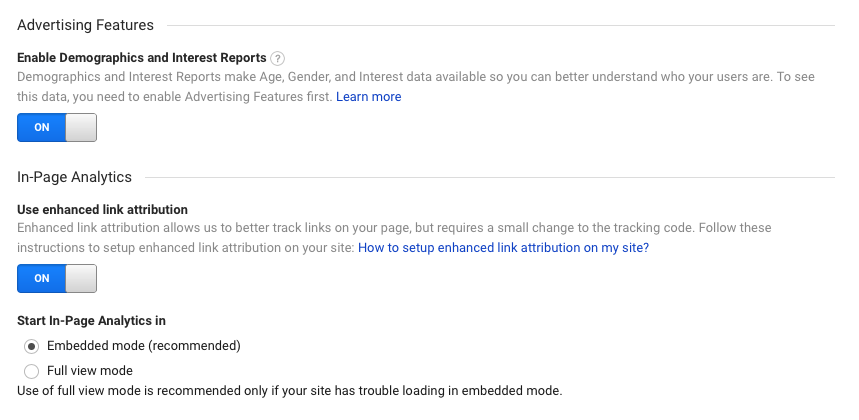

Google will craft campaigns on any other display based on demographic and categorical interest data for visitors we have set. If anything you need was done, click Save.

------

## **Step 4. Configure View-level settings**

Back to the View.

There are three sets of clean up reports and makes better understand visitor behaviour: 

### Part 1. Add Filters

You will exclude internal hits. Set up a filter that contains our office's IP address

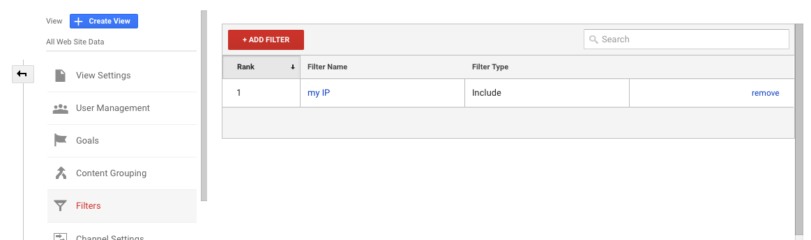

### Part 2. Exclude URL Query Parameters

Track where visitors come from, hold information about visitor's shopping cart, or pass messages from one page to another. 

Insert query parameters into View Settings. Scroll down to the Exclude URL Query Parameters box.


The field is a comma-separated and case-sensitive list. You don't need UTM parameters because Google automatically stripped from URLs. Add custom, unique parameters like the one highlighted below only.  

### Part 3. Activate Site Search

Site Search tells us exactly what our visitors want from the website. 

There are four main reports in GA.

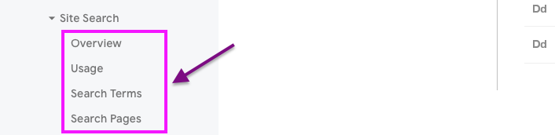

Turning on Site Search tracking with:

- Click View Settings
- Scroll down until find Site search tracking.
- Turn on the Site search settings
- Insert up to five parameters in the Query parameter field such as `q = search + term`, `advq = search + term`. Add both `q` and `advq` to the "Query parameter".


Checkbox Strip query parameters out of URL. It's mean we won't have to include search query parameters in Exclude URL Query Parameters list.

------

## **Step 5. Set up Goals as Success Key Metrics**

You need Goals settings for tracking conversion optimization and overall website performance.

GA providing [Goals default setup](https://conversionxl.com/blog/google-analytics-setup-101/#view) :

- Count once per session. If a single visitor fills out the same contact form five times in a session, they trigger only one Goal conversion.
- Track more than one Goal per session. If we set Goal 1 is "visit the contact form thank-you page," and Goal 2 is "watch a video," visitor who performs both actions during their session registers two conversions, one for each goal.
- Up to 20 Goals in a Single view and they're arranged in four sets of five Goals each.
- You cannot delete a Goal after it's created. You can change the criteria, but any conversion history for the Goal will remain.
- Allow pause data collection and hide Goals from your reports by switching the Recording setting to "Off."

To set up Goals, back to the Admin button. Find the Goals on the right side. Click to setup New Goal.

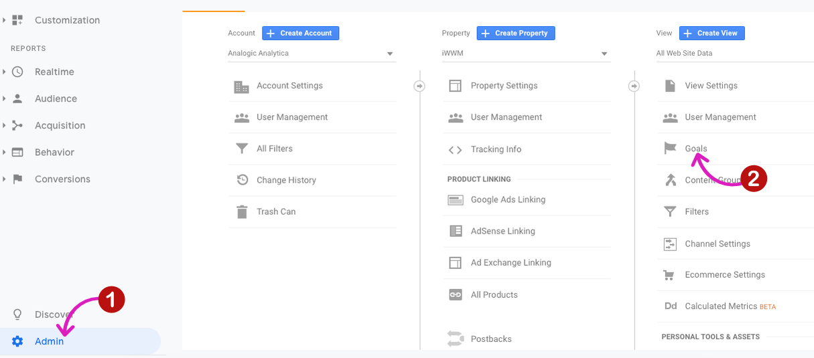

We will be taken into the new settings window. If we aren't sure where to begin, click "Import from Gallery." We will see the Goals setting, submitted by users and provided by Google. 

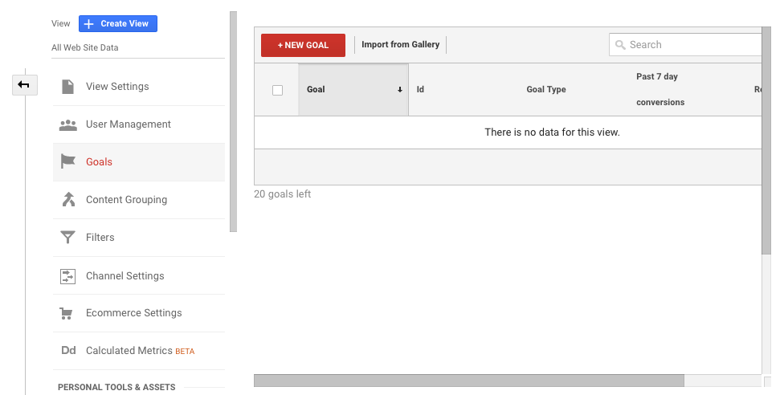

For the best choice, filter by category and rating, and sort the results based on rankings.


The Goals setting that you see will import multiple elements:

- Dashboards
- Custom reports
- Segments

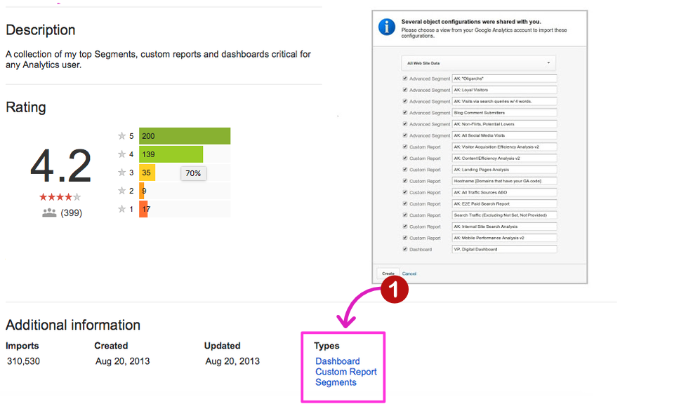

If we want to create a Goal of ourself, click on "+ New Goal". There are nine Goals or Custom Goal Templates: 

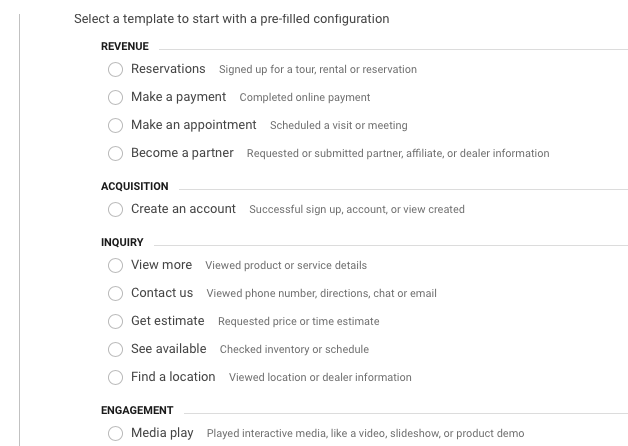

Choose "Template" and fill the Goal Name and Type. There are four types:

- Destination. A URL on a website that a visitor must hit, like a thank-you page.
- Duration. A length of time our visitor's session must last.
- Pages / Screens per session. A number of pages per visitor must view per session.
- Event. A visitor must complete an action that triggers an Event.


As a sample, select Duration to measure content engagement. Toggled to "Yes", if we have Value for the Event. Toggled to "No", If not. 

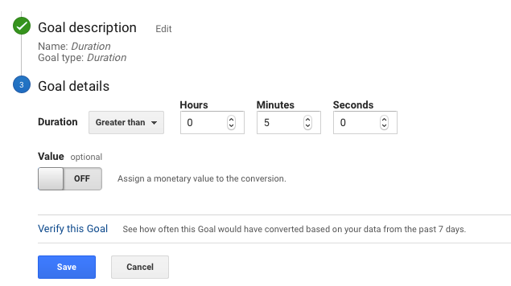

Click Verify this Goal. These settings will show the conversion rate based on the last 7 days of data.


Click Save. You're done! 

As you can see, set up Google Analytics is not only about adding Tracking Code to your website. This is about how to make the analysis results easy to read and understood.