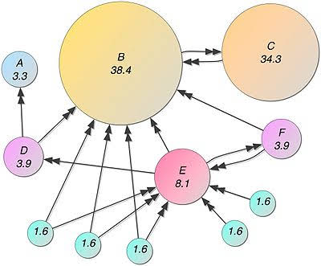
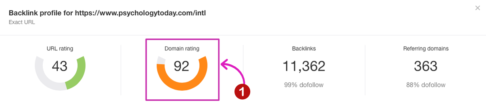
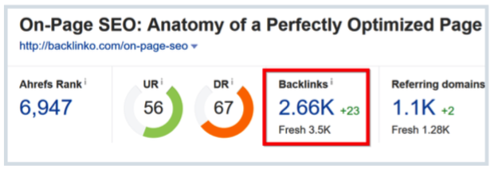
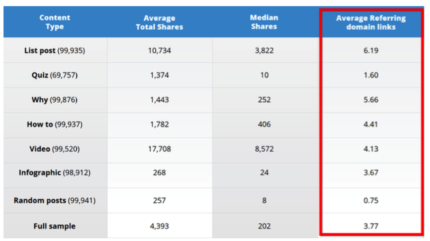
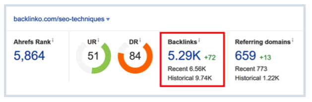
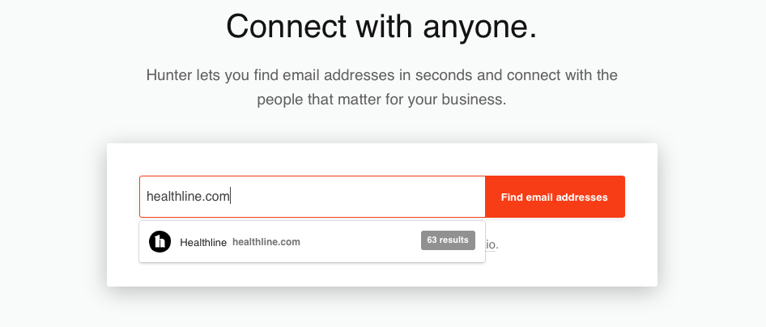
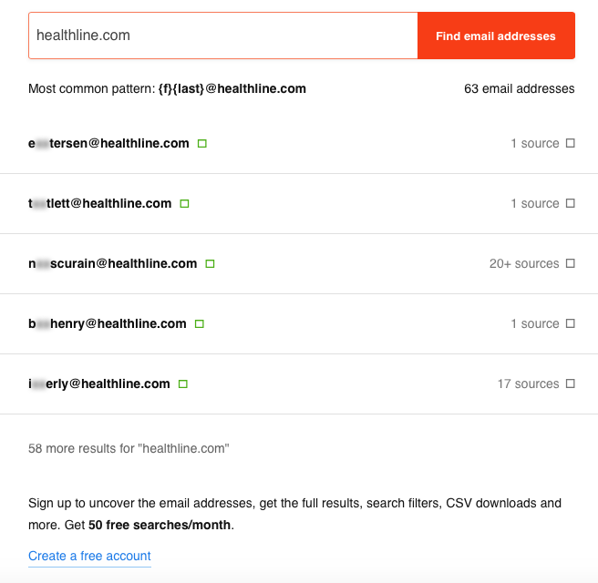

Link building makes a website still alive. I'm so excited to write about it. As you know about SEO, link building is a part of the hundred SEO tips. So, why I choose the link building first?

I build this website this month (July 2019). There are 4 or 5 content only. So, I write the most important about SEO first. Before I dive SEO strategies in deep, link building would be an entry point. This article cover some topics.

<div class="toc-master">
  <div class="toc-articles">
    <h3>Table of Content</h3>
    <ol>
      <li><a href="#search-engine-success-factors">Search Engine Success Factors</a></li>
      <li><a href="#link-building-fundamentals">Link Building Fundamentals</a></li>
      <ul>
        <li><a href="#a-high-quality-links">High-Quality Links</a></li>
        <li><a href="#b-content-marketing">4 Styles Content Marketing</a></li>
      </ul>
      <li><a href="#googles-valuation-of-links">Google's Valuation of Links</a></li>
      <li><a href="#advanced-link-building">Advanced Link Building</a></li>
      <ul>
        <li><a href="#a-black-hat-links">Black Hat Links</a></li>
        <li><a href="#b-link-building-strategies">5 Types of Link Building Strategies</a></li>
      </ul>
    </ol>
  </div>
</div>

------

## **Search Engine Success Factors**

Are you ready to grow faster? These are the shortcut. Search engine factor is a compass for SEO Specialist, maybe blogger too.

The point is, search engine factors contains many factors. They work in combination. No single SEO factor will guarantee your site being the top in search engine rankings.

From 200 [Google search factors](https://searchengineland.com/schmidt-listing-googles-200-ranking-factors-would-reveal-business-secrets-51065), I took in part only. Just 35 factors appear in here, according to [Search Engine Land](https://searchengineland.com/guide/seo/types-of-search-engine-ranking-factors).


The result of 35 factors are 3 category:

1. [On-the-page SEO](#INTERNAL_LINK#/post/9). Contains a type of content, HTML clues, site architecture, and data structure.
2. Off-the-page SEO. Take up link building, trust, shares, and content engagement. The purpose of Off-page is getting a positive reputation from others.
3. Violations. The tactics to manipulate a search engine about the site’s true relevancy and authority.

The key success in Google search result is helping the visitor. It's suitable with Google mission. Google made to help people finding trusted and [high-quality information](https://www.google.com/search/howsearchworks/mission/). So, make sure whatever you do, it's in Google rules. 

I will write about 3 categories above next time. At this time, we learn about Link building first as an entry point.

------

## **Link Building Fundamentals**

Link building is the process of getting trust from another website. If another website trust with us, our website will be their reference. When this role is happening, our website gets high-quality referral traffic and increase site authority. 

Finally, the website would be number one within the Gooogle search result.


As you have seen above, link building is a part of SEO Off-page strategies. It's mean, success at off-page strategies makes our website visible within the search result. Follow this way before you being number one in Google result through link building strategies:

### a. High-Quality Links

The first role of link building is Google seen high-quality links only, not quantity or low-quality links. Google see a difference between a link from an authoritative, small, or newly website. 

The high-quality links would improve organic rankings without violating Google guidelines. You could identify the links before. Then, make sure the link come from a high-quality website. Here's how to find it:

#### **Authority of the PageWhat is it?**

It is how Google ranks web pages in search engine results. According to Google:

```
Web Pages Rank works by counting the number and quality of links to a page. If the web page receives more links from other websites, Google would be web page as important and valuable.
```

Look at the illustration:



A link from the high-authority page is so significant and powerful for a website. Know the web page is high-authority using Ahrefs. Go to [Ahrefs](https://ahrefs.com/backlink-checker) and look at the URL rating.


The higher rating score is better than the site with a lower score.

#### **Authority of the Site**

A high-quality link comes from the domain’s sitewide authority. So, what it is? 

[The site authority](https://searchenginewatch.com/sew/how-to/2429817/what-is-an-authority-website-and-can-i-become-one) is a trusted site. It's mean, the site is trusted by:

- Users,
- Industry experts,
- Other websites,
- Search engines.

Who is the trusted site? They are The Guardian, BBC, The Huffington Post, as well as other industry blogs.

Ahrefs could help us about it. Go to [Ahrefs](https://ahrefs.com/backlink-checker) and look at the DomainRating.



The higher rating score is better than the site with a lower score.

#### **Relevancy of the Site**

A high-quality link isn't page and site authority only. The link is expected to bring the visitor go to the website. According to [ex-Googler](https://backlinko.com/link-building):

```
“...getting a link from a high PageRank page used to always be valuable, today it’s more the relevance of the site’s theme in regards to yours, relevance is the new PageRank.”
```

A link comes from relevancy site would impact within Google result and makes your visitor grow naturally. Much more every day. It's sound better.

*Example:*

If your website is about Bodybuilder. Make sure the link come from SuperProf.co.uk, Crazybulk.com, and as well as similarity it.

#### **Link Co-Citations**

Co-Citations is like as “baby anchor text”. The baby anchor text is the words and phrases around the link.

Google would identify the text around the link as clues about what your page is. You can add the words and phrases around the link.

Here's the Co-Citations illustration:


### b. Content Marketing

Content marketing is a weapon for link building. They're the reason why a visitor stays and return on your website.

#### **Visual Assets**

It's the most favourite content marketing. According to Jesse Mawhinney from [Hubspot](https://blog.hubspot.com/marketing/visual-content-marketing-strategy):

```
When people hear information, they're likely to remember only 10% of that information three days later. However, if a relevant image is paired with that same information, people retained 65% of the information three days later.
```

If you create a content marketing, the visual asset is the first.

Visual assets are:

- Images
- Diagrams
- Infographics
- Charts and other visual-oriented pieces of content

In facts, [Backlinko](https://backlinko.com/on-page-seo) received 2.5 thousand link building on her content.



#### **List Posts**

List-post is the next most favourite content. It's a numbered list of tips, techniques, reasons, myths, and about anything.

Why? List posts loved by our brain. These are providing a ton of value, result, and specific within single content. [BuzzSumo](https://backlinko.com/link-building) analyzed 1 million articles and found:



How much link you get? Say thanks to [Backlinko](https://backlinko.com/link-building). The list-post has over 5,000 links:



#### **Research and Data**

Be a trusted website. Make something the first and most newly. It's so hard and challenging. But, high-quality links will back to you quickly. The effect is, most of the blogger make you blog reference.


Before we make a decision, we need statistics and data. So these highly-linkable.

How to produce content like this? Insert the new data from industry studies, surveys or original research into your content.

#### **In-Depth Guides**

Loveable content by me.

I must create a comprehensive content and covers everything about a topic. Complete, details, and deep are the depth content requirement. But, the result so happier:


Generally, the depth content contains multi-chapter and sometimes will be updated. Even though has to long and comprehensive, make sure the content cover super-important words and sentence only.

------

## **Google's Valuation of Links**

Getting many links isn't good news. 

Google invented PageRank which different from existing [ranking algorithms](https://moz.com/blog/20-illustrations-on-search-engines-valuation-of-links). In the past, the website will be number one on Google research because:

- All of the links are equal
- Receiving a lot of links make the website being number one (high rank)
- The important pages cast more valuable than the low quality-page

Nowadays, Google develope their product more innovative. They have new page quality metric, such as:

- Anchor text,
- Topic-modelling,
- Content analysis,
- Trust signals,
- User engagement indicators,
- Provide more to deliver better,
- Make better results.

Because of GoogleRank updated, here [20 Google's Valuation of Links](https://moz.com/blog/20-illustrations-on-search-engines-valuation-of-links).

------

## **Advanced Link Building**

The main link building is, someone mentions our brand (or link) into their site. Unfortunately, we eat our patience and sometimes did even a mistake. 

It's normal and human nature. 

So that the mistake doesn't come back, learn the high-quality link building strategies and make it a practice in real-live. Here we go:

### a. Black Hat Links

[Google suggests](https://support.google.com/webmasters/answer/35769?hl=en) avoiding this way.


What is it black hat links? 

Manipulate search engine to believe our site is relevant and authoritative. I didn't recommend using this tactic because it harms on our website.

Avoid the unnatural links (shady guest posting and blog comment spam) before you get Google Penguin penalties.

What is Google Penguin? According to [Wikipedia](https://en.wikipedia.org/wiki/Google_Penguin):

```
...decreasing search engine rankings of websites that violate Google's Webmaster Guidelines by using now declared black-hat SEO techniques involved in increasing artificially the ranking of a webpage by manipulating the number of links pointing to the page. 
```

### b. Link building strategies

Make link building works! 

Link building is the most popular strategies in Search Engine Optimization. But, the process is a confusing and [long-term effect](https://moz.com/beginners-guide-to-link-building).


In this time, I wanna share some link building strategies that easy to doing by anyone. Let's go.

#### **Pre-Curated target**

Finding a high-quality link building target is hard. You know that and it's a challenge.

Nowadays, good news has come. 

Using pre-curated content is the best shortcut that can do now. Why does this work so well? The reason is, pre-curated content has many query and valuable anchor-text to pointed on your website. 

Took the example:


As you can see, the articles above have 27 subtopics. Every topic contains many keywords. It's mean, these have so much the high-quality link.

How do point these keywords to your website?

Type one of this script:

```
“Best [topic] blogs”
“List of [topic] blogs”
“Keyword” + inurl:links
“Keyword” + “helpful resources”
“Keyword” + “useful resources”
“Keyword” + “useful links”
```

Save the URL list on Google Sheet or similarity
Open [Ahrefs](https://www.healthline.com/nutrition/27-health-and-nutrition-tips) and put the URL in the field one by one
Make sure the page has a decent URLRating of 12.


Send an email to site owner politely about the best part of your content and what will the benefits site owner get.

If you aren't catching the site owner email, try email hunter tools likes [Hunter.io](https://hunter.io) or [VoilaNorbert](https://www.voilanorbert.com). 

It's easy to use:

Go to [Hunter.io](https://hunter.io) or [VoilaNorbert](https://www.voilanorbert.com). Type the domain target in the search field



And boom!!



To see all of them, you must register. If the email address is in your pocket, it's time to send an email.

#### **Link reclamation**

You will reclaim links or the anchor text with a query and pointed it to your site. There are various link reclamation strategies:

*Non-linking Brand Mentions.* Sometimes, someone writes about your website without a link. It's easy to send a notify for web owner. Use [Mention.com](https://mention.com/en/) or [Google Alerts](https://www.google.com/alerts). These tools will send notifications when someone writes about your brand.

*Non-linking Images.* That's digital asset power. Make sure that the digital asset is yours. Use [TinEye](https://www.tineye.com) and [Google’s Image Search](https://www.google.co.id/imghp?hl=en) to find who publish your images. Then, send an email for attribution politely.

#### **Broken link building**

This is the most favourite link building strategies all the time. We can get a high-quality link building faster. Why? Because this gives valuable information for a website owner. 

Here how to do it:

- Install [Check My Links](https://chrome.google.com/webstore/detail/check-my-links/ojkcdipcgfaekbeaelaapakgnjflfglf) or [LinkMiner](https://chrome.google.com/webstore/detail/linkminer/ogdhdnpiclkaeicicamopfohidjokoom) on Chrome. These tools quickly find broken links on any page.
- Find lots of outbound links on pages. If the page more links have, you will find many broken links.
- Check the broken linkssend email to the site owner about their broken link.

#### **The skyscraper technique**

This technique has 3 points: content with link-worthy, create something even better, reach out to the right people.

We have to make cleary about "Create something even better" point. "Better" it's mean:

- Make it longer or more
- More up-to-date
- Better readable and designed
- More valuable

And then, it's time to show up! Go to [Majestic SEO](https://majestic.com/reports/site-explorer) or [Ahrefs](https://ahrefs.com/backlink-checker). Type your competitor’s content into the field. Find the backlink even pointing to your competitor's. Send an email to site owner politely about your content.

#### **Guestographics**

Guestographics is a combination of a guest post and infographics. How did it work?

Same with guest post generally, you will ask the website owner to display your post. The difference is, the main content is infographics. This link building strategy successfully did by Repairly.co.id.


How to do that?

- Go to [Mention.com](https://mention.com/en/) or [Google Alerts](https://www.google.com/alerts) and find the best content ever about.
- Save the page URL and its email.
- Create an infographic. Make sure your infographic is more awesome and comprehensive than other infographics.
- Send an email to site owner politely about your content.

Build the high-quality links is hard. Sometimes, you are give up. But, these are more effective to make website visible even become number #1 on Google result.

So, make sure your energy and mind still on :)