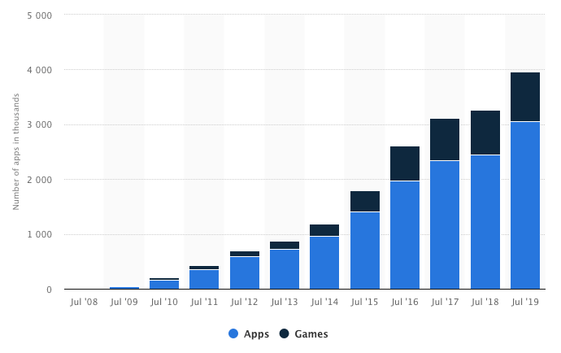
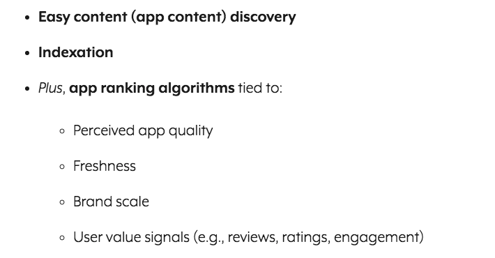
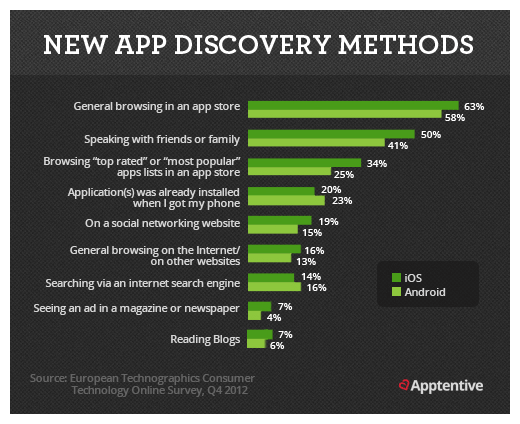
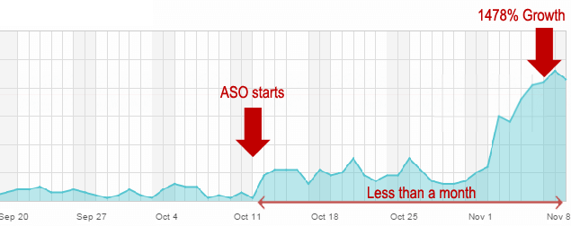
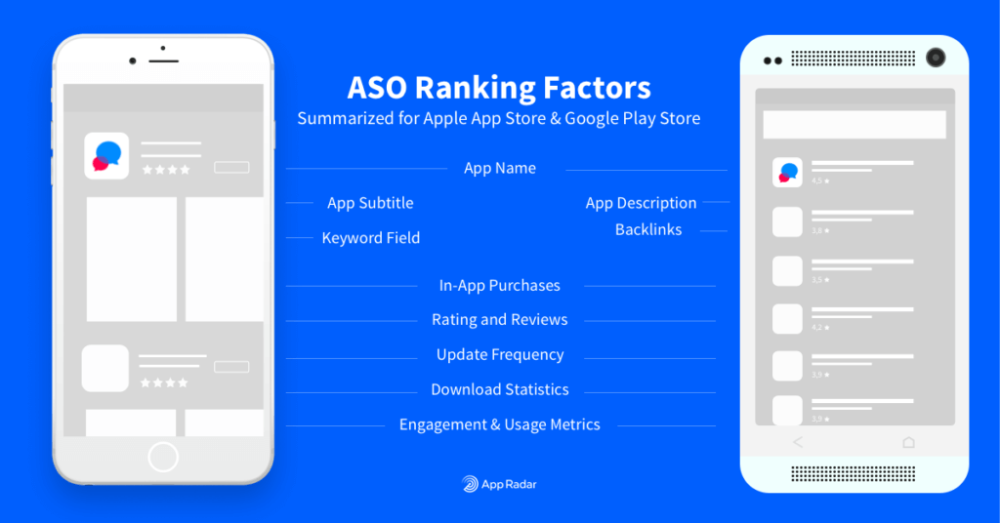
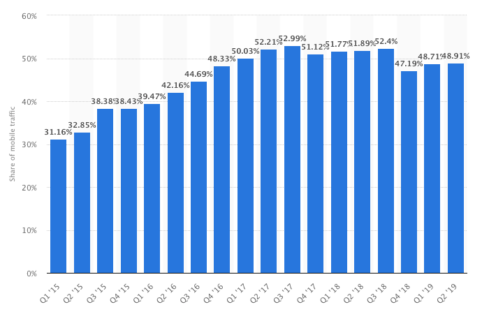
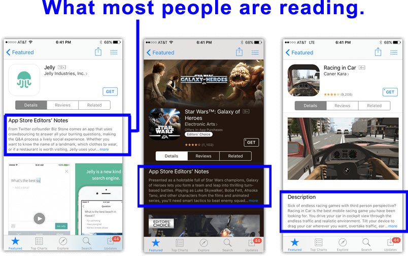

In a few days ago, I just finished the article of [google algorithm for SEO](https://gtag.dev/google-algorithm/). I guess that's enough to learn GoogleBot is. But I can't stop to learn. Take a step up anytime and anywhere immediately. 

The reason all of that is, I stumbled on the page about the [app store algorithm update](https://incipia.co/post/tag/app-store-algorithm-update/). I never think about that till I decide to write it in-depth.

Thus, why is app store optimization crucial for SEOs? What's the benefit the business will get? How to do that? Pay attention to start here:

  

    <h3>Table of Content</h3>
    <ol>
      <li><a href="#mobile-apps-business-grow">Mobile Apps Business Grow</a></li>
      <li><a href="#aso-vs-seo-for-app">ASO Vs SEO for App</a></li>
      <li><a href="#app-store---play-store-algorithm">App Store & Play Store Algorithm</a></li>
      <li><a href="#mobile-web-visibility">Mobile Web Visibility</a></li>
      <ul>
        <li><a href="#software-app">Software App</a></li>
        <li><a href="#app-packs">App Packs</a></li>
      </ul>
      <li><a href="#mobile-app-seo-strategy">Mobile App SEO Strategy</a></li>
      <ul>
        <li><a href="#keyword-research">Keyword Research</a></li>
        <li><a href="#collect-positive-ratings-and-reviews">Collect Positive Ratings and Reviews</a></li>
        <li><a href="#get-quality-backlinks">Get Quality Backlinks</a></li>
      </ul>
    </ol>
  

---

## Mobile Apps Business Grow

On the [second quarter of 2019](https://www.statista.com/statistics/276623/number-of-apps-available-in-leading-app-stores/), the number of apps available for download in leading app stores is 2.46 while Apple's App Store is almost 1.96 million.

If you saw the next of data, the number of apps in the [Apple App Store from 2008 to 2019](https://www.statista.com/statistics/268251/number-of-apps-in-the-itunes-app-store-since-2008/) grow up significantly.

According to Statista, [consumers downloaded 178 billion apps](https://www.statista.com/statistics/271644/worldwide-free-and-paid-mobile-app-store-downloads/) for 2017. That number will grow up to 205 billion in 2019 and 258 billion in 2022. This number increase to over 45 per cent within five years.

How about business? How much the App Creator will get? Their revenue will go to [$188.9 billion by 2020](https://www.statista.com/statistics/269025/worldwide-mobile-app-revenue-forecast/). In a few years ago the total revenue of mobile app downloads, advertising, and in-app purchases in 2016 was $88 billion.

You can see the stat, the numbers over four years increase 113 per cent. 

These numbers reflect the consumer's behaviour. They are becoming more attached to their mobile devices and more comfortable making in-app purchases.

That app mostly generates a profit through 2 ways:

* Subscriptions
* In-app purchases

And the list of [apps make the most money](https://www.androidpit.com/which-applications-make-the-most-money) is:

* Spotify
* Line
* Netflix
* Tinder
* HBO NOW
* Pandora Radio
* iQIYI
* LINE Manga
* Sing! Karaoke
* Hulu

That is the list of apps with the highest sales revenue in 2016 (Android and iOS combined) internationally. None the less, the consumers have variation apps to choose as they want.

You knew, there are more free apps than paid apps available on the market. That's how to market challenge works.  

The revenue potential is still alive. If you think the freemium apps ruins the apps market. Sensor Tower predicts that between 2018 and 2023 the [App revenue forecast](https://sensortower.com/blog/sensor-tower-app-market-forecast-2023) is

* Global Google Play: $25B to $60B
* Global App Store: $47B to $96B

As an App developer or owner, this fact sounds good. On the other hands, getting your app discovered was the biggest issues you will facing today. 

Because of that, you have to understand the various methods of marketing for making Apps more visible and easy to found.

---

## ASO Vs SEO for App
For the first, you must know the difference between ASO and SEO Mobile first.

App Store Optimization (ASO) is often referred to as “mobile SEO” (Search Engine Optimization) or “SEO for mobile apps”. This analogy is pretty handy to understand the principle of both.

ASO and the “SEO for App” life in two different ecosystems and have many differences. The main difference is:

* ASO is about ranking an app in a particular app store.
* SEO for App is about ranking a website or content landing page on a search engine.

In the theory:

ASO improving the [visibility](https://www.business2community.com/mobile-apps/aso-vs-seo-stand-battle-optimization-01690089) of a mobile application in an app store. This strategy ensures an app appears as the top list on the search results when the consumer's type-specific keyword search query or within a category.

The goal of ASO is to drive more traffic to the app’s page in the app store. And expected, a searcher will take action downloading your app. 

According to A Complete Guide to [App Store Optimization](https://www.searchenginejournal.com/app-store-optimization-how-to-guide/241967), the goal of ASO is:

* Increased brand exposure.
* Positive app reviews and ratings.
* Audience engagement.
* Additional marketing channel diversification.

Also, App stores are a closed site search engine and rely on:

Based on these, there are [two main rankings of ASO](https://www.apptweak.com/aso-resources/aso-vs-seo) are On-metadata and Off-metadata.

On-Metadata:

* App title (iOS & Android)
* App subtitle (iOS) and short description (Android)
* App description & keyword density (Android)
* iTunes Connect Keyword Field (iOS)
* In-app purchase(s) (iOS)
* Publisher name (iOS & Android)

Off-Metadata:

* Total number of downloads (iOS & Android)
* Conversion rate (iOS & Android)
* Retention rate & engagement rate (iOS & Android)
* Reviews & Ratings (iOS & Android)
* Crash rate (iOS & Android)
* Backlinks (Android)

The single reason why ASO is the most important cause:

> [Over 63% of app downloads](http://techcrunch.com/2013/04/17/forrester-app-discovery-report/) are coming from general app store browsing and direct keyword searches.

How about SEO for App?

SEO for App improving the visibility of a website or a webpage (like an app webpage ) and take the website appears higher on the search results.

As you knew before, the search engine was built by algorithms and using ranking factors to put websites and webpages. The main algorithm that works for SEO for App is [Mobilegeddon Algorithm](https://gtag.dev/google-algorithm/#mobilegeddon-algorithm).

> If the site pages aren’t mobile-friendly, the mobile traffic from Google Search may be a significant decrease. But once your site becomes mobile-friendly, the pages will automatically re-process (i.e., crawl and index).

Nowadays, mobile search has now a growing priority for app developers and marketers. Even more, Google [updated the Mobilegeddon Algorithm](https://www.searchenginejournal.com/google-algorithm-history/mobile-friendly-update/) user behaviour and trends in the market.

The main ranking of SEO for App is On-page SEO (HTML) and Off-page SEO. 

On-page SEO:

* Title tag `<title>`
* Description of page `<meta-description>`
* Titles in page `<h1>`; `<h2>`;`<h3>`
* Content of page `
`
* URL structure
* Image alt text

Off-page SEO:

* Total number of unique visitors
* Conversion rate
* Bounce rate
* Response time
* Crash rate
* Backlinks: quantity & quality of the links to the domain

It is not like ASO that the result will come up among 3-5 weeks (Apple App Store) and 4-6 weeks (Google Play Store), SEO is more challenging and eating a lot of time & resources. 

You might need 4 - 6 months to see the SEP for App result. SEO is not a one-shot or magical trick. You must keep attention to various factor such as:

The basic flow for SEO for App is like this:

Maximizing SEO --> more impressions & conversions --> more organic visitors --> more business.

Although different, ASO and SEO for App has one bridge to connect their goal, that is the GOAL of them.

According to How to Get [Mobile Apps Ranked In SERPs](https://searchengineland.com/5-seo-tips-to-get-mobile-apps-ranked-in-serps-104595): 

> Higher Google visibility grow up app downloads. More downloading drives higher App Store popularity. They will develop business revenue in the end.

Based on [App Store SEO Study Case](https://www.meatti.com/blog/app-store-seo-increase-app-downloads), App Store SEO helped boost app downloads by 1478% in less than a month. It's wow result, you know!

Because of this, you need to ensure both strategies used as simultaneously well.

---

## App Store - Play Store Algorithm

What is the reason I write this topic? 

I'm so excited at [App Store Algorithm](https://incipia.co/post/mobile-app-marketing-industry-updates/app-store-keyword-algorithm-update-2-23-18/). In fact, the algorithm will update time by time. One of the impact because of the algorithm update is the missing of Bukalapak on [Google Play Store](https://www.thejakartapost.com/life/2019/09/19/we-apologize-for-the-inconvenience-bukalapak-goes-missing-from-google-play-store.html).

For your information, Bukalapak is one of Indonesian eCommerce unicorn. For 2019, they claim that going on $5b in [GMV for 2019](https://www.techinasia.com/bukalapak-claims-track-5b-gmv-2019).

What's the matter for Bukalapak?

It because Google updates the [Developer Content Policy](https://play.google.com/about/developer-content-policy-print/). They do not allow applications that facilitate the sale of tobacco (including electronic cigarettes) or encourage irresponsible use of alcohol or tobacco.

It's clear, Algorithm will change any time. And the [basic rank factors](https://appradar.com/academy/bonus-chapters/app-store-ranking-factors/) you can optimize is:

---

## Mobile Web Visibility
Based on [Mobile App Marketing Insights](https://think.storage.googleapis.com/docs/mobile-app-marketing-insights.pdf) by Google, there are 27% of users who discover apps in search engines with their mobile devices. 

Because of that, you can't ignore the mobile search opportunity because the [mobile search behaviour](https://www.statista.com/statistics/277125/share-of-website-traffic-coming-from-mobile-devices/) grew faster. 

In the second quarter of 2019, Statista presents the stat that 48.91 per cent of global internet traffic comes from mobile devices. 

Google reported that 1 of 4 app users discover apps
through search engines. 

To maximize visibility and get more visitor who installs the app, you can optimize various Google features:

### Software App
This feature contains an app name, number of ratings, average rating, and app description. Sometimes taken from a short description or long description, as for Android apps.

The first line of app description and an install button. By clicking the install button, the user taken to Google Play for installing the app.

### App Packs
App Packs include 3 or 6 apps (or more, then there is a possibility to expand this list) relevant to the search keyword. 

This is usually featured at the top of the SERP, however, can also appear in the middle or the end.

Depending on what a user using to looking for, the result will come. That is because of its result based on device-specific.

* When people searching on Android devices, the results will be from the Google Play Store
* When people searching on iOS devices, the results will be from the Apple App Store

---

## Mobile App SEO Strategy

How to higher the app ranking on SERPs? It will be the same thing as SEO Website.

### Keyword Research
Keyword research is the king. 

Tune (Formerly MobileDevHQ) show that using keywords in your title can result in up to a 10.3% boost in rankings.

Use low or medium difficulty keywords which have the most traffic (several searches). Find the right keywords using Google Keyword Planner or some third-party tools. 

Place the keyword you got in the title and description. But don’t stuff every keyword into your title or app. It will look spammy. Type a good balance between keywords and branding.

The best App title format you can replicate like this:

* App Name Format. Use the format “Brand Name – Keywords” or “Brand Name: Keywords”.
* Brand Name: Use 23 characters or less for optimal presentation on every device.
* Total Length: 30 character limit, use more than 20 characters to include a few relevant app store keywords after a brand name.

How about app description?

* Play Store: Keyword placement into the title and description up to 5 times. 
* The App Store. Put keywords in App Title, Subtitle and Keyword fields is waste of keyword space.

You need to pay attention to the [first few sentences](https://www.meatti.com/blog/app-store-seo-increase-app-downloads#AppName) because 5% of users will click the “read more” button below on Google Play and 2% on Apple’s App Store.

### Collect Positive Ratings and Reviews
User ratings and reviews are important things for ASO or SEO. The reason is:

Google tends to rank higher apps by reviews and rating.
They will crawl user reviews to identify possible keywords.

And you need to know, Google scanned some keywords from comments and make the app higher using it. 

> The better your rating is, the more relevant the app stores consider your app, and the higher your position in the rank is.

### Get Quality Backlinks

The role is, the domain strength is the key here. More quality backlinks make your app better in search results.

You can promote the app store in mobile web search through app store listing, or a download page. Mention the best features and benefits will encourage your web users as well.

The trigger for you, what's the best backlink strategy for a mobile app?

* Share the quality screenshots in social media 
* Persuasive Media & PR strategy
* Sponsor an event
* Become a speaker at an event
* Create a spectacular infographic
* Startup or business directories
* Go Local Non-profit

There is so many mobile app SEO. I've shared a just part of it. This strategy will optimise with offline strategy. 