How do you spend playing smartphone? 

In 2019, the average US adult will spend 2 hours, 55 minutes on a smartphone. That is a [9-minute increase from 2018](https://www.emarketer.com/content/us-time-spent-with-mobile-2019). They will spend more time engaging with their mobile devices than watching TV.

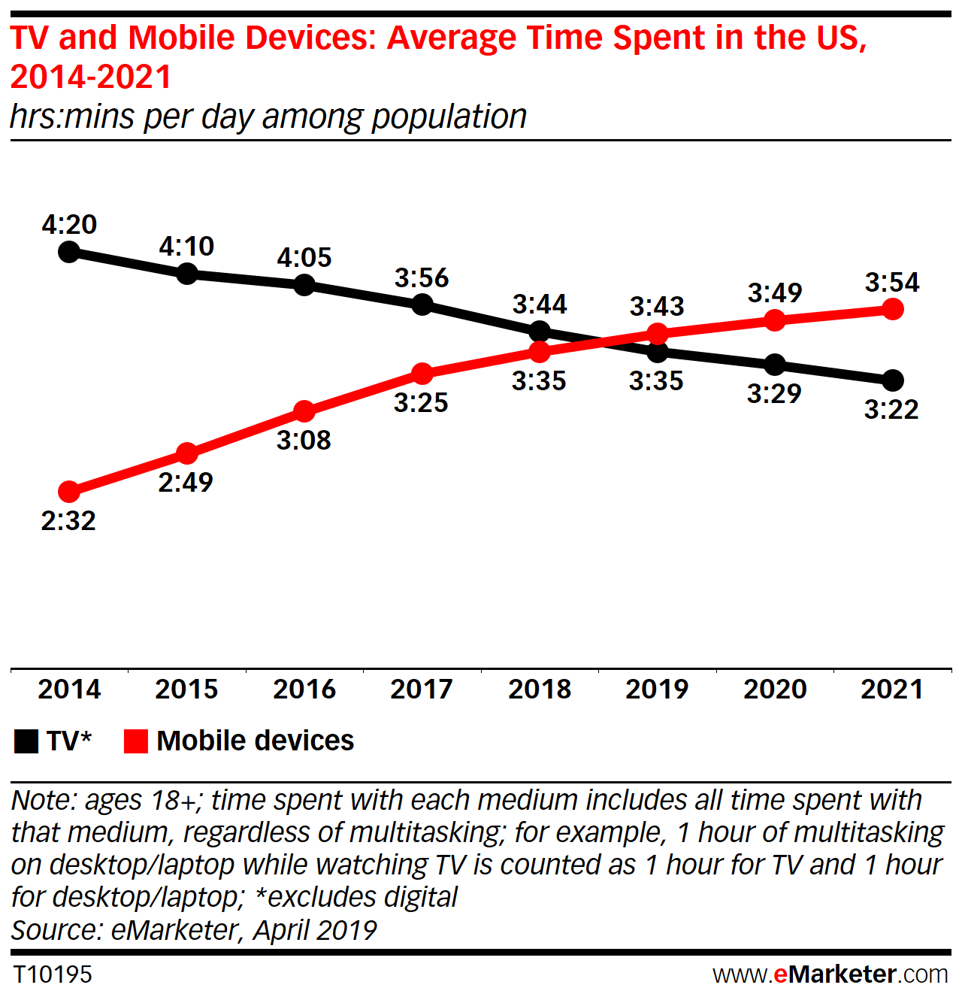

Based on 11,000 of the RescueTime app users, most people spend 3 hours and [15 minutes on their phones](https://blog.rescuetime.com/screen-time-stats-2018).

Even more, most people lock on smartphone 58 times a day (30 of those during working hours)


But the sessions are short.  The fact is, 50% of screen time sessions start within 3 minutes of the previous one.

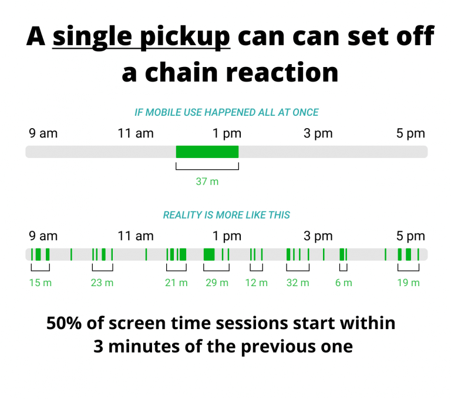

This is the fact of mobile user behaviour. People will depend on their smartphone in real life. Tragic but that is the opportunity for the mobile app business. 

This phenomena indirectly makes mobile app revenue grow more than [935 billion U.S. dollars](https://www.statista.com/statistics/269025/worldwide-mobile-app-revenue-forecast/) via paid downloads and in-app advertising.

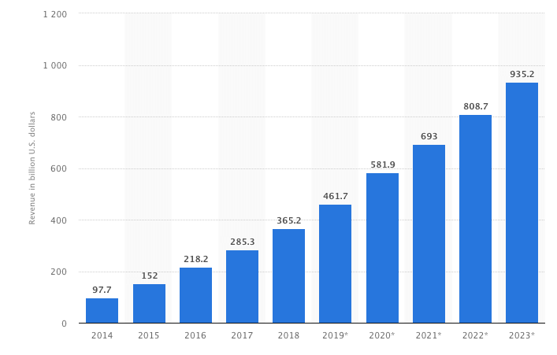

As you can see, the revenue will increase at least 100% between 2019 till 2023. 

This is the stat of the [mobile app ranking](https://www.statista.com/statistics/251096/fastest-growing-shopping-app-categories/) with the highest install and user base growth in 2018 btw.


Take a step in the next chapter.

<div class="toc-master">
  <div class="toc-articles">
    <h3>Table of Content <span class="toc-span-scroll">scroll see details</span></h3>
    <ol>
      <li><a href="#what-is-mobile-seo">What Is Mobile SEO?</a></li>
      <li><a href="#mobile-vs-desktop-seo">Mobile vs Desktop SEO</a></li>
      <li><a href="#googles-mobile-first-index">Google’s Mobile-First Index</a></li>
      <li><a href="#technical-seo-for-mobile">Technical SEO for Mobile</a></li>
      <ul>
        <li><a href="#separate-urls">Separate URLs</a></li>
        <li><a href="#responsive-design">Responsive Design</a></li>
        <li><a href="#accelerated-mobile-pages-amp">Accelerated Mobile Pages (AMP)</a></li>
        <li><a href="#canonical-urls-aka-relcanonical">Canonical URLs aka rel=canonical</a></li>
        <li><a href="#update-the-meta-name--viewport">Update The Meta Name = “viewport.”</a></li>
        <li><a href="#allow-google-crawl-everything">Allow Google Crawl Everything</a></li>
      </ul>
      <li><a href="#optimize-mobile-user-experience">Optimize Mobile User Experience</a></li>
      <ul>
        <li><a href="#fast-load-time">Fast load time</a></li>
        <li><a href="#scale-images">Scale Images</a></li>
        <li><a href="#clean-navigation">Clean Navigation</a></li>
        <li><a href="#remove-mobile-pop-ups">Remove Mobile Pop-Ups</a></li>
      </ul>
      <li><a href="#closing">Summary</a></li>
    </ol>
  </div>
</div>

---

## What Is Mobile SEO?
The practice of optimizing content for users on smartphones. This is how to achieve a better ranking for your web pages in mobile search engine results (SERPs).

This technique helps you to improve organic traffic, which is the traffic coming from mobile search results.

By the Statista, the [mobile search market increased 95%](https://optinmonster.com/mobile-seo/) in 2018.


Because of this case, the [mobile search result](https://www.searchenginejournal.com/seo-guide/introduction-to-mobile-seo) is the backbone of Google’s index at the smartphone. 

Nowadays, Google will display the desktop and mobile URL as different things.

---

## Mobile vs Desktop SEO

It isn’t enough to have a mobile-friendly site only. After the [Mobilegeddon Algorithm](https://gtag.dev/google-algorithm/#mobilegeddon-algorithm) comes up, Google will display the desktop URL for the desktop searches and the mobile searches get the mobile URLs.


This update took based on smartphone users fact. Nielsen discovers that 93% of smartphone users choose a mobile search engine before purchasing the product. They use it to research a product review.

According to [Mobile Marketer research](https://www.mobilemarketer.com/), some popular brands are founding more than 30% of their organic search traffic coming from mobile devices. 

Because of that, the search query volume was in mobile search grew faster. According to Google, there are 27.8 billion more queries performed on mobile than desktop in 2016.

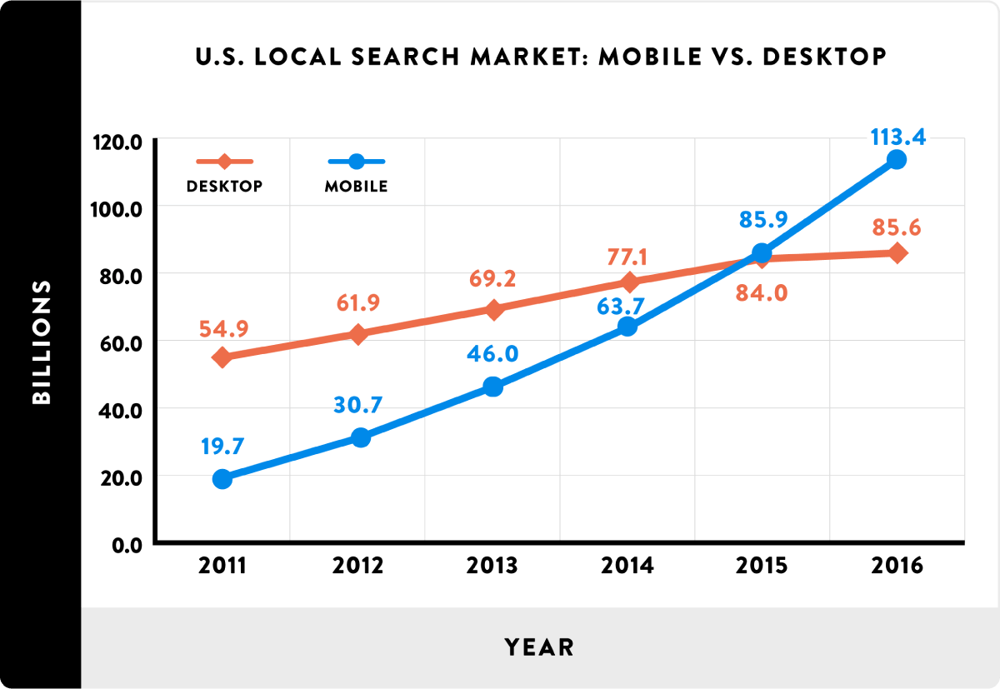

And then, look at 2019. The mobile search query volume leading than desktop as much as 79.6 billion.

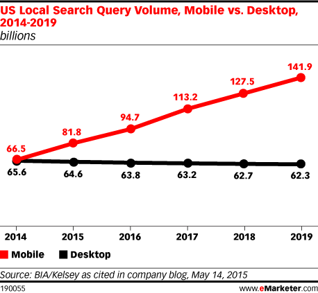

The [exploding of mobile searches](http://hitwise.connexity.com/070116_MobileSearchReport_CD_US.html) has come. By fact, 58% of all searches in Google are now using a mobile device.


Thus, mobile is the future of search. This being the reason for Google to updates better mobile search algorithm.

---

## Google’s Mobile-First Index

Nowadays, Google optimized for mobile users first. They rolled out its [Mobile-Friendly Update](https://webmasters.googleblog.com/2015/04/rolling-out-mobile-friendly-update.html) (Mobilegeddon).

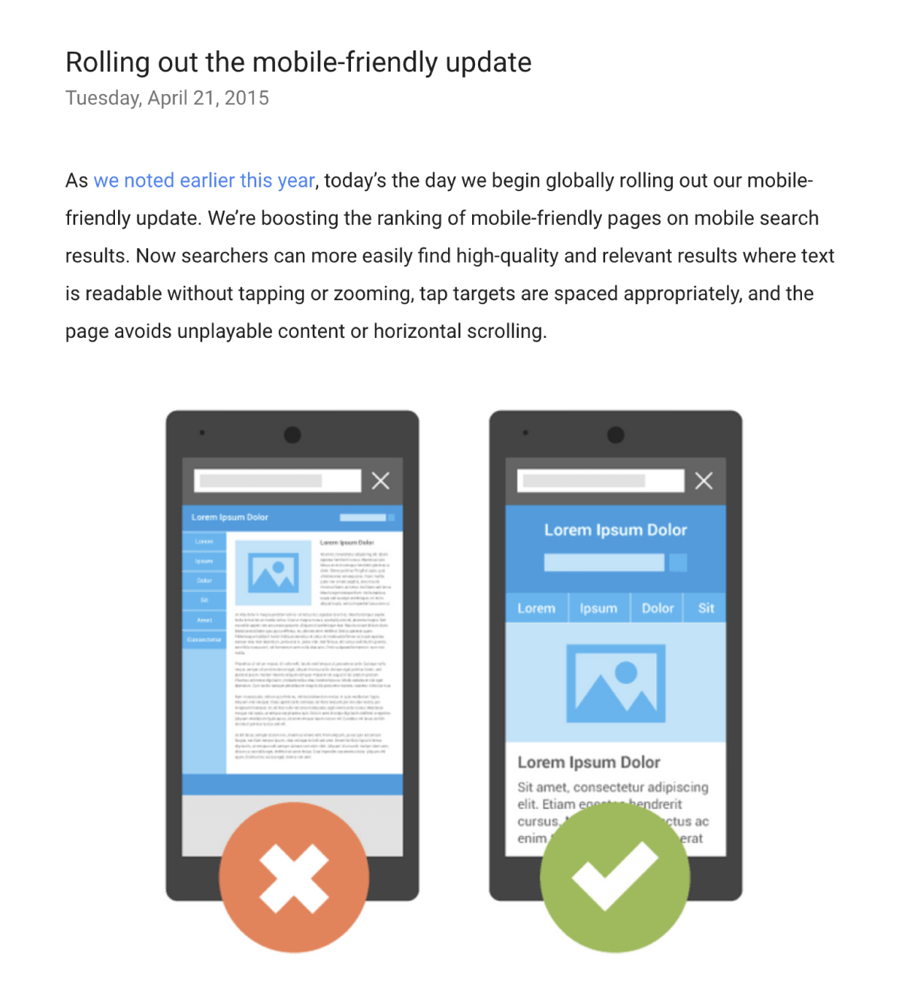

This update penalized the sites does not mobile-friendly. If you need a mobile search, consider the Mobile-First algorithm.

What Is that?

This algorithm used to ranks query in the search results based only on the mobile version of the page. Before this update, Google uses a mix of desktop and mobile results.


> If someone searched from an iPhone, Google would show them mobile results. And if someone searched for something on a desktop, they’d get “desktop results”.

But today is different. No matter what device you use, Google shows the results based on the mobile index.


The "Mobile device" means a smartphone only. Tablet does not a part of it.


[Google puts the tablet](https://developers.google.com/search/mobile-sites/mobile-seo/) in the Mobile device. Fortunately, these updates do not impact to mobile SEO.

> Mobile = Smartphones

---

## Technical SEO for Mobile
Implementing a mobile website isn’t hard or complicated technically. You have some options to configure a site for mobile.

### Separate URLs
You have a desktop version of your site and mobile version (“M.”) too.


Separate URLs become popular a few years ago. How about now? Not so much.

The reason is, “M.” sites have a host of SEO issues. You need multiple URLs for every piece of your content and so complicated for `rel=canonical` and `rel=alternate` tags. 

> You will learn more about `rel=canonical` and `rel=alternate` tags below

The solution to this problem is, serve content dynamically. All of your content is on the same URL but the site will serve the different HTML/CSS depend on the device using.

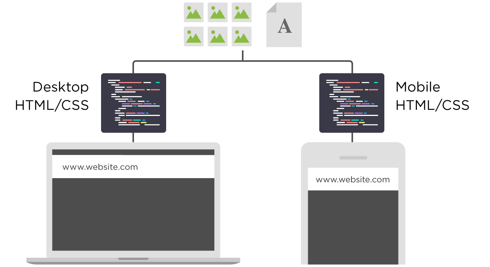

The reason why the dynamic is so better because:

* All of your content is on a single URL
* Minimal SEO headaches (no “rel=canonical tags”, duplicate content issues etc.)
* Insanely user-friendly
* No redirects

Dynamic serving is better for SEO. But it has issues. According to Google, [responsive design](https://developers.google.com/search/mobile-sites/mobile-seo/) is Google's recommended design pattern.

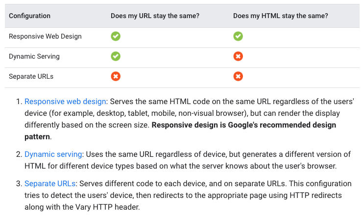

Read more about the responsive design below!

### Responsive Design
There’s a mistaken belief that if your site is responsive then it’s automatically mobile-friendly.

That is a false thing.

As you know, the responsive design presents the same website content from desktop to mobile (URLs, HTML, images, etc). 


But it does not always need by the visitor. Responsive design is Google preferred option for mobile SEO, but there is no ranking boost because of that.

Based on Appticles study, [responsive websites](https://www.smashingmagazine.com/2017/03/building-for-mobile-rwd-pwa-amp-instant-articles/) are the most common mobile-friendly used by 51.11 per cent of all websites in the study.


Thus, you need to optimize your responsive design for mobile SEO so that make your site stand out than other.

Implement the AMP version.

### Accelerated Mobile Pages (AMP)

Accelerated Mobile Pages or AMP is a Google-backed project designed as an open standard for any publisher to have pages load quickly on mobile devices. Here is an example:


Technically, [AMP](https://neilpatel.com/blog/google-amp-stories/) only allows for asynchronous JavaScript to run on pages. It means the JavaScript code won’t block any other code present on your site.

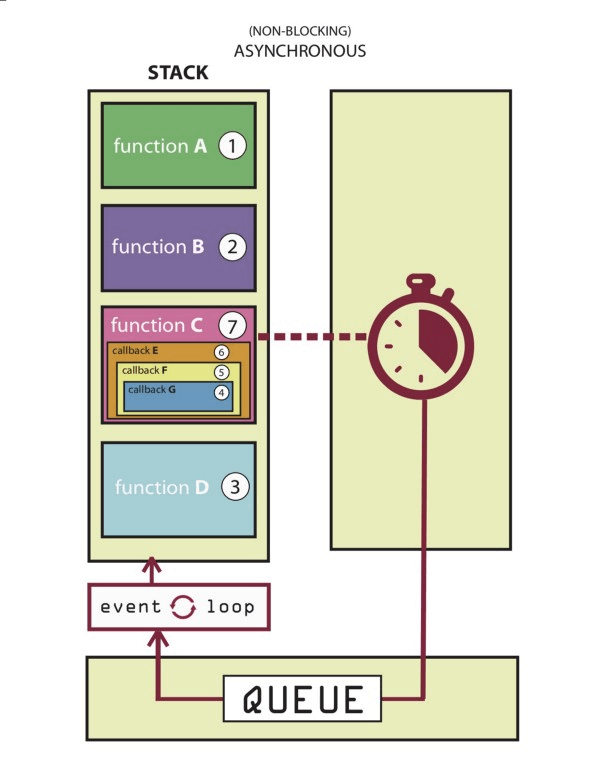

The benefit of AMP is, your site is more visible on SERPs. The page will appear as featured in the AMP carousel, above traditional Google search results.


And then, AMP giving you tons of opportunities to attract, engage and hold your viewers’ attention.

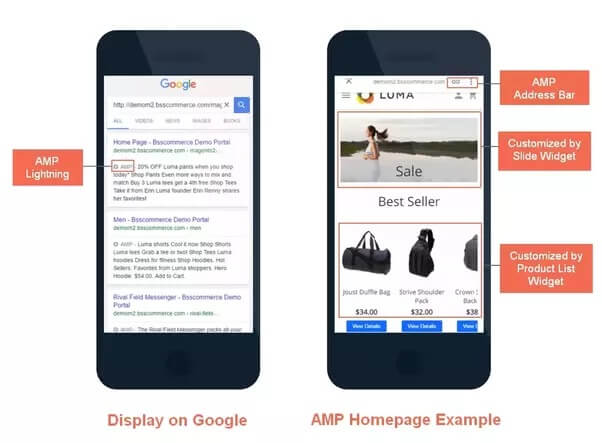

### Canonical URLs aka rel=canonical

Most people calling it the “canonical link”. The `rel=canonical` element prevent duplicate content issues. Let's look at a list of common duplicate content URLs.

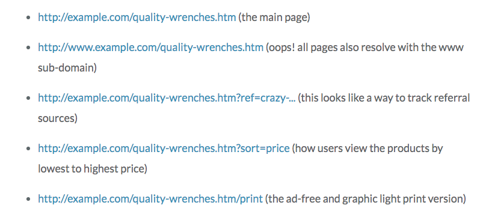

A canonical tag will inform to GoogleBot that the main page of these is `http://example.com/quality-wrenches.htm`. 

Place the canonical link in the header of all of the above pages.

```
<head>
  ...
  <link rel="canonical" href="https://example.com/dresses/green-dresses" />
  ...
</head>
```

At the real-life, the code looks like:

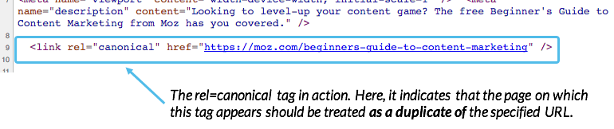

###  Update The Meta Name = “viewport.”
Add a viewport `<meta>` tag in the `<head>`.

```
<head>
  ...
  <meta name="viewport" content="width=device-width, initial-scale=1">
  ...
</head>
```

* The `width=device-width` is key-value pair sets the width of the viewport to the width of the device. 
* The `initial-scale=1` is key-value pair sets the initial zoom level when visiting the page.

This code means that the browser will (probably) render the width of the page at the width of its screen. 

If that screen is 320px wide, the browser window will be 320px wide, rather than way zoomed out and showing 960px (or whatever that device does by default, in lieu of a responsive meta tag). There are more attributes of [viewport tag supports](https://developers.google.com/web/tools/lighthouse/audits/has-viewport-meta-tag):

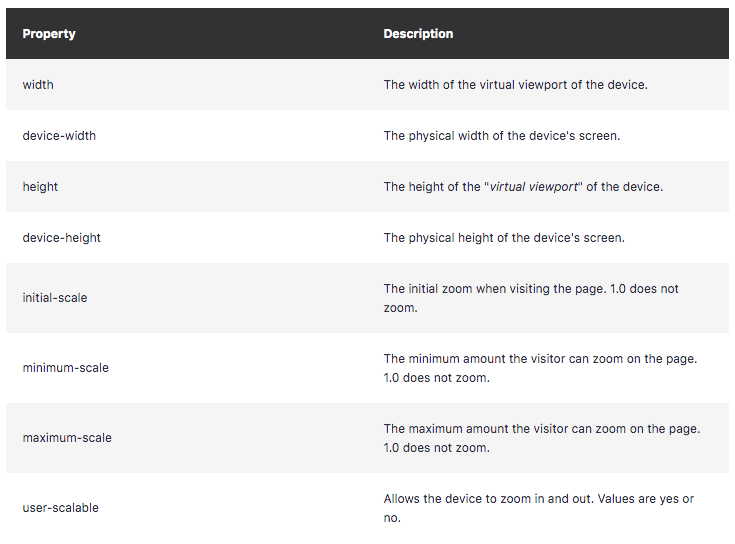

### Allow Google Crawl Everything

Block Googlebot from accessing Javascript, CSS or other important parts of your site’s code is so bad idea today.

That is a way to tell the GoogleBot that your site is mobile-friendly or not.

How do you know the issue is still alive in your site?

Check out your `robots.txt` file. You can look at what the Googlebot cannot crawl or index certain parts of your site.

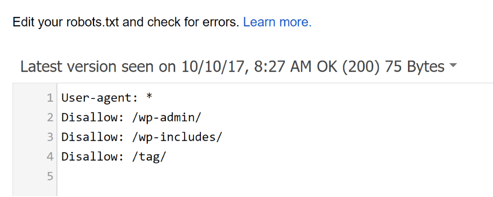

And then, click on “Google Index”, choose “Blocked Resources”.

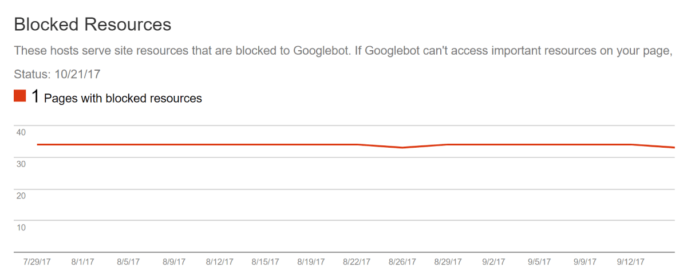

You can see what you’re blocking Googlebot from crawling in your site.

---

## Optimize Mobile User Experience

The [responsive web design](http://mattkersley.com/responsive/) looks like:


But that is not enough.

The most important decision you'll make is using a responsive, dynamic serving, or separate site configuration. Each has its advantages and disadvantages.

Google prefers responsive design but supports all three options other.

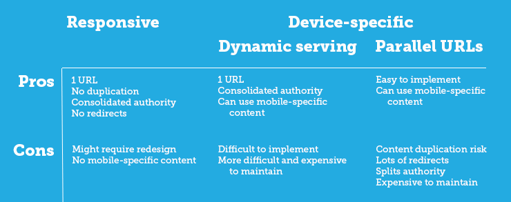

Technically, responsive web design use CSS3 media queries to serve the same content to mobile and desktop users. These usually fluid grids and a flexible design to automatically adapt to the size of a user's screen.

Responsive designs use media queries to target the layout based on screen width, orientation, and resolution. Here is the code sample of responsive design:

```
@media screen and (max-width: 420px) {
  .class {
    [styles for this class here]
  }
}
```

This code will put in between your `<head>` tags as CSS.

On the other hands, responsive design in the mobile version has a [higher bounce rate](https://www.stonetemple.com/mobile-vs-desktop-usage-mobile-grows-but-desktop-still-a-big-player/). Based on the research,  bounce rates on mobile are 40% higher than on desktops.

That is because users are aware of their experience when surfing the Web on mobile. Thus, responsive design does not enough. You need the optimize the mobile user experience. 

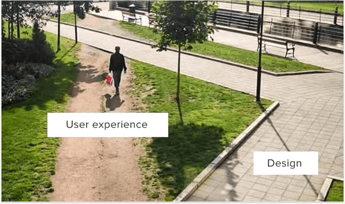

As you can see, users have own ways to make their self more satisfied. By this insight, your mobile site is supposed to have:

### Fast load time
Google cares how fast your mobile site loads. 

According to [mobile page speed study](https://www.thinkwithgoogle.com/marketing-resources/data-measurement/mobile-page-speed-new-industry-benchmarks/), as page load time slows down from one second to six, the bounce rate increases by 106%.


Additionally, 53% of visits are abandoned if sites take more than 3 seconds to load.  Visitors expect pages to [load in 1-2 seconds](https://www.doubleclickbygoogle.com/articles/mobile-speed-matters/).

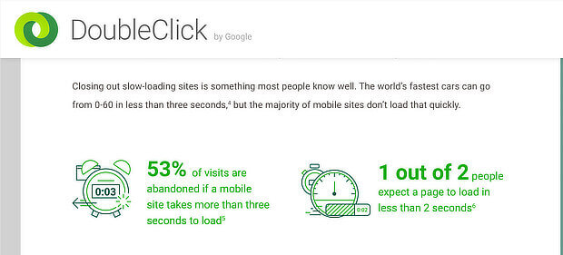

You can ensure the mobile site speed use some free tools. 

First, [Google’s PageSpeed Insights tool](https://developers.google.com/speed/pagespeed/insights/).

This tool gives you quickly your site loads on mobile and desktop analyze.


You will get some recommendations to speed things up.

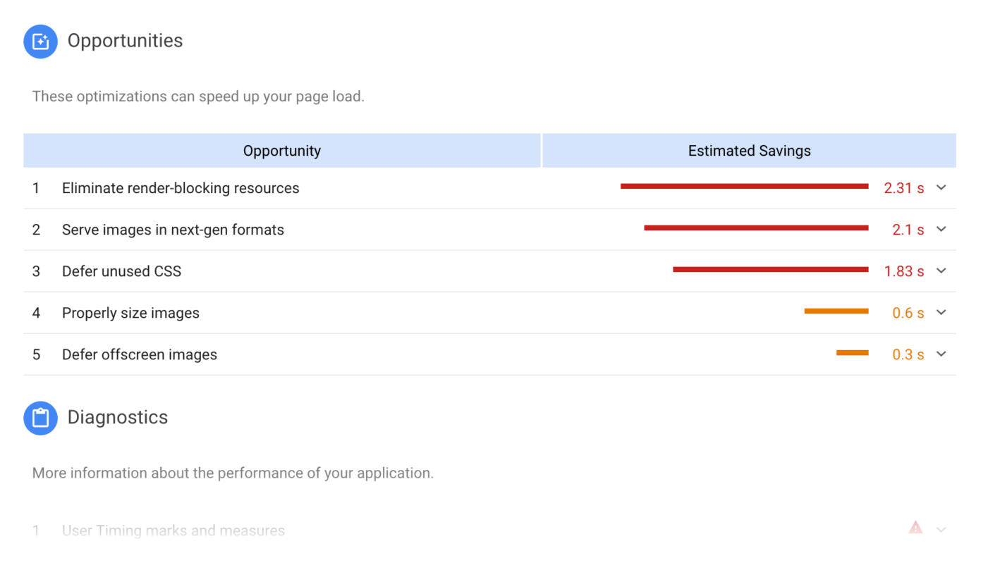

Second, [WebPageTest.org](https://www.webpagetest.org/). 

By default, the tool loads desktop browser version. Choose a mobile browser from the menu.

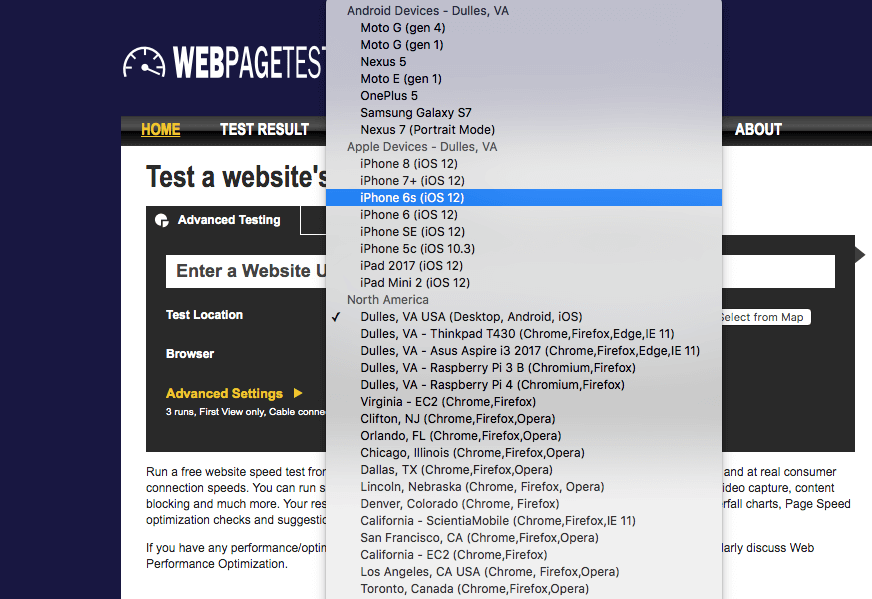

This tool presents specifically speed audit, mobile and desktop. 


If you need to speed up the site speed, check out this [excellent resource speed tips](https://developers.google.com/speed/docs/insights/mobile).


### Scale Images

Responsive design provides images scale. But the size does not fit on screen. Here is the Navy Federal Credit Union’s as an example.


Check out the Bank of America’s as to compare the scale of the image scale.


Bank of America's is better than Navy Federal. The reason is:

* Bank of America’s CTA’s are front and center.
* Navy Federal’s was no call-to-action

If you meet the image scale issue, create alternate images for [different viewports](https://developers.google.com/search/mobile-sites/mobile-seo/responsive-design). `meta name="viewport"` tag will tell the browser how to adjust the content.


Add a meta tag code to the head of the document.

```
<head>
  ...
  <meta name="viewport" content="width=device-width, initial-scale=1.0">
  ...
</head>
```

### Clean Navigation
The clickable and easy-to-view navigation menu is essential for mobile users.

You need to audit your mobile user behaviour to understand what the user is searching for. According to Google:

> ["Hamburger-menus"](https://twitter.com/googlewmc/status/1007235827100012544) and "accordions" on mobile websites is fine.

Take the time to see an example. Best Buy keeps site navigation at the top using a hamburger menu in the center.

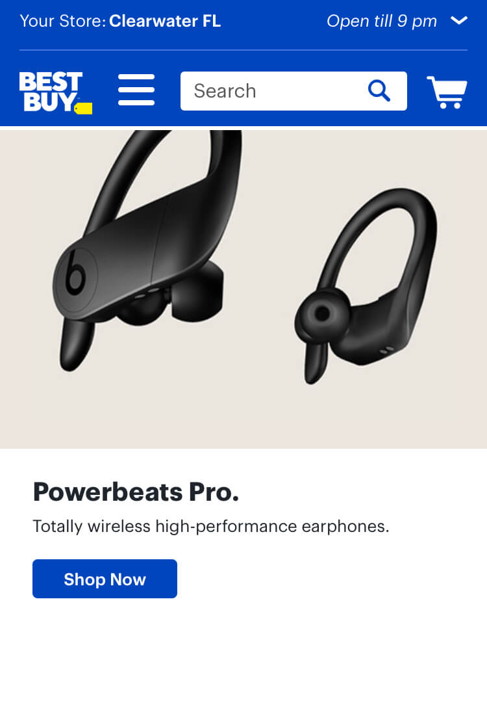

If you have a new site, you can consider auditing the user behaviour to know what they looking for. Use the [free heatmaps tool](https://www.hotjar.com).


This tool is free with limit function. You can understand users and identify any points where users are getting stuck. 

### Remove Mobile Pop-Ups
According to Google:

> “Pages where content is [not easily accessible](https://webmasters.googleblog.com/2016/08/helping-users-easily-access-content-on.html?m=1) to a user on the transition from the mobile search results may not rank as high.”

That is the reason why all pop-ups are bad. Pay attention to this a bad pop-ups example.


Why Is bad?

The newsletter pop-ups take up the entire screen without letting users read the content behind.

As an addition, Google has bad pop-ups techniques that make content less accessible:


If you need the description, here is the Google said:


On the other hands, this is the solution that would not be affected by the new signal:

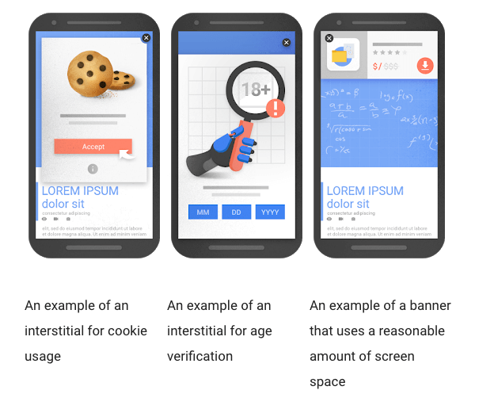

Google gives us a detail explanation about three examples above. 

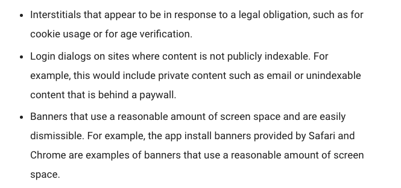

Because of that, you can proceed with caution when the pop-ups appear in your site.

---


## Closing

The majority of the sites I discover are already responsive. But some of that is suck. That is because the site has only a beautiful design, not provide a delightful design. 

Thus, the end goal remains of this article is:

* Allow the crawlers to access, read, and digest content.
* Optimize the UX for all devices.
* Continue testing for better results.

This is the time to make your mobile site still alive in a mobile search result. Are you ready?
