Are you looking for google analytic alternative? Here are the best website analytics tools. I collect 49 website analytics tools and split into 5 different category. 

Let's get started!

Everyone acknowledges that Google Analytics is the best SEO audit tool. In another hand, Google analytics is too complicated. Its a wasting time sometimes. We're using additional tools to make it easy to understand.  

These are the tools that split into several groups by specific category:

* Simplified Web Analytics Tools
* SEO Analytics Tools 
* Best Content Analytics Software
* Conversion Rate Optimization Tools
* Best Digital Marketing KPI Dashboard 

> The sort of all this did not represent the quality each. This is just a random sort. 

----

## Simplified Web Analytics
What is web analytics? In short, the definition of web analytics is a process to measurement, collection, analysis and reporting of web data. It is an important aspect for every company to increase brand visibility at SERPs.

The focus of web analytics is understanding and optimizing web usage. Sometimes, web analytics tools are helping the company to get business to analyze, market research, and assess then improve the effectiveness of marketing strategy.

Web analytics is mostly about the number of stats from the data source. But that is not the point. All of that number needs to analyze in-depth and convert as a marketing insight at the future.

To make it easy for everyone, this is the web analytics tools listing instead of google analytics.

### StatCounter - Website audit tool
StatCounter is my favourite website audit tool. This tool shows website visitors, where they come from, what pushed them towards page, what they’re downloading, and how long they’ve spent on each page.

StatCounter available on Android and iOS version and can be accessed on the browser.

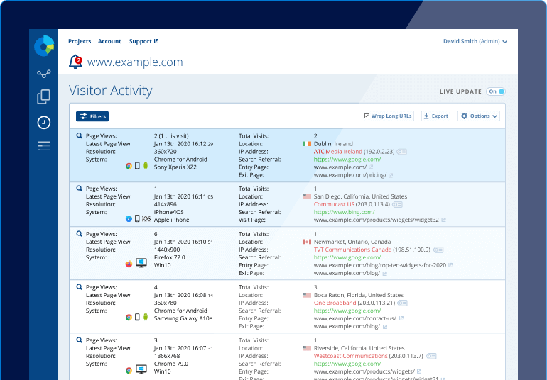
IMG: https://statcounter.com/images/visitor_activity.png

I already subscribed a freemium version on StatCounter while six months. Everything is great, I can see another side of my site which Google Analytic can't give. During using a google analytic, I always found [not set google analytics](https://gtag.dev/not-set-google-analytics/) issue.


IMG: https://jmp.sh/kVUuQeW

Through weekly email update, StatCounter helps me to understand the traffic that comes to the site.


IMG: https://jmp.sh/6cd2FlW

In details, I got:
* Average daily traffic
* Daily traffic breakdown
* Popular Pages
* Came From - Domain Only
* Keyword Analysis
* City
* ISP
* Entry Pages
* Exit Pages
* Country
* Search Engine Wars
* Browsers
* Exit Links
* Visit Length

An awesome fact of StatCounter, All report above is on a single screen. So, make us understand visitors the easy way.

How to use StatCounter?

* Click register (Try it FOR FREE button)
* Fill the form consist of name, email, username, and password
* Open your email. Confirm the account registered
* Copy the StatCounter code and put on your '<head>'
* Back to StatCounter and add a new project
* Setup your project and fill out the form
* Wait 2x24 hours, your data will be visible

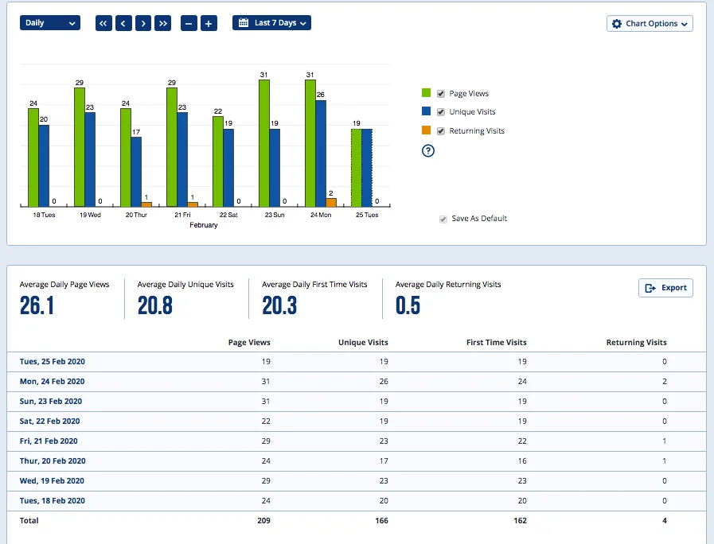
IMG: https://jmp.sh/iMkTMKG

Finally, we need to know about the pricing stage which StatCounter had a unique structure based on log space. See this screenshot:

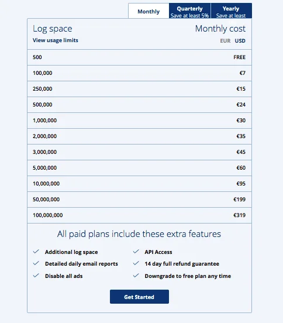
IMG: https://jmp.sh/dw3gQFd

### Motomo (Formerly Piwik) - Website analyzer and conversion
Motomo is the most powerful website analyzer and conversion optimization platform. You will get 100% data ownership, full privacy compliance, and all the flexibility web data.

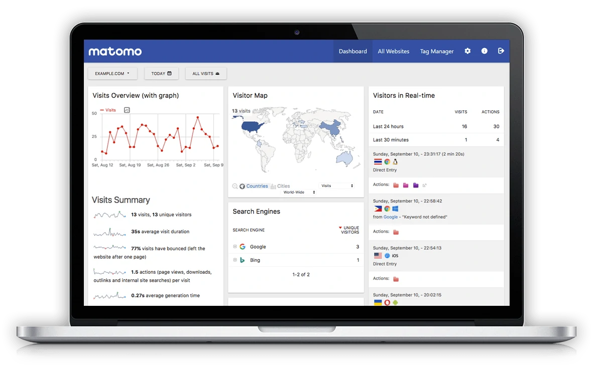
IMG: https://static.matomo.org/wp-content/uploads/2018/10/piwiklaptop-new.webp

Motomo provides several main features:
* Complete Analytics
* Increase Acquisition
* Increase Engagement
* Conversion Rate Optimization
* Log Analytics
* Intranet Analytics

How about Motomo pricing?

They give you 21 days trial version without credit card. Drop your contact information into their form.

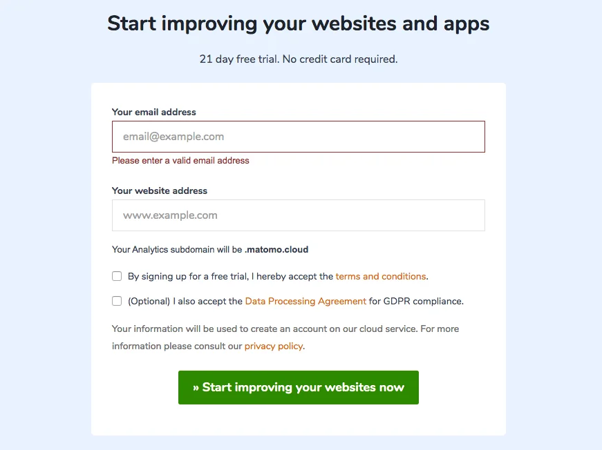
IMG: https://jmp.sh/zcGFncG

If you're feeling good with Motomo services, choose three pricing structure, based on page views.

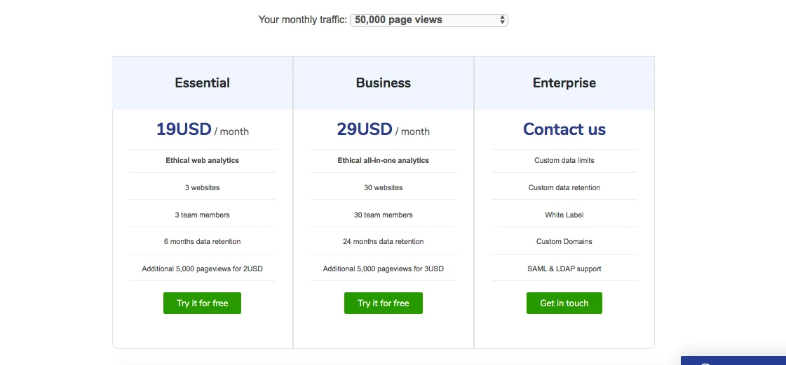
IMG: https://jmp.sh/DScJen7

### Open Web Analytics - Open-source web analytics

Open Web Analytics is an open-source web analytics software framework. This tool helps the company to track and analyze visitor behaviour in websites and applications. 

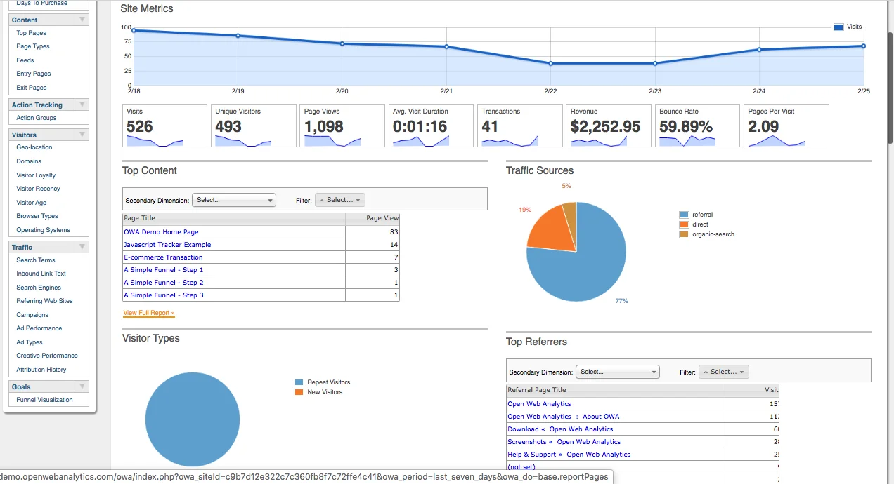
IMG: https://jmp.sh/FNFBWFj

The main feature of open web analytics is...
* Monitoring analytics
* User click heatmaps
* Detail usage of any web page
* Sessions by clickstream of anonymized user
* Track custom site actions with unlimited data report
* Track search terms that why visitors come
* Analyze how ofter visitors come
* Monitor click on web pages elements

I'm so proud about this tool because everyone allows to download and install into the private server. It's like having a personal website analyzer. Open Web Analytics is truly website analytics free online.

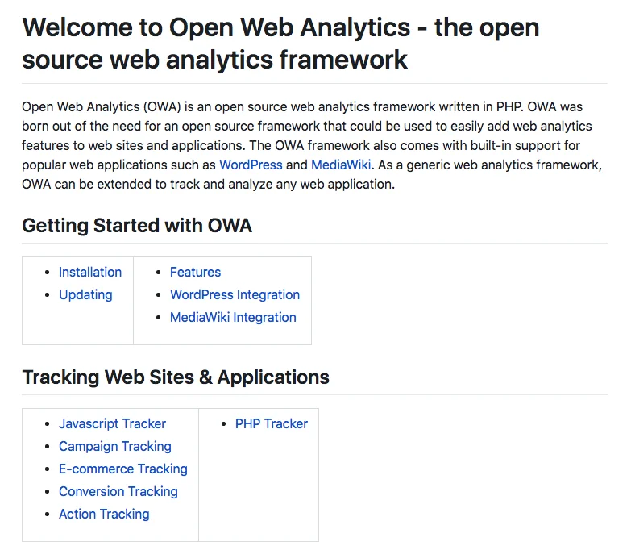
IMG: https://jmp.sh/maANKyt

### Clicky - Website analytics tool

Clicky provides the basic feature of website analytics, such as to monitor, analyze, and react to traffics in real-time. The dashboard provides various reports consist of monitoring uptime, social media, feeds, and custom links.

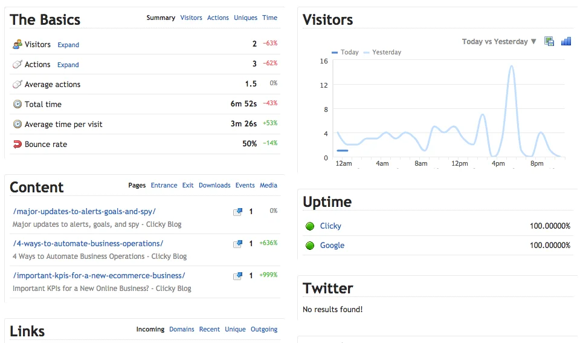
IMG: https://jmp.sh/WuSwVFV

Amazingly, it also presents you with a heatmaps analysis. And then, you can set up different goals and will inform you when these goals happen. The favourite thing of Clicky than Google Analytics is you can connect visitor IP address among conversions and important events which GA  does not allow.  

Clicky gave everyone freemium subscription with limited feature. If you need more, you can pick one of this pricing structure:
* Pro: 9.99 USD/month
* Pro Plus: 14.99 USD/month
* Pro Platinum: 19.99 USD/month
* Custom: 37.99 USD/month

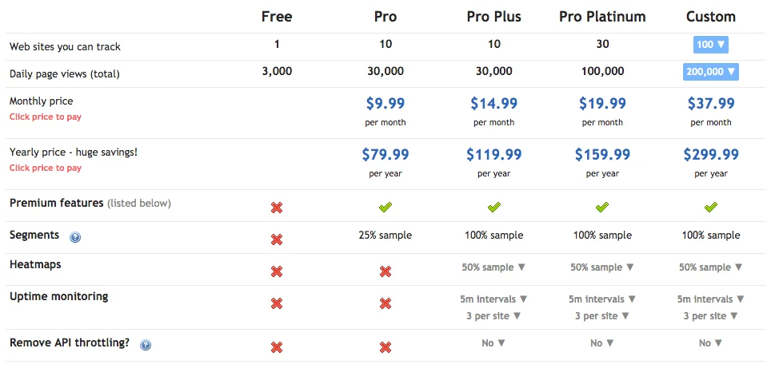
IMG: https://jmp.sh/nuZIEVt

Like as other website analytic tools, in each pricing stage had a different feature.

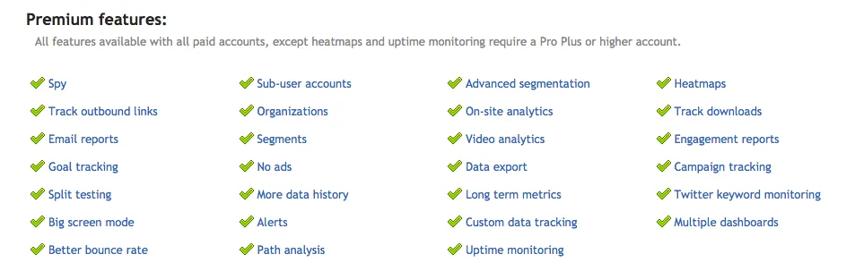
IMG: https://jumpshare.com/v/n6ZaJMyEzR5isv7WOGT1

### PaveAI - Web audit report
PaveAI is the simple alternative of Google Analytics. This tool doesn't provide the dashboard of a web audit report. Choose your business stage and connect to with Google Analytics, Google Console, and Others services. 

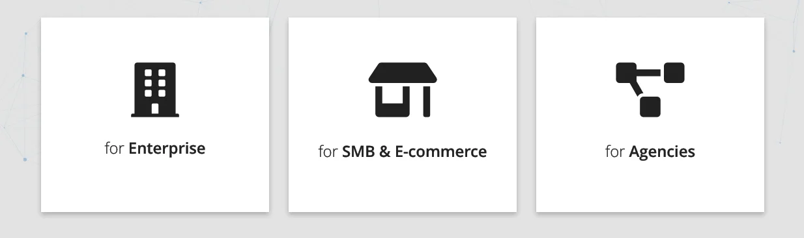
IMG: https://jmp.sh/ZtDqwYF

PaveAI works through AI to analyze your marketing data. After connected, you will get a PDF format. We can add up to three websites on PaveAI.

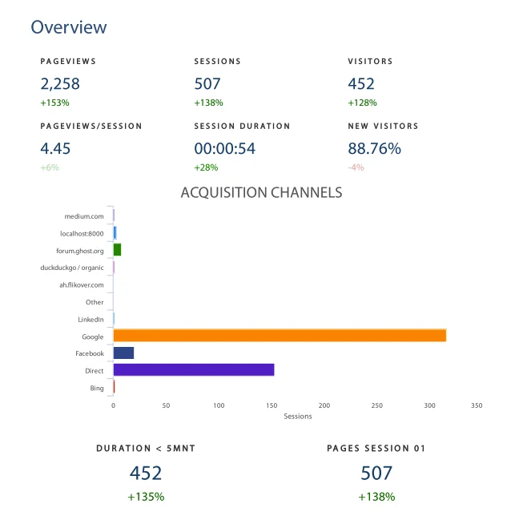
IMG: https://jmp.sh/atPwmPt

The kind of report you will get is:
* Pageview
* Session
* Visitor
* Acquisition channels
* Content engagement
* Visitors technology
* Day/time engagement
* Location
* Charts of age
* Comparison of returning visitors and new visitor

It is kind of Google Analytics report actually but the report is more simple better. I'm so surprised with PaveAI because we allow receiving the monthly report regularly. 

How about pricing? It's free. Don't worry about it. But it depends on your business stage. I am currently on the SMB plan and still free until I write this content. Here is the PaveAI pricing on SMB plan:
* Starter: 39 USD/month
* Growth: 79 USD/month
* Professional: 179 USD/month
* Custom: contact sales team

This is the package detail:

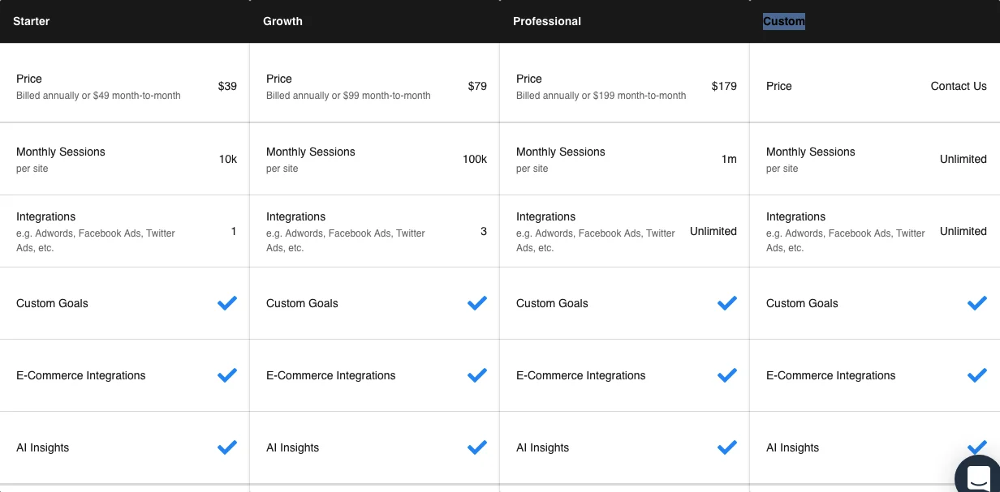
IMG: https://jmp.sh/eqsuPX1

> If you have a recommendation about simplified web analytics, let me know. Reach out me through this business email: fatul@gtag.dev

---
## SEO analytics tools
What is SEO analytics? The point of SEO definition is a process to track and monitor a website based on the search engine result. The purpose of SEO analytics is growing the amount of high-quality organic search traffic to a website via search engines.

In general, we are using Google Webmaster/Console to do that. But that is not enough for now. Because of that, this is the alternative of Google Webmaster to track and monitoring our organic search:

### Bing Webmaster - SEO console

Bing Webmaster is like Google Webmaster tools. But this tool is not popular than Google product. 

The Bing Webmaster does not a favourite option today, but I curious with their services. That is because Bing Webmaster is a segmented channel, this tool only helps you to manage an online presence on Bing. 

The dashboard presents any report such as errors crawl, submitting the site, and other SEO aspects.

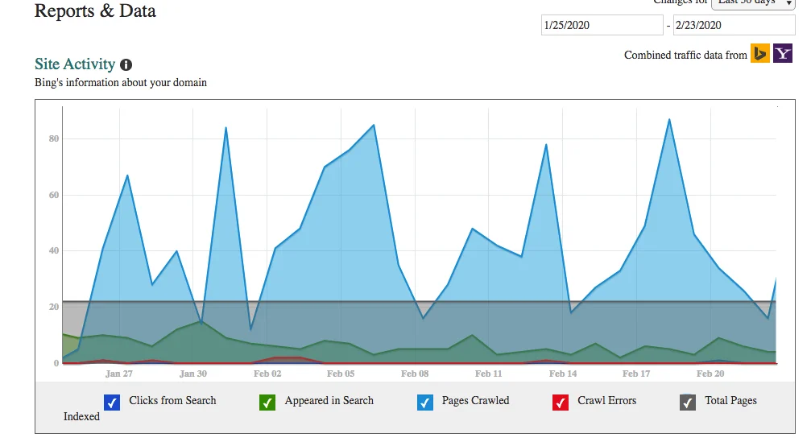
IMG: https://jmp.sh/sRXUVPm

While this web analytics tool is free, you can see complex report inside consist of report data and diagnostics and tools.

Report data:
* Page traffic
* Index explorer
* Search keywords
* SEO reports
* Inbound links
* Crawl information

Diagnostics and tools:
* Mobile-friendliness test
* Keyword research
* Fetch as Bingbot
* Markup validator
* SEO analyzer
* Verify Bingbot
* Site move

How to add a site on Bing Webmaster? Follow this simple step:
* Go to Bing Webmaster sign-in page.
* Connect with your account (Microsoft, Google, Facebook)
* Choose add site or import from Google Search Console
* If you choose to add the site, fill out your sitemap into Add a sitemap column
* Click add then. 
* Verify ownership for through uploading an XML file, copy and paste code into '<meta>' tag, or add CNAME record manually to DNS
* Wait a moment. You will get the confirmation.
* It's done.

### Rank Science
Rank Science is Al-powered platform for SEO testing. The main purpose of this tool is growing organic traffic and get content ranking higher. It is the point of all SEO tools.

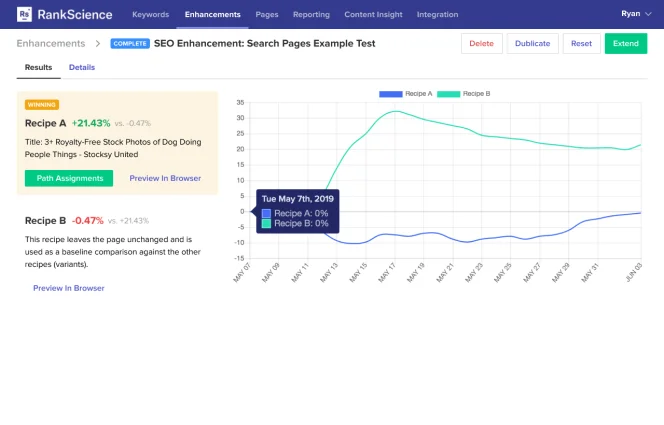
IMG: https://www.rankscience.com/wp-content/uploads/2019/11/ab-sample-test.jpg

The dashboard displays SEO testing result including:
* SEO A/B test result
* Search traffic
* Click-through rates
* Content summary (searcher intent and maps)

The thing that I feeling good with Rank Science is about content. The company will find a way to optimize past blog posts, plan out, and create new ones with highly relevant to the visitor.

Rank Science provides free trial version during 30 days and needs to pay a monthly subscription just $295/month.


IMG: https://jmp.sh/9JFxarG

When I'm stopping into this tool, I think so many people did not familiar with this tool. Their domain name "Rank Science" is attractive in the SEO field. 

### Siteimprove - Fixing and improving a website
Siteimprove is the best tool for fixing and improving the website. It works in SEO, analytics, accessibility, data privacy, and content quality. Not only that, but you also can monitor campaign conversions and performance of the website in the dashboard. 

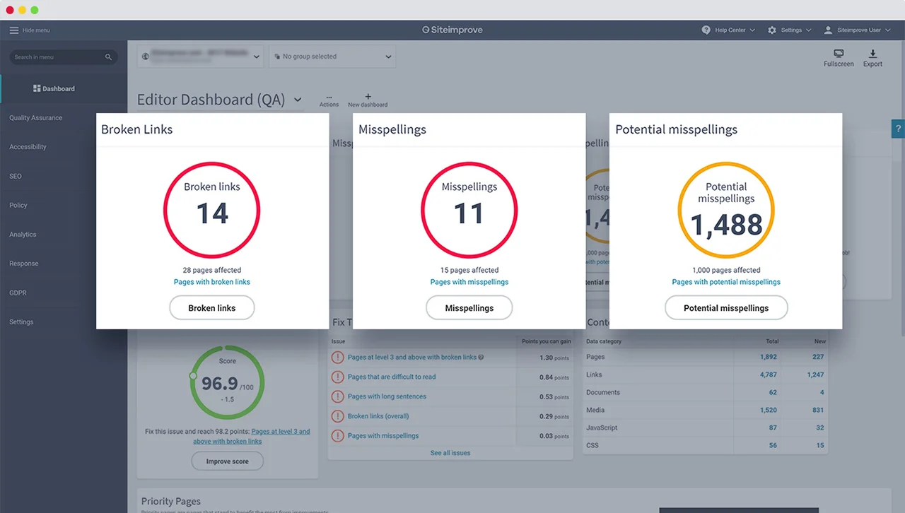
IMG: https://images.g2crowd.com/uploads/attachment/file/81023/link-and-spell-check-1280px.png

You can see the audit score in the dashboard and follow the step to fix problems. Even, you would be provided error information with an easy visual representation.

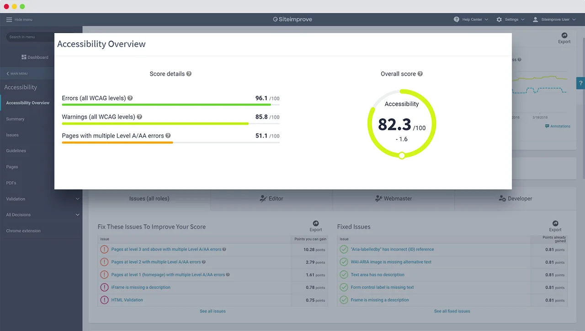
IMG: https://images.g2crowd.com/uploads/attachment/file/81020/accessibility-checks-1280px.png

Unfortunately, Siteimprove has not provided pricing information. You need to request a demo to try their products.

### BrightEdge - SaaS SEO platform
BrightEdge is the SaaS SEO platform to drive traffic, conversions, and revenue from organic search. BrightEdge's keyword research, page rankings, backlinks, and page recommendations are the core feature inside this platform. 

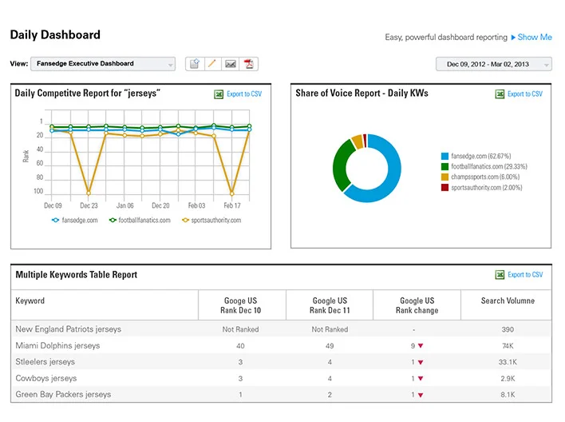
IMG: https://images.g2crowd.com/uploads/attachment/file/5107/LG_06_Daily_Rankings.jpg

The reports and analytics are also extremely helpful. You allow to tracking campaign performance compared to key competitors. This feature will be shown by the period. And then, you also can see how to optimize content and measure progress and results.


IMG: https://images.g2crowd.com/uploads/attachment/file/5109/LG_05_Blended_Local_Search_Management_Reporting.jpg

BrightEdge is the way to fix [Google’s ‘not provided’](https://gtag.dev/not-set-google-analytics/) issue. This tools will work through their comprehensive report in organic search then suggest the SEO requirement when creating content marketing. 

### NetpeakSoftware - SEO tool specialists
NetpeakSoftware is the best tools for SEO specialists and webmasters to solve day-to-day SEO tasks. The feature of NetpeakSoftware is:
* SEO specialists and webmasters
* Link builders
* Marketing and content teams
* Web developers and QA
* Sales teams

While this tool just provides two product (Netpeak Spider and Netpeak Checker), amounts of data it can process is much. It helps the company by signalling any SEO or usability errors. 


IMG: https://frontend.netpeaksoftware.com/dist/ns_spider_features_1_en.svg?ddcdba02ccb206d6dd6e72bdccfd4e4d

If you looking for the dashboard with strongly analyze competitors and their activities across the web, Netpeak Spider and Checker are the best choices. 

If you are doubting with their services, you can use a 14-day trial to test all Netpeak features. And then choose one of their pricing and plan:
* Netpeak Spider Standard: 15.20 USD/month
* Netpeak Spider Pro: 31.20 USD/mo
* Netpeak Checker Standard: 15.20 USD/mo

See the pricing and plan in details.

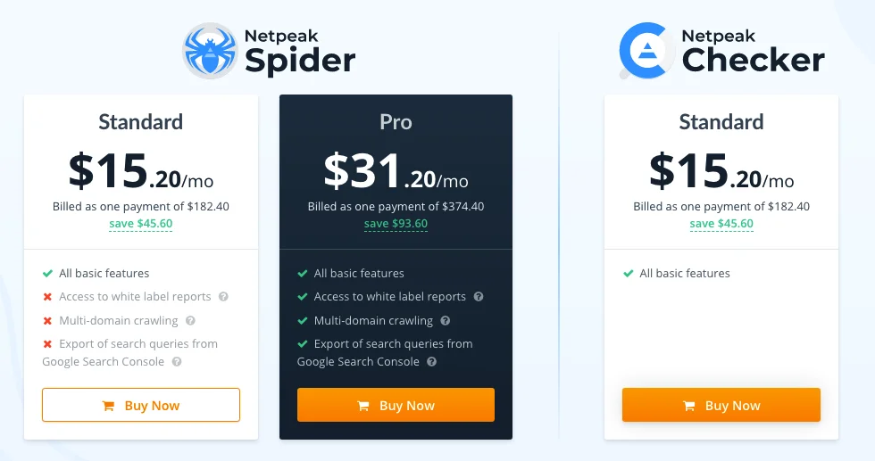
IMG: https://jmp.sh/EqvHXeN

### Silktide - Manage website performance
Silktide helps us to monitor and manage websites effectively. This is Silktide promise. They will analyze several aspects of web such as content, accessibility, marketing, mobile, speed and legal compliance.

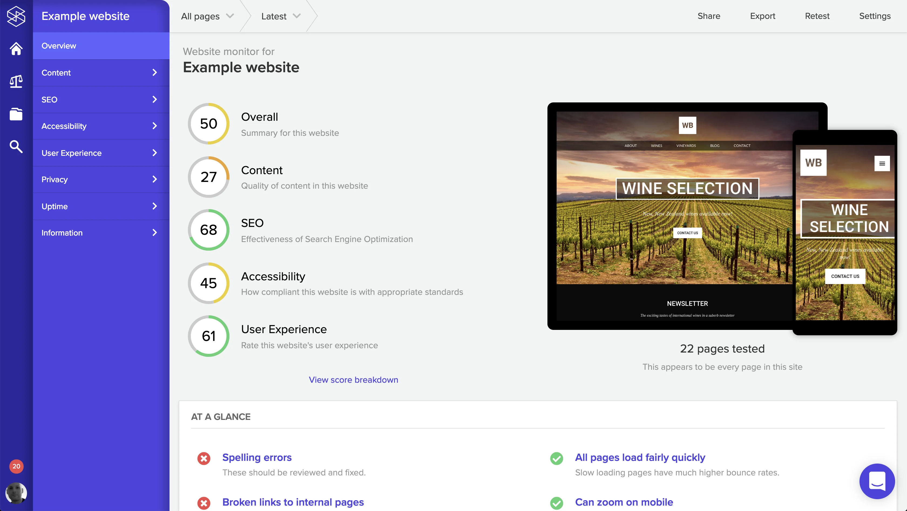
IMG: https://images.g2crowd.com/uploads/attachment/file/100743/image-_1_.png

The dashboard also provides an in-depth report on SEO on-page elements including spelling, broken links and readability, as well as elements of SEO, javascript faults and page-load time.

Silktide's pricing based on webpages you want to analyze.
* Editor: 50 USD/month for 100 pages
* Marketer: 80 USD/month for 100 pages
* Executive: 200 USD/month for 100 pages
* Custom: contact sales team for 100 pages

You can analyze webpages until 5000 pages. See the package that Silktide's pricing for 100 pages:

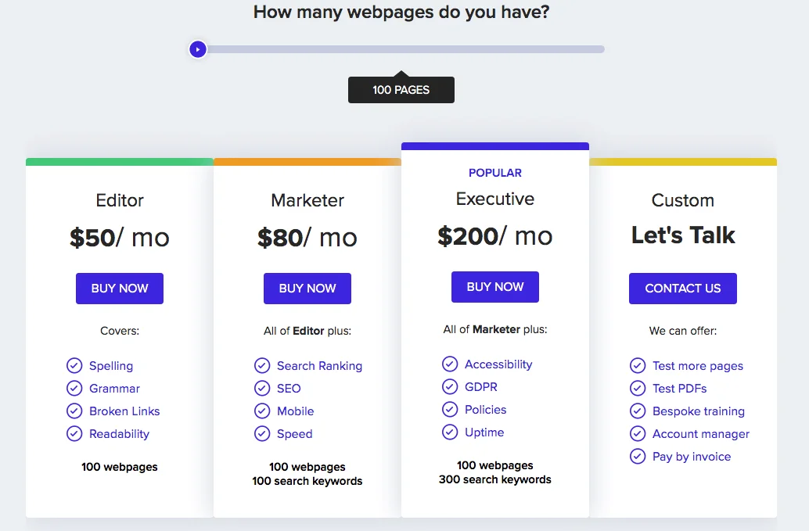
IMG: https://jmp.sh/govXjoV

This is you get for 5000 pages:


IMG: https://jmp.sh/KIA36wH

### SEOPowerSuite - Organic search audit
SEOPowerSuite covers most of the bases of SEO tasks, from rankings audit to on-page to backlinks. 


IMG: https://cdn0.capterra-static.com/screenshots/2089305/190365.png

They create four tools to manage all these. 
* Rank Tracker: Research keywords, track rankings, and analyze competitors.
* Website Auditor: Crawl and optimize site structure, improve on-page optimization.
* SEO SpyGlass: Discover and analyze the site's backlinks.
* LinkAssistant: Track link building and outreach campaigns.

The specific feature in here:

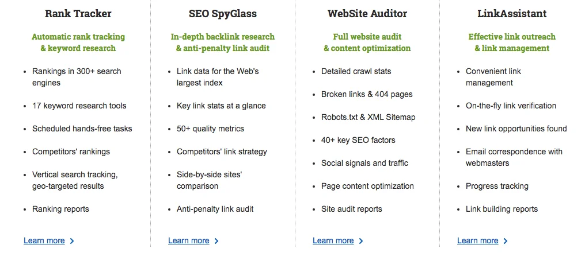
IMG: https://jmp.sh/Hm25Ajc

The pricing is a yearly payment with a freemium version. It is good news from an SEO Specialist. If need more package, then buy others package.
* Forever free: 0 USD
* Professional: 299 USD/year
* Enterprise: 699 USD/year

See the package details.

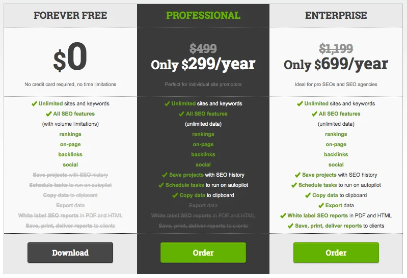
IMG: https://jmp.sh/ddzfdxE

### RavenTools - Monthly organic report
RavenTools helps generate monthly Organic SEO reports. If you need a comprehensive solution for an SEO campaign, this is recommended tools.

In details, it manages link building, track keywords, research competitors and carry out backlink research. 

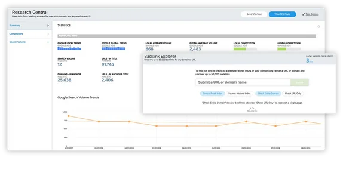
IMG: http://d9hhrg4mnvzow.cloudfront.net/unbouncepages.com/raven-tools-seo-gdm/15r4hl0-image2_0fy08m0fy08m000000.png

The pros I meet in this SEO toolbox are:
* Track and reporting for google analytics and google ads. 
* Allow scheduling a monthly report email (PDF format) for the last 30 days. 
* Handles a large number of clients quite.
* Provides effective SEO and detailed reporting

About the pricing, RavenTools give a free trial version. After that, subscribe to their pricing stage.
* Start: 70 USD/month
* Grow: 139 USD/month
* Thrive: 249 USD/month
* Lead: 399 USD/month

Just for additional pricing info, this is the comparison table among each stage.

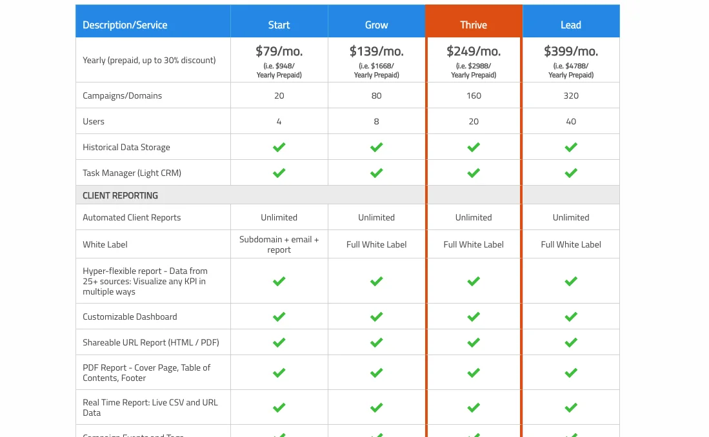
IMG: https://jmp.sh/00bK7kp

### AgencyAnalytics - SEO campaign audit
Agency Analytics is kind of SEO tool in general. Provides a basic report for the SEO campaign such as on-page audits, backlinks, perform keyword research and website reports at one single dashboard.

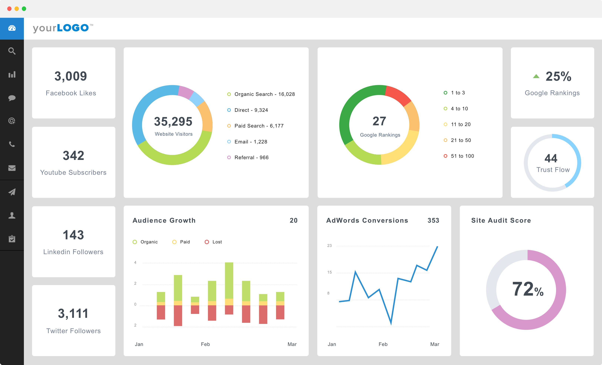
IMG: https://images.g2crowd.com/uploads/attachment/file/74736/expirable-direct-uploads_2Fb172512b-57b0-4110-9c89-01c437c76475_2Fdashboard.png

The advantage of this tool that allows you to connect with more than 40 platforms at a single dashboard. And then, you can set:
* Automation report delivered to the inbox
* Custom dashboard with own KPIs
* Track and report SEO, SMM, PPC, Email, and Call tracking at one dashboard

To use this tool, get free for 14 days first. If the features are fit as you needed,  pick the one of AgencyAnalytics pricing:
* Freelancer: 49 USD/month
* Agency: 149 USD/month
* Enterprise: 399 USD/month

The pricing item that you will get:


IMG: https://jmp.sh/EfJo49r

### Web CEO - SEO software tools
WebCEO is a powerful tool for keyword research, rank tracking, SEO audits, internal link analysis and backlink tracking. While SEO is the first impression, its features are extremely helpful for social media and paid ad campaigns.

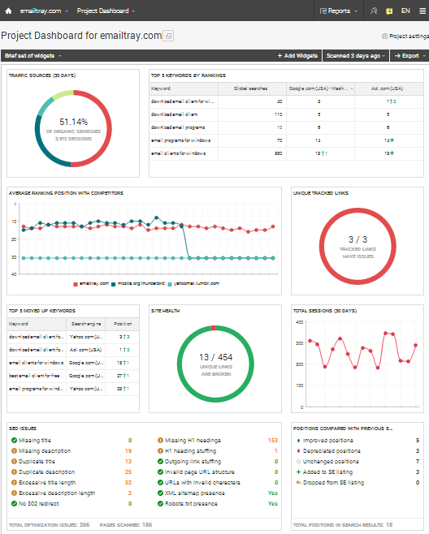
IMG: https://images.g2crowd.com/uploads/attachment/file/28889/uploads_2F131f457b-3b9d-4728-9332-ef190268df6f_2Fscreen-S-Dashboard.png

Take time at Web CEO and you will get:
* SEO software tools
* Manage hundreds of client sites
* Get SEO leads daily
* Set up a white-label marketing platform
* Beautiful SEO reports

Web CEO allows you to try their service at the free trial version and then pick regular monthly subscription:
* Startup: 99 USD/month
* Corporate: 299 USD/month
* Agency Unlimited: 99 USD/month + scanning fees

All plans include this feature below without additional fee:

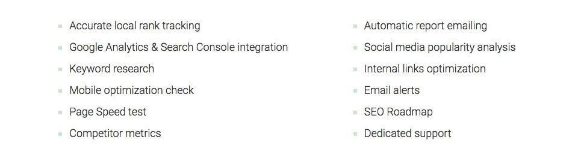
IMG: https://jmp.sh/ml7XDJi

### Contentkingapp - Website audit
ContentKing App is the best way to find potential issues on the website. If you looking for the too with cloud-based, this is the answer. You don't need to install anything to get the data and reports.

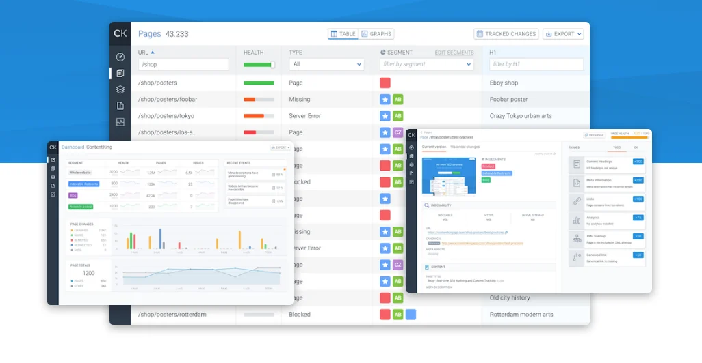
IMG: https://jmp.sh/ZrosSgU

ContentKing App focuses on real-time SEO Auditing, content tracking, and PPC. Their services split into four aspects:
* SEO auditing
* SEO monitoring
* SEO alerting
* SEO change tracking

The first impression of this tool is about the health of websites. If the issue comes, then their dashboard show guideline what you have to fix to make the site better.

The pricing structure according to the number of pages in the domain with extra features such as unlimited websites, projects and users. The pricing structure is:
* Basic: 39 USD/month for 1000 pages
* Standard: 89 USD/month for 1000 pages
* Pro: 149 USD/month for 1000 pages
* Enterprise: starting at 550 USD/month for 1000 pages

There are so many features you will get. If you need an overview of this pricing structure, look at this screenshot.

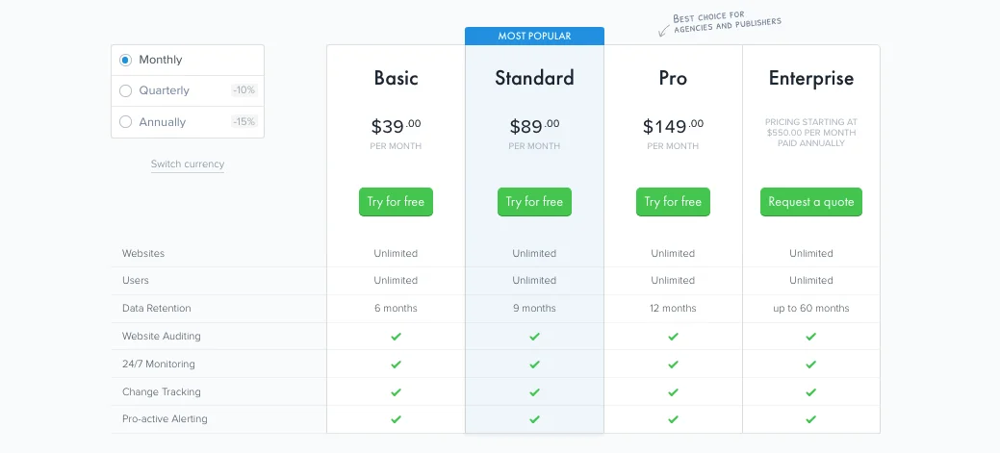
IMG: https://jmp.sh/2VXaAN2

### MorningScore - Creating and optimizing SEO
Morning Score works for creating and optimizing successful SEO campaigns. It will identify the key metric for SEO. And you can use it for tracking keyword at the Google Adwords value.


IMG: https://cdn0.capterra-static.com/screenshots/2126183/156559.png

The dashboard is clear and easy to understand about the suggestion, improvement, and how to fix the issue. This is a feature-rich inside the dashboard, their features include:
* Keyword rank tracker
* Competitor analysis tools
* Full backlink profile tool
* Google health (on-page crawler) tool
* Smart SEO suggestions
* SEO project management
* Goal tracking tool and more

Regarding the pricing structure, MorningScore offers 14 days free trial version with four premium pricing.
* Starter: 25 USD/month
* Lite: 45 USD/month
* Business: 79 USD/month
* Pro: 149 USD/month

The specific feature at each pricing is here.


IMG: https://jmp.sh/mHblcnp

### Monsido SEO - Website analytic tools
Monsido SEO is a website analytic tools to audit on-page SEO errors and opportunities. It improves better rankings and attracts more visitors. Monsido works basically through 3 different aspects: SEO, accessibility and quality assurance.

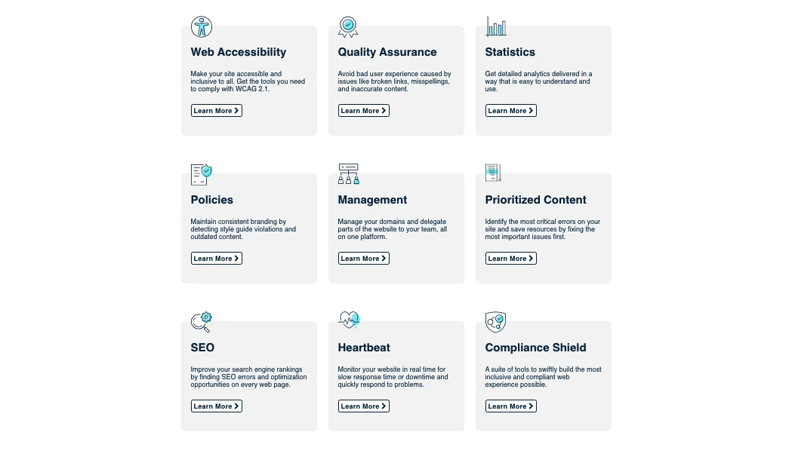
IMG: https://jmp.sh/GCNitue

Unfortunately, that pricing structure was hidden. But before going to their dashboard audit, we can access their free demo request. It includes several features within.


IMG: https://jmp.sh/gqrUZDU

> To make this article more different than others, I did not review familiar SEO tools such as SEMrush, SE Ranking, Moz Pro, Ahrefs, Serpstat, SpyFu, and SEO Spider. If you have a recommendation about SEO analytics tools, let me know. Reach out me through this business email: fatul@gtag.dev.

---

## Best Content Analytics Software
What is content analytics means? In definition, Content Analytics is a process for combining business intelligence (BI) and business analytics (BA) practices into digital content. 

Companies use content analytics to attract, engage, and keep prospects and customers takes specific actions. 

Content analytics is relevant to content marketing. Make content marketing stand out is long-term efforts. We need to figure out how to optimize content creation through content performance. 

Thus, content analytics software will help us to run effective and impact on publishing great content that resonates with the audience and differentiates from competitors. Let see the listing of content analytics software.

### Conductor Searchlight - Content intelligence
Conductor Searchlight is a content intelligence platform that helps the company create more targeted content, increasing organic search results, and eliminating needless content reworks.

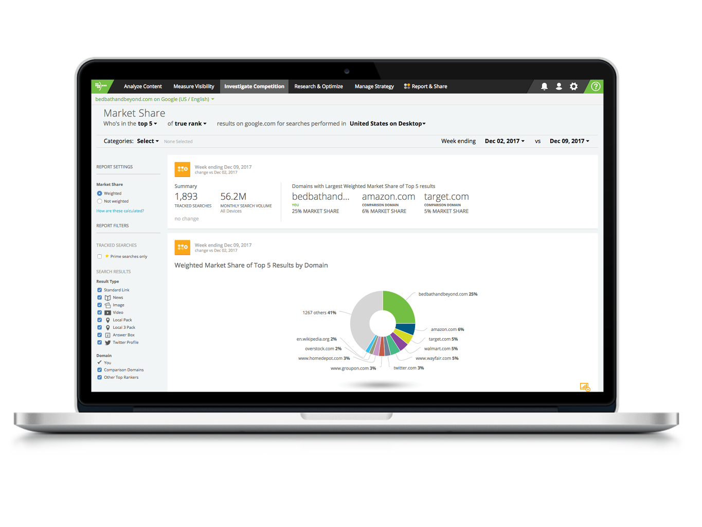
IMG: https://images.g2crowd.com/uploads/attachment/file/75800/expirable-direct-uploads_2F85f4d99a-7ada-43a8-a29d-2e4e8270f549_2FG2_Screenshots2.png

This platform sets:
* A content editorial calendar and it optimizes
* Track HTML changes and the impact on visibility (SEO)
* Content ideas such as keywords to target 

The dashboard is extremely helpful to deep dive the data and having all data on one platform. And then, you can see competitor rankings, all the details within, explore how users, and do a market search for content.

Unfortunately, Conductor Searchlight has not provided pricing information for this product or service.

### ClearScope - Content production platform
ClearScope is AI platform for content production that integrating SEO into Content Marketing. It drives more organic traffic performance through your content. 

If you don't have an experience in content creation, then It will find a gap between competitors, keyword target, and content outline. It means ClearScope helps rank for competitive search terms by search intent.

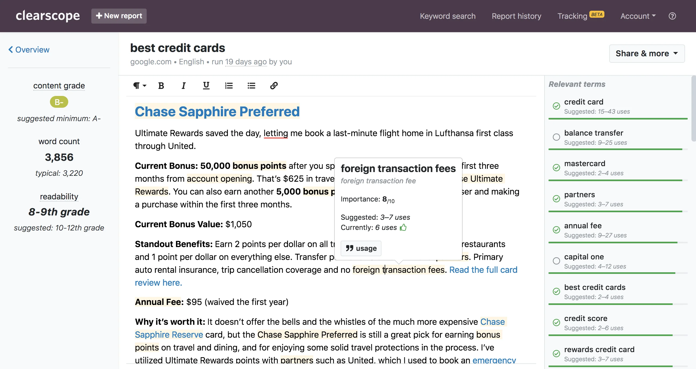
IMG: https://www.clearscope.io/assets/splash/optimize-ss-c694eda66918b37130113de7b41cbd136facc2ca279d8cc9de7ea92540252136.png

This tool had simple pricing without add-ons or hidden costs. 
* Clear scope Pro: 350 USD/month
* Agency & Enterprise: content sales team

The detail of the pricing structure is here.

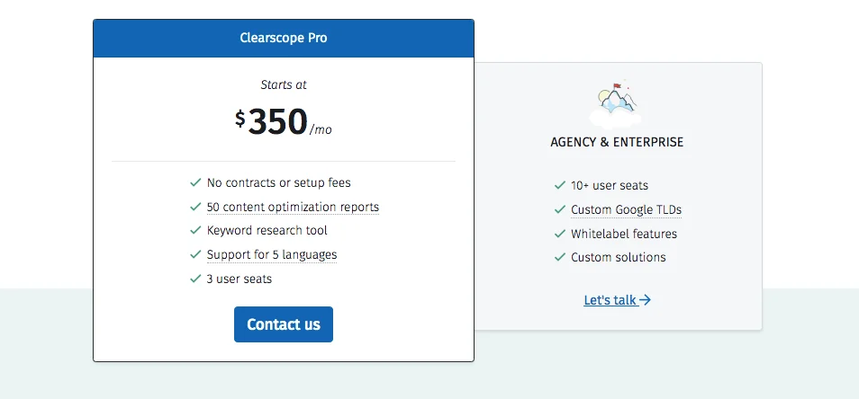
IMG: https://jmp.sh/UlH7sqS

### Parse.ly - Analytics platform
Parse.ly is an analytics platform to track content marketing performance. It's like the content insight that provides visualize the performance of content across all platforms and channels.

Parse.ly also was able to see exactly where traffic comes, how long someone stays on-site, and know the exact time when people reading.


IMG: https://images.g2crowd.com/uploads/attachment/file/121354/Screenshot-2019-11-06-10.06.11.png

Nowadays, Parse.ly had 5 features within:
* Content insight
* Content analytics
* Content API for developers
* Data pipeline analysis
* Enterprise infrastructure

VIDEO: https://www.parse.ly/static/video-overview-post-report-b05182b2b170afd10387cd8d1c3aa4d8.mp4

Parse.ly allows integrating with WordPress, Google Tag Manager, Gatsby, even with iOS and Android. If you interest, pick a free trial version (Starter only). After that, subscribe to the best plan for your business.
* Starter: 500 USD/month
* Growth: 1.500 USD/month
* Enterprise: custom

The detail of that is here.

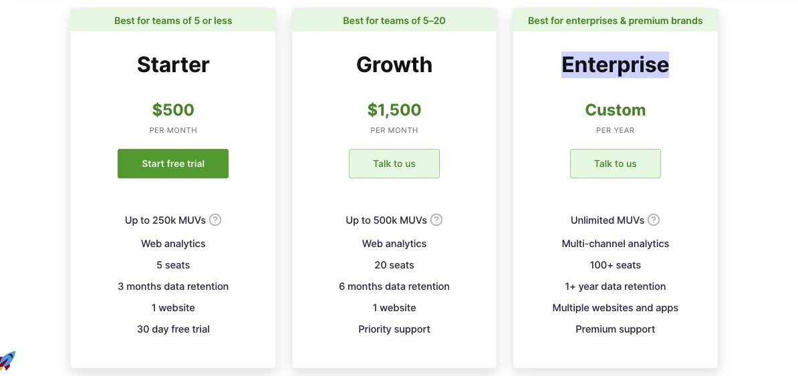
IMG: https://jmp.sh/6a4Mo4U

### MarketMuse - Content intelligence
MarketMuse is an AI content intelligence and strategy platform. It helps the company to research, plan, and craft content. This platform works through 3 steps: personalized difficulty score, content briefs, and first draft NLG.

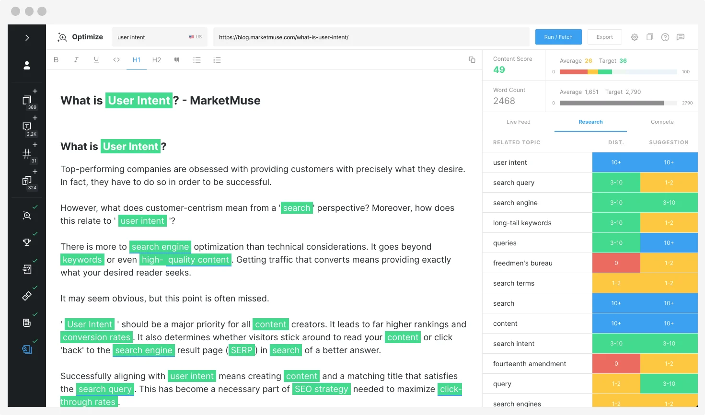
IMG: https://images.g2crowd.com/uploads/attachment/file/90882/Group-24.png

MarketMuse accelerates content creation, improves organic search rankings, drives expertise in the industry, and finally impacts revenue. The features of it include:
* Content research
* Content strategy
* Content creation
* Content optimization
* Natural language generation (NLP)

Regarding in content workflow, MarketMuse works such as:
SEOs through plan content. It will increase organic search traffic, control outbound and inbound link, and measure the content quality of important pages.
Content strategist through content briefs. It will identify content strengths, weaknesses, and gaps.

MarketMuse displays single pricing of 399 USD/month. There is 4 pricing package actually on the pricing page.
* Gold
* Silver
* Bronze
* Pro

Here is the detail that you need to know.

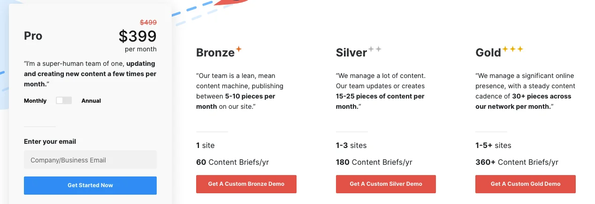
IMG: https://jmp.sh/qSzwlhx

### Bitly - URL shortener
Bitly is a URL shortener, in short. The long definition is a link management platform that inserts data and analytics to track customer experiences.

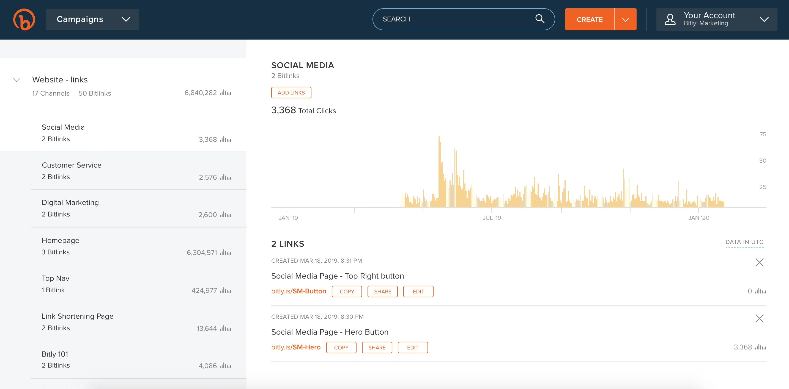
IMG: https://images.g2crowd.com/uploads/attachment/file/126610/campaigns.png

Bitly is a part of the brand strategy which provides shrinking long links. It dashboard covers:
* Track visitor coming
* Track content shared
* Customize the links

There are four features within Bitly:
* Link management
* Branded links
* Mobile links
* Campaign management and analytics

If you want to try this, choose the free package or subscribe to their other pricing plan. 
* Free: 0 USD/month
* Basic: 29 USD/month
* Customized solutions: customer pricing

The detail of link management is here.


IMG: https://jmp.sh/Lt5DOmb

### Rebrandly - Link management platform
Rebrandly is a link management platform to track and short URLs with a custom domain name. This platform has the same several features with Bitly.


IMG: https://cdn0.capterra-static.com/screenshots/2115871/137531.png

The advantage between Rebrandly and other link management platform is in the integration feature. You allow to connecting your tools with 100+ other platform such as Bookmarklet, MeetEdgar, Zapier, AWS S3, Slack, IWantMyName, etc.

Rebrandly provides five pricing structure:
* Free: 0 USD/month
* Starter: 29 USD/month
* Pro: 69 USD/month
* Premium: 499 USD/month
* Enterprise: custom pricing

The feature that you will get is here.

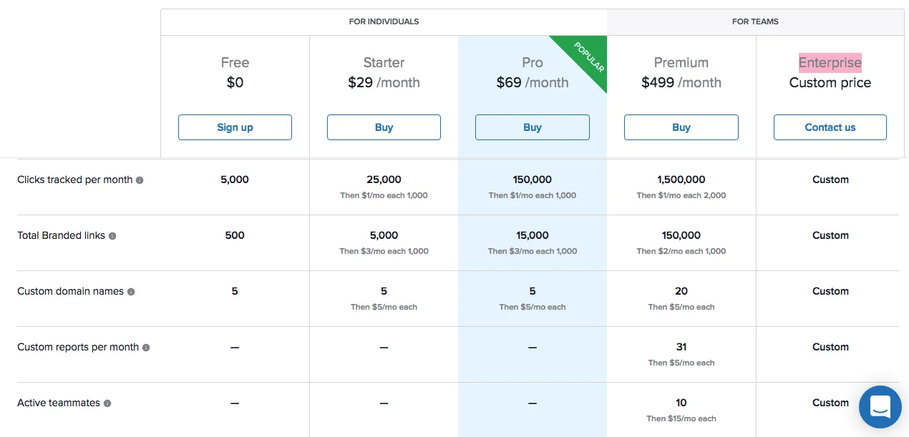
IMG: https://jmp.sh/4QkWCdi

### SqueezeCMM - Content marketing analytics
SqueezeCMM Content Marketing Analytics is content analytics with a customizable dashboard. It is the smart content marketing tool I've not ever seen before. In short, this tool provides managing content performance and analytics.

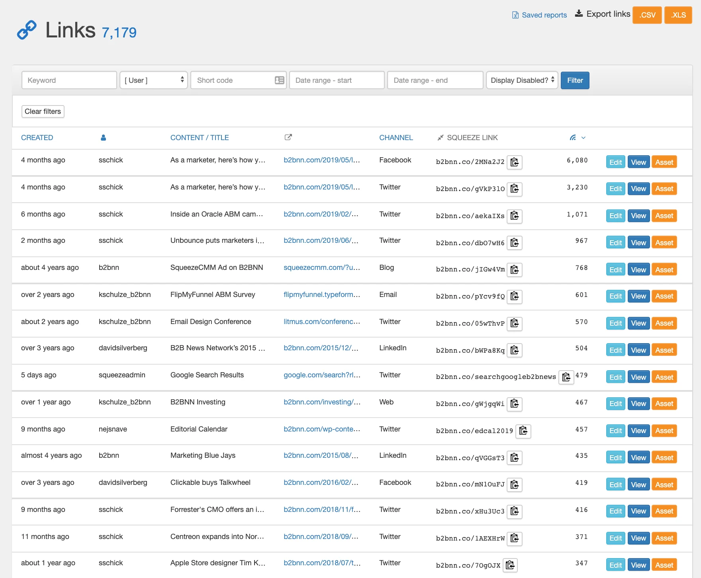
IMG: http://squeezecmmv2.wpengine.com/wp-content/uploads/2019/08/b2bnn-links.png

The thing that makes SqueezeCMM unique because six features inside include:
* Custom content analytics. Allow everyone to define itself metadata
* Contextual IP/GEO data for retargeting. Automagically build a contextualized IP database (used to customized IP/GEO retargeting campaigns).
* Detect click fraud in ad campaigns. Confirm the clicks you are paying for are human beings. 
* Link management. Track URL in each link.
* Enterprise-class URL redirection. Monitor the speed and reliability redirection link.
* Custom branded domains. Remake your branded domain as the business needed.

SqueezeCMM is powerful to cost efficiency. That is because it can track the performance of the digital campaign (content marketing, SEO, Ads). It's given better insights about customer behaviour and what kinds of content perform well.

SqueezeCMM allows the company to try this platform without subscribing (14-day free trial). If the feature performs well, then pick their pricing strategy.
* Starter: 49 USD/month
* Professional: 199 USD/month
* Agency/Enterprise: 499 USD/month

* The detail that you will get is these three pricing.

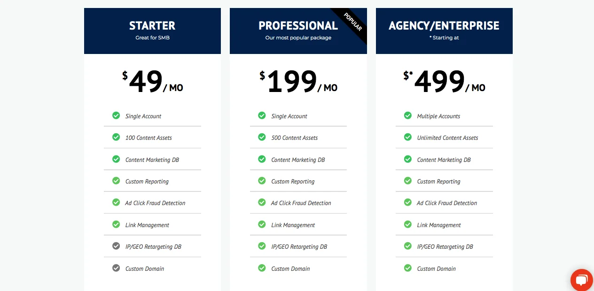
IMG: https://jmp.sh/3SdQoZM

### Dnnsoftware Evoq-content - Content engagement & organic visibility
Dnnsoftware Evoq-content is a content management system (CMS) which powerful to editing, publishing and monitoring content. In their product, Evoq-content had various feature to increase content engagement and search engine visibility.


IMG: https://www.dnnsoftware.com/portals/0/Images/DNN/SEO-URL-Management.png

All benefit from Evoq-content because:
* Content creation
* Content analytics
* SEO
* Web performance
* Integration

How about the pricing structure? There is no clear definition, but they provide a free trial version. This is details.

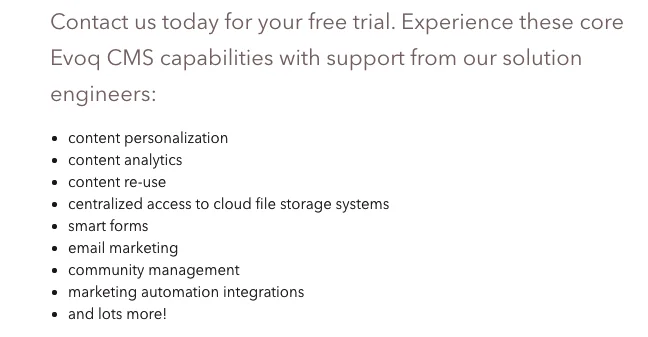
IMG: https://jmp.sh/KPHXLA6

### Acrolinx - Enterprise content governance
Acrolinx is the #1 enterprise content governance solution. It will capture strategy, guide creators, and gives full control of content and campaign goals.

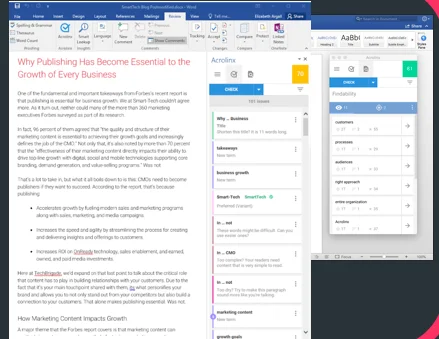
IMG: https://images.g2crowd.com/uploads/attachment/file/84884/Screen-Shot-2018-07-24-at-5.13.51-PM.png

Acrolinx is increasing content more effectivity than before. It keeps all content contributors on target, helping them use the right language and style. As we know, better quality and accurately represents a brand company voice will create a positive engagement with customers.

Acrolinx pricing is not definitely. We need to talk with the sales team using the contact form.

### Knotch - Content intelligence platform
Knotch is a content intelligence platform that plan, measure, optimize and benchmark content marketing across owned sites and paid channels. 

VIDEO: https://videos.files.wordpress.com/kQObHMrX/homepage-hero-animation_hd.mp4

Some person thinks that Knotch is more expensive than similar tools. But the dashboard is affordable than their feature. That is because Knotch allows the company to understand the content gaps are in each specific topic. 

In another hand, there are 6 core capabilities such as:
* Quantitative and qualitative content measurement
* Research content strategies, and best publishers
* Automatically organize all of the content
* Define custom stages for the audience and content mapping

Knotch hides its pricing strategy, but you can request a demo. Fill out the demo form and get the benefit from it.

### StoryChief - Content marketing workspace
StoryChief is an all-in-one content marketing workspace. It makes a different approach than other tools above. Based on how it works, StoryChief is a platform that becomes co-create, plan, and distribute articles to various channels with one click

Its motto is, all from one place. This is the smart way to define their advantage and what they do.

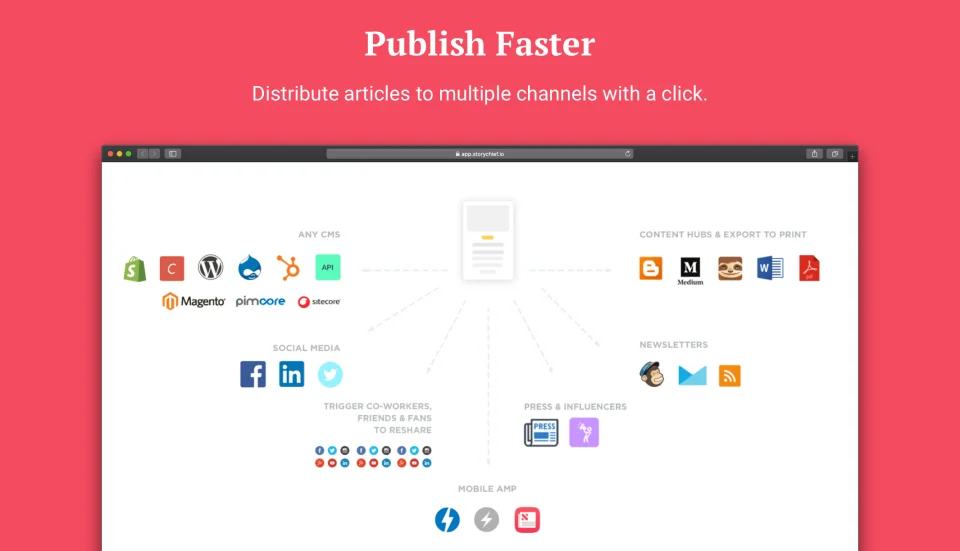
IMG: https://cdn0.capterra-static.com/screenshots/2124176/205532.png

Because StoryChief focuses on content optimization, the dashboard also provides perfect SEO management, boost articles readability, and track visitor behaviour (Actual reads, time spent, view, click, and social share)

There is four pricing structure. The structure is based on each user.
* Free: 0 USD/month
* Essential: 12 USD/month
* Pro: 24 USD/month
* Custom: 65 USD/month 

Let see the detail of pricing here.

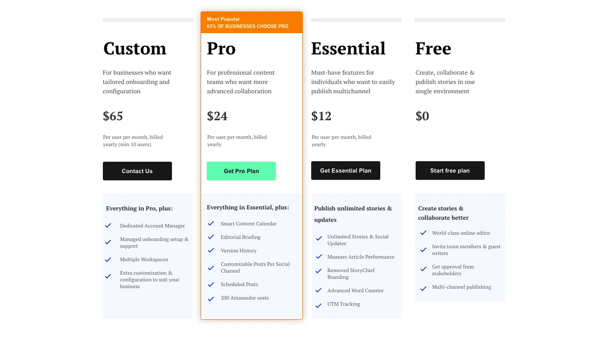
IMG: https://jmp.sh/62yP5t6

### Giveitanudge Insights - Content marketing analytics
Giveitanudge Insights is content marketing analytics and optimization. Its dashboard contains three points:
* Optimize campaigns through actionable data.
* Pick out the best performing device, source, content, and partner.
* Adjust budgets and measuring the right things

IMG: 
https://giveitanudge.com/wp-content/themes/website4.0/assets/video/homepage-video.mp4

Giveitanudge Insights promises world-class measurement, insights and benchmarks with affordable pricing. There is a freemium version for monthly traffic above 150,000 views.

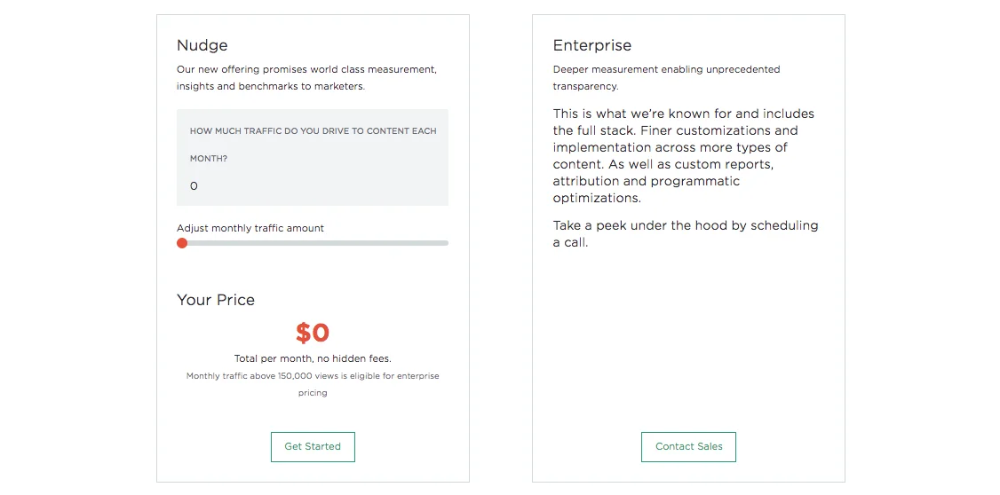
IMG: https://jmp.sh/mp9uJ0v

### Chartbeat - Content intelligence platform
Chartbeat is a content intelligence platform. Its focus to monitor and optimize content for long-term audience loyalty. The dashboard provides real-time analytics, insights, and transformative tools for content creation teams.

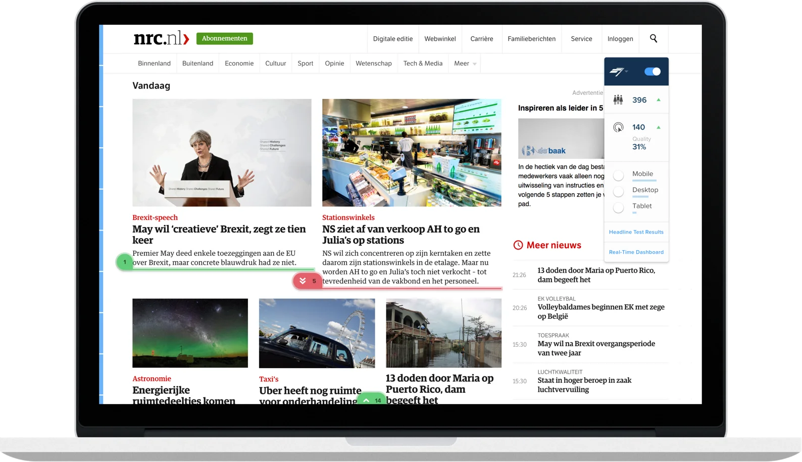
IMG: https://static2.chartbeat.com/images/marketing_ng/site2017/home/HUD@2x.png

Chartbeat presents extremely valuable data that show page views and headline testing. To make it perfect, there are four products include:
* Understand how the audience is connecting
* A customizable and flexible reporting tool 
* Track headline tests that optimize for reader engagement 

This content tool helps us to more understand the traditional misleading metrics such as page views, instead of measuring how engaged users. Because of this, this tool is useful for content creators and website owners to monitor traffic behaviour and campaigns in real-time.

Unfortunately, the Chartbeat pricing structure is not definitely.

> If you have a recommendation about content analytics software, let me know. Reach out me through this business email: fatul@gtag.dev

---
## Conversion Rate Optimization Tools

If you are looking for "Conversion Rate Optimization" into the search engine, then stopping out into this conversion rate optimization definition:

```
The systematic process of increasing the percentage of website visitors who take the desired action — be that filling out a form, becoming customers, or otherwise. The CRO process involves understanding how users move through your site, what actions they take, and what's stopping them from completing your goals. - by Moz.com
```
The result of conversion rate optimization definition is, an effort to increase website visitors will do into our website. The specific "do" means buy a product, call the sales team, subscribe to the newsletter, request demo version, and more. 

To optimise the conversion rate we need powerful tools to track, monitor, and analyze visitor behaviour during our site. If you need the tool looks of that, then this is the option:

### Mouseflow
Mouseflow focuses on optimizing a website based on customer activity. This tools will replay visitor experience. The impact of this, the company can identify pain points, boost conversions, and optimize the site in a single tool.

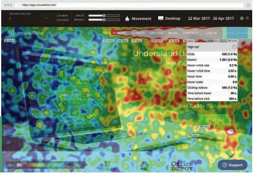
IMG: https://jmp.sh/lrecjHr

Mouseflow helps the company to understand visitors behind the number. If you need website analytics tools with actionable insight, Mouseflow is the best choice. They had several core components:
* Session replay
* Heatmaps
* Form analytics
* Funnels
* User feedback

How about pricing?

Mouseflow provides 4 pricing structure with different feature each pricing:
* Starter: 24 EUR/month
* Growth: 79 EUR/month
* Pro: 299 EUR/month
* Enterprise: Custom

This is the details you will get in each pricing structure:


IMG: https://jmp.sh/VUiRdOh

### Lucky Orange

Lucky Orange focuses on conversion optimization. It shows you which elements that attract clicks and how. It is same with Hotjar, you can also watch the recording of site visitors within the app or site. 

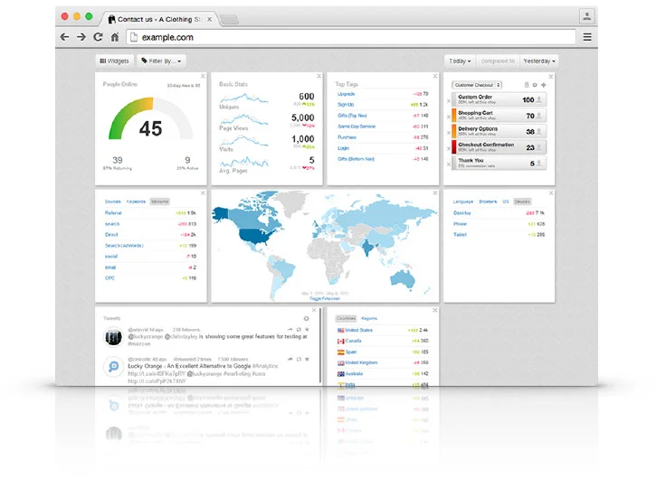
IMG: https://www.luckyorange.com/images/dashboard-in-browser-3.jpg

They provide seven core features:
* Web analytics: track how many visitors right now and where are they coming from. You can see the dashboard with a comprehensive report. You can see compare historical statistics and what keywords, locations, referrers, tweets, languages, etc. are driving traffic and behaviours on your site, all filterable by behaviour tags.
* Recording: every single visitor will be recorded by Lucky Orange. You can monitor visitors behaviour while on the website.
* Dynamic heatmaps: It just as like as heatmaps in general, how visitors interact with the site will leaving a trail.
* Chat. It allows you and visitors to talk on the site. 
* Conversion funnels. Track abandon the process and understand a reason why visitors do or did not do check out or create an account.
* Form analytics. It provides highly valuable reports and gives company insight about problem areas on your website's forms.
* Polls. Bring customer feedback more palpable with fully customizable (multiple questions, redirect to URLs, and trigger scenario).

Lucky Orange give you 7 days free trial and 5 pricing structure with several features inside. Here are the details:
* Starter: 10 USD
* Small business: 20 USD
* Medium: 50 USD
* Large: 100 USD
* Enterprise: custom

The differences among this pricing are on five component. You will get a discount if choose the yearly subscription. 

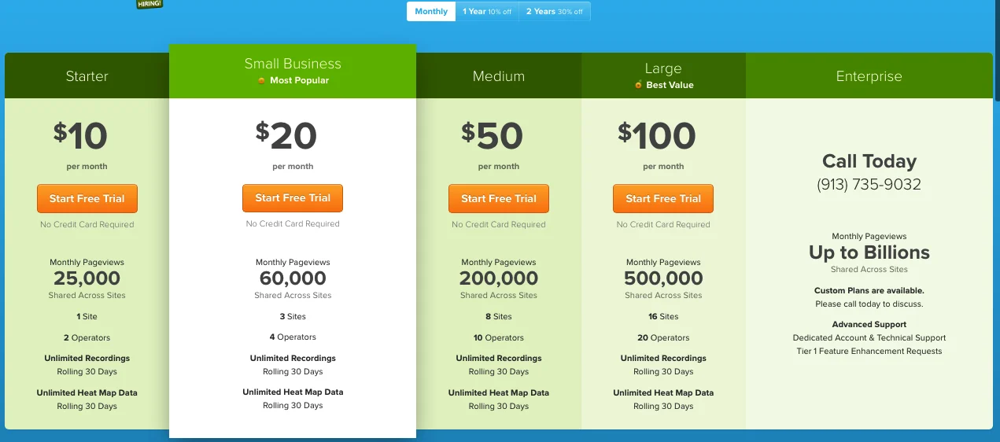
IMG: https://jmp.sh/NPSuoId

> Hotjar, Mixpanel, Crazyegg, VWO and other conversion rate optimization tools did not explain by me into this article. That is because I think these are overly familiar. 

---
The Best Digital Marketing KPI Dashboard (Multiple Data Sources From Analytics Platform) 

What is digital marketing KPIs Dashboard? This is the tools help us connect all data source, automatically calculate metrics, and show the result of that into a single dashboard.

The pricing and feature of these tools are different among each other. But the point of that is, getting an easy way to process the data source for everyone and everywhere. Look at these alternative tools to see each feature within. 

### Databox
Databox is a single place analytics platform that pulls all of KPIs into one place. We can show results across digital campaign analytics tools within.

The user interface is clean and makes it easy to notice trends. The thing that makes me comfortable to use this tool is reporting features format (Daily, weekly and monthly). This is convenient to use for every company.


IMG: https://images.g2crowd.com/uploads/attachment/file/103437/charts-tv.jpg

The other advantage is their sharing feature, it is easy to collaborate with other people without open your sensitive data. Because of that, this tool is fit for daily KPI tool and increase our value and traffic.

The feature list is this.


IMG: https://jmp.sh/xEr8kfZ

How about the Databox pricing structure? They give a free version for a new user. And if it feeling good, choose their other pricing structure.
* Free: 0 USD/month
* Basic: 49 USD/month
* Plus: 99 USD/month
* Business: 248 USD/month

The detail feature you will get is.

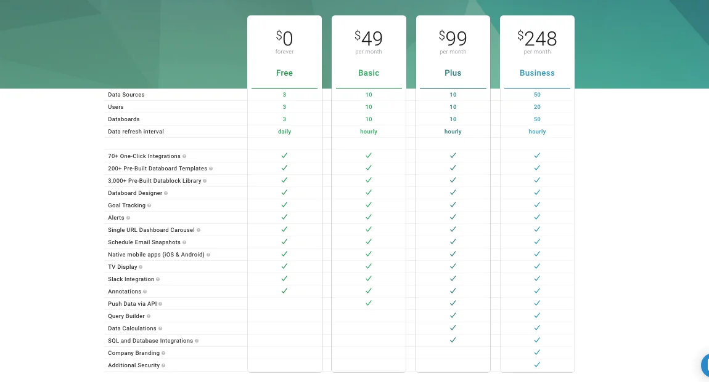
IMG: https://jmp.sh/jrOwuPy

### Cyfe
Cyfe is an all-in-one business dashboard. We can monitoring all of the digital campaigns such as social media, web analytics, marketing, sales, support, infrastructure, and more.

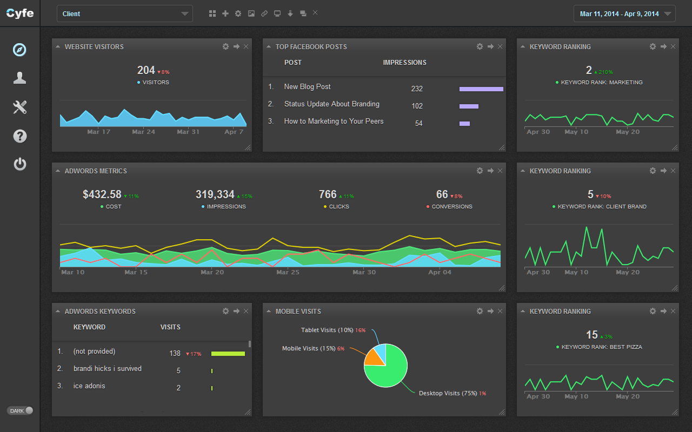
IMG: https://images.g2crowd.com/uploads/attachment/file/43057/expirable-direct-uploads_2F28417ab0-f825-4615-9f88-5ec7df849483_2FCyfe_Client_Dashboard__28Dark_29.png

The Cyfe dashboard helps the company to do research real-time statistics at each online channel. It provides a very simplified report. The dashboard has split into ten categories.

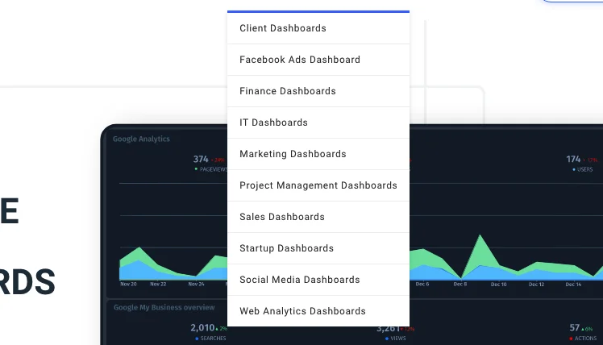  
IMG: https://jmp.sh/KGgXDoD

The pricing strategy seems as like as with Databox, but there is a limited feature. Cyfe allows everyone to signup with 0 USD/month (freemium version). And then, there is three pricing stage for the next.
* Solo: 29 USD/month
* Pro: 49 USD/month
* Premier: 89 USD/month

The feature inside of Cyfe pricing looks like this.

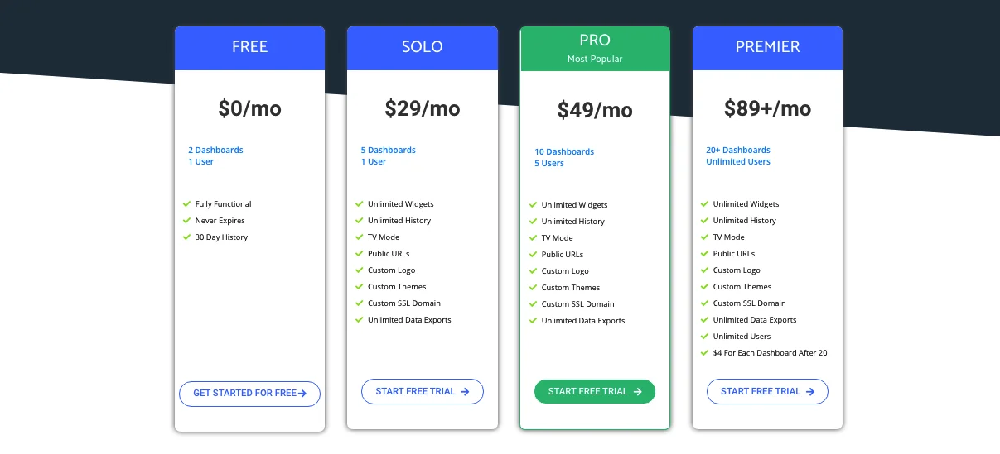
IMG: https://jmp.sh/mDI1dKw
 
### Datahero
Datahero is cloud intelligence software platform in data visualization and data dashboards. It enables the company to do three analytics report: 
* Create charts and data visualizations
* Automate dynamic client reporting
* Build KPI dashboards to track key metrics

It's as like as Databox, it allows the company to share their report with teams and clients.

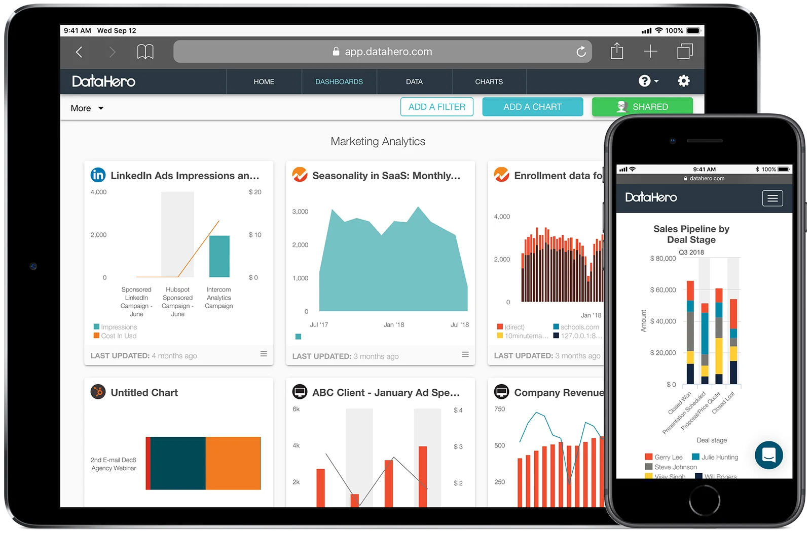
IMG: 
https://datahero.com/wp-content/uploads/2018/10/datahero-ipad-iphone-dashboard-small.png

Datahero plans start with a free 14-day trial. There are four other plans for getting up.
* Starter: 49 USD/month
* Premium: 79 USD/month
* Team: 99 USD/month
* Agency / Enterprise: custom pricing

Its pricing plan is separately based on various features. Let see the details.

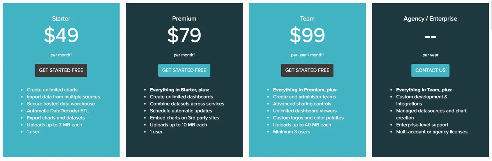
IMG: https://jmp.sh/ENFFxIi

### Domo
Domo is a business cloud that allows the company to use its connector to integrate with 1000+ data sources. As like the related tools before, Domo can connect and combine with many data sources, visualize & analyze them, and leverage low-code custom apps.

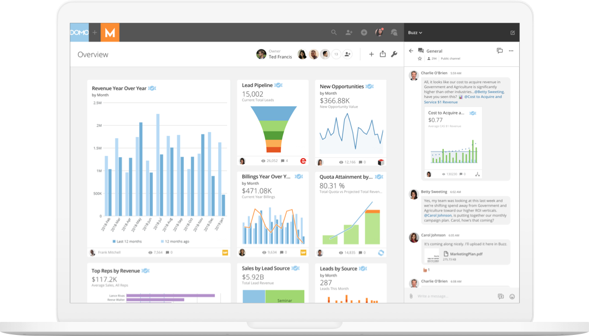
IMG: https://images.g2crowd.com/uploads/attachment/file/102385/domo-device-laptop-dashboard-overview-sales-finance.png

What is the best side of Domo? This looks like an operating system, but it runs in the cloud. The company can install all kinds of business applications and share it for everyone and from anywhere. And the point is, you don't need to install anything else on your devices.

Hmm... It's impressive, right? What is the next we need to know about Domo? The pricing structure. Domo covers free trial version without show regular pricing. This is Domo pricing page looks like (FAQ).


IMG: https://jmp.sh/1dJiiPm

### Supermetrics
Supermetrics is marketing metrics for PPC, SEO, social and web analytics. Instead of manual reporting, the company can pull all of the marketing data into one place. No more copy/pasting or importing CSV files again. 

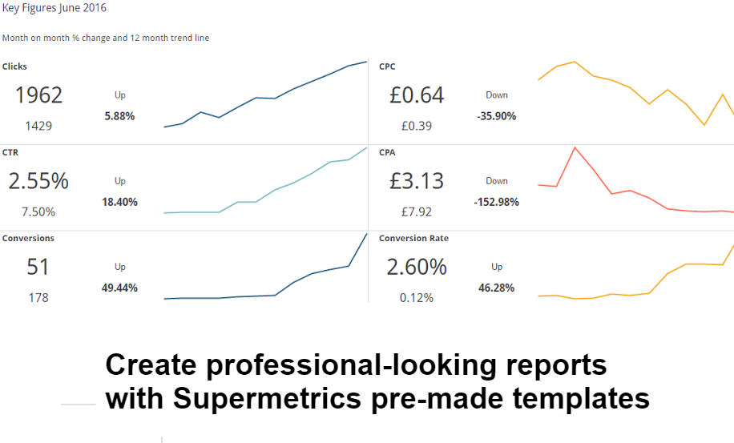
IMG: https://images.g2crowd.com/uploads/attachment/file/61884/expirable-direct-uploads_2F3204bb32-b645-4e9d-b400-a48268597b22_2FScreenshot1b.png

The source of marketing data such as Google Analytics, Google Ads, Facebook, Bing, Twitter, Linkedin and other marketing platforms you are optimising.

Supermetrics provides eight products. They look like this image. 

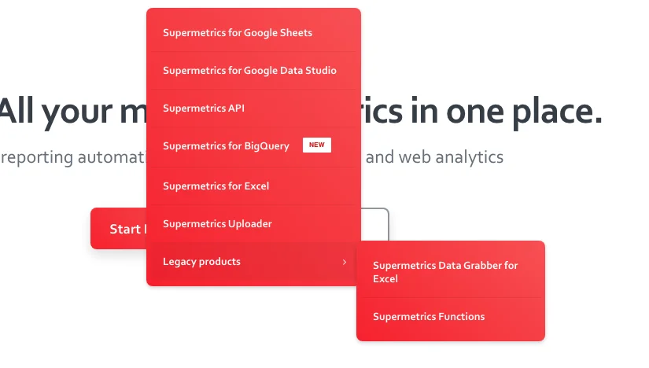
IMG: https://jmp.sh/6Tzhjl8

There is a free version (60-day trial) and it was so useful that going to purchase the full version. Need to know, these product listing impacts pricing structure. Let's see the details.

**Supermetrics for Google Sheets:**
* Free trial: 14 days
* Hobby: 0 USD/month
* Pro: 99 USD/user/month
* SuperPro: 199 USD/user/month
* Enterprise: contact sales

**Supermetrics for Data Studio:**
* Individual connector: 39 USD/month
* Pro: 99 USD/month
* SuperPro: 299 USD/month
* Enterprise: contact sales

**Supermetrics API is based on usage.** The company need to fill out the form.

**Supermetrics for BigQuery:**
* Free trial: 14 days
* Data source package 1: 190 USD/month
* Data source package 2: 490 USD/month

**Supermetrics for Excel:**
* Free trial: 14 days
* Pro: 99 USD/user/month
* SuperPro: 199 USD/user/month
* Enterprise: contact sales team

**Supermetrics Uploader:**
* Free trial: 14 days

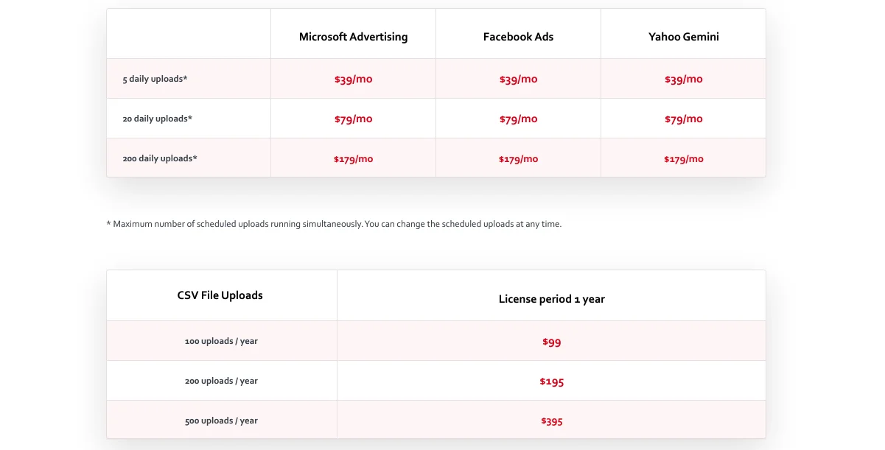
IMG: https://jmp.sh/AQ1ECwb

**Supermetrics Data Grabber:**
* Free trial: 14 days
* Google Analytics Module: 39 USD/month
* Google Ads Module: 39 USD/month
* Google Search Console Module: 39 USD/month
* MailChimp Module: 39 USD/month
* Microsoft Advertising Module: 29 USD/month
* Facebook Ads Module: 39 USD/month
* Facebook Insights Module: 29 USD/month
* YouTube Module: 29 USD/month
* Twitter Ads Module: 39 USD/month
* Twitter Tweet Search Module: 19 USD/month
* Stripe Module: 29 USD/month

Supermetrics Functions:
Consist of some data source such as Google Analytics, Google Ads, Microsoft Advertising, Facebook Ads, Facebook Insights, YouTube, Twitter Public Data, Google BigQuery, Google Search Console Module, Yahoo Gemini, and Stripe Module. 

All data sources at $29.99 per month per each.

### Cynapse Numerics
Cynapse Numerics is a realtime dashboard app. It lets the company design custom dashboards, personalized to business KPIs and metrics. The impressive one of this app is, Numerics is available for iPhone, iPad, Apple Watch and Apple TV.

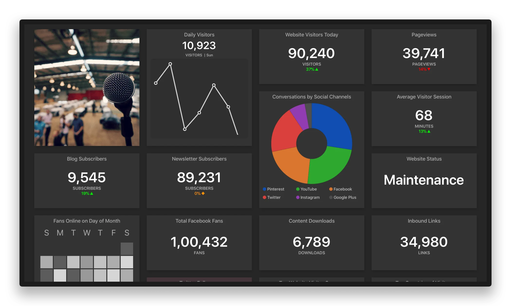
IMG: https://cynapse.com/img/Optimized-for-Office-Walls.png

Numerics is easy to use because of allowing the company to:
Connect with 44+ data sources (Google Analytics, WooCommerce, Wordpress, Mailchimp, Facebook, and more)
Create own dashboards by choosing from hundreds of pre-designed KPI templates (Drag-n-drop feature).

Numerics just covers three pricing structure including free to use version. This is Numerics pricing:
* Free: 0 USD/month
* Pro: 9.99 USD/month
* Enterprise: custom pricing

The item the company will get is here.

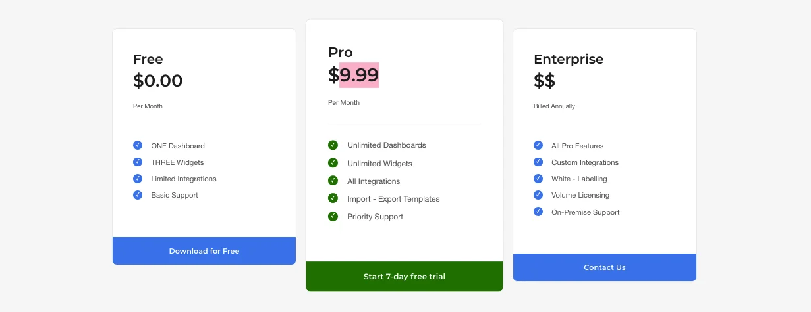
IMG: https://jmp.sh/uQ0DKoB

### Calypsus | Calypsus.io
Calypsus is digital marketing reporting that connect online advertising platforms such as Facebook, Instagram, Youtube, Google Ads, Google Analytics & Linkedin. 

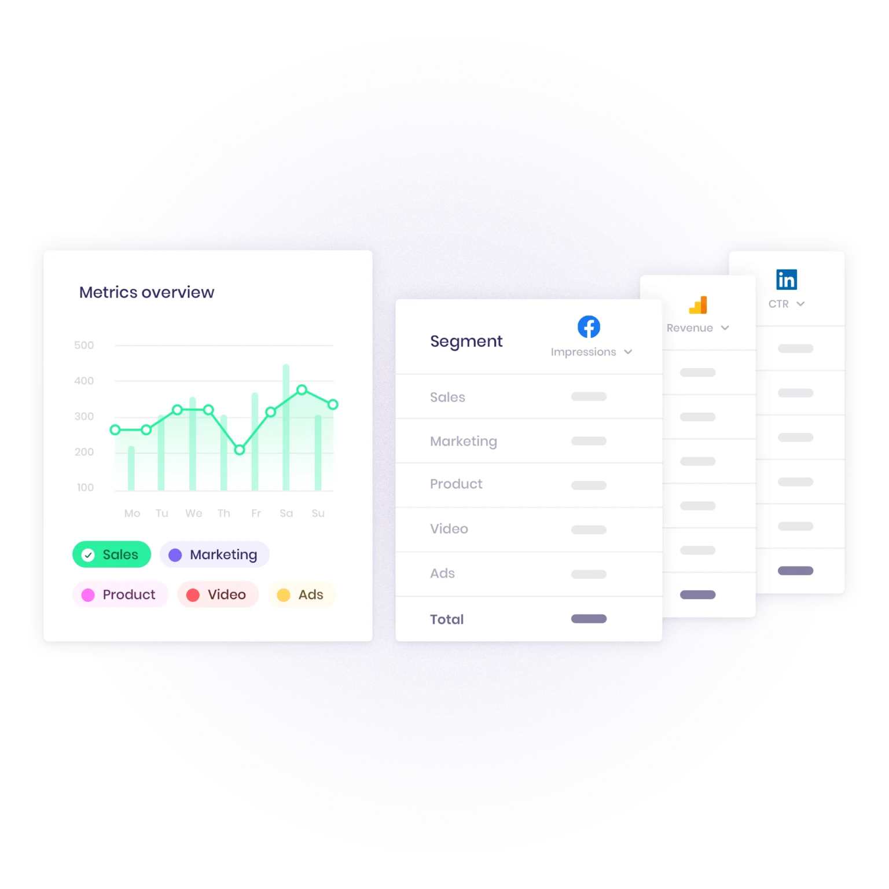
IMG: https://calypsus.io/wp-content/uploads/2020/02/03_Calypsus_Report-1536x1536.png

The best part of Calypsus is, they provide four core aspect:
* Connecting with various digital channels
* Linking many platforms through specific advertising metrics
* Report data across channels by any dimension
* Share reports to XLS, CSV, TSV or PDF.

The free version is in this tool. But we need to learn their ad spend requirement. To get a free version, ensure you have average monthly ad spend of less than €1000. If this not on you, choose other pricing:
* Starter: 50 USD/month
* Basic: 100 USD/month
* Pro: 150 USD/month

The detail of it can see here.


IMG: https://jmp.sh/aRstIA0

### Geckoboard
Geckoboard is a metrics dashboard. Allow the company to create a dashboard, connect with 60+ data sources, and get it published on a tv. 

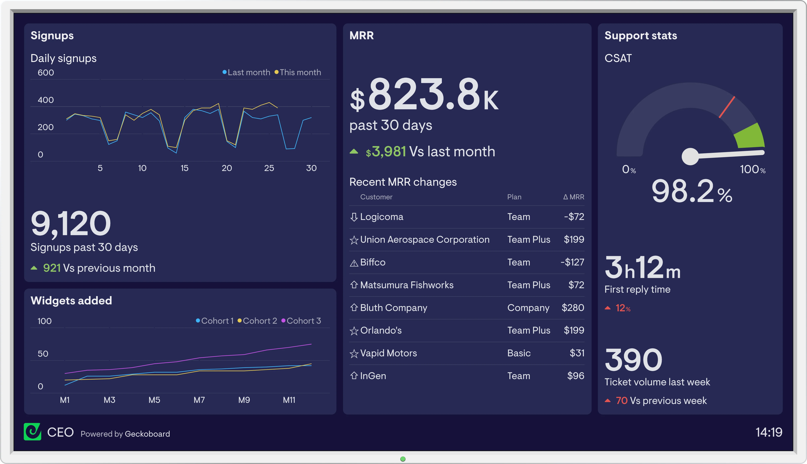
IMG: https://www.geckoboard.com/uploads/CEO-dashboard-geckoboard-2.png

If you are an art lover, Geckoboard is your best dashboard tools. They provide many beautifully-designed interfaces with live visualizations. 

Geckoboard has four pricing options with a limited feature within. Let's check the option here.
* Basic: 31 USD/month
* Team: 127 USD/month
* Team plus: 199 USD/month
* Company: 479 USD/month

If you want to see the detail of pricing option, see this image below.

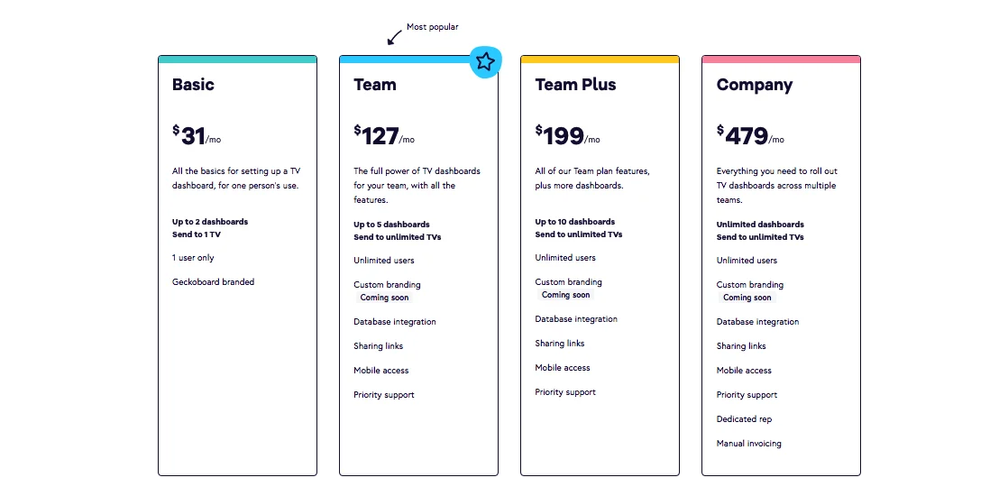
IMG: https://jmp.sh/g0NTflg

### DashThis
DashThis is the digital marketing reporting tool. In one dashboard, it provided complete campaign metrics such as LinkedIn, Facebook, Google My Business, Google Analytics, and email.

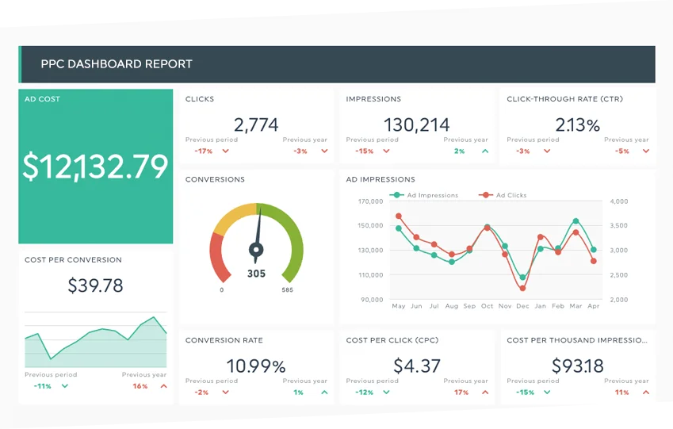
IMG: https://static.dashthis.com/media/3059/ppc.png

The dashboard is simply, but supply pretty understands campaign performance from various business types and reporting needs. Let's see the one by one of that.

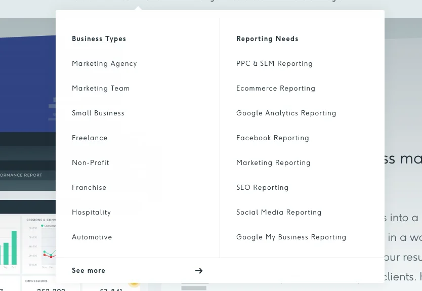
IMG: https://jmp.sh/K4R54ag

The pricing option comes through 5 types, in each pricing type there are limit features.
* Individual: 33 USD/month
* Professional: 109 USD/month
* Business: 209 USD/month
* Standard: 339 USD/month
* Enterprise: 499 USD/month

The detail of all pricing options coming up in this image below.

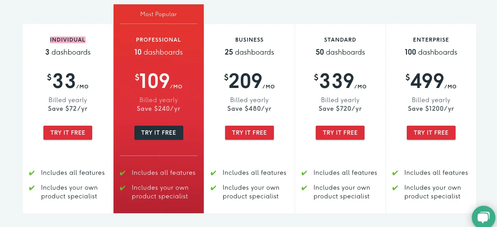
IMG: https://jmp.sh/rfyEpxt

### Klipfolio
Klipfolio is a business dashboard software that connects to any data source, create beautiful data visualizations, and share them to anyone. Allow the company to pull data from hundreds of data sources, including spreadsheets, files, databases, and web services applications.

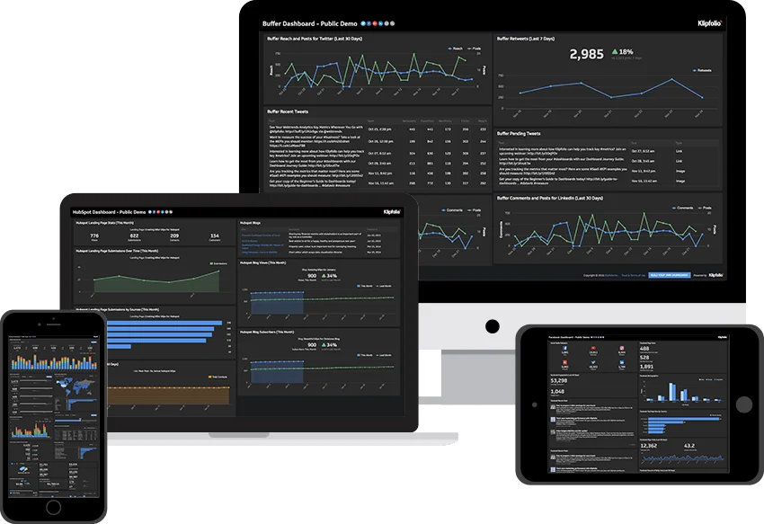
IMG: https://images.g2crowd.com/uploads/attachment/file/64000/expirable-direct-uploads_2F6122a053-f114-48fa-b531-56e5c9ea96df_2Fwhat-is-a-data-dashboard-dashboard-examples.png

It allows the company to sort reporting by group, filter, and aggregate. The dashboard is customizable so easily display as charts, tables and other views format to present KPIs. 

I jump into Klipfolio, but the pricing structure did not provide. Fortunately, I stumble at SaaS software review and found the Klipfolio pricing.
* Publish: 49 USD/month
* Grow: 99 USD/month
* Team: 199 USD/month
* Team+: 399 USD/month

The feature we will get based on this pricing structure looks like this image below.

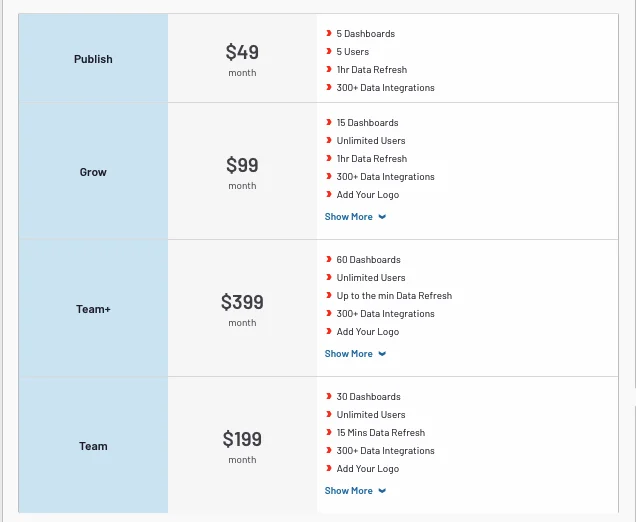
IMG: https://jmp.sh/w4luBoL

### Megalytic
Megalytic is the dashboard for KPI reports that give the company full control to present it. View the report as a widget, maps, charts and grids. All of these able to extend with CSV imports and image imports.

VIDEO: https://youtu.be/Oa6_9W7LvYI

Because it was created for digital agencies, marketers and business owners, there is four pricing option with 14 days free trial. Let me know share to you.
* Basic: 39.99 USD/month
* Standard: 99.99 USD/month
* Premium: 199.99 USD/month
* Enterprise: 399.98 USD/month

If you pick one of them, then you will get these features.

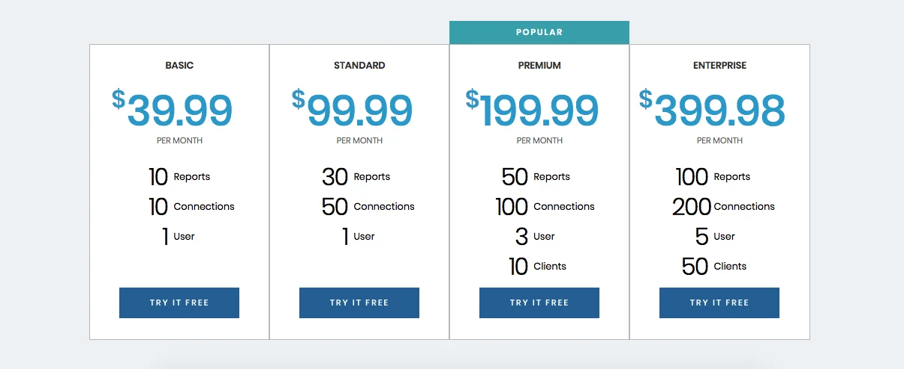
IMG: https://jmp.sh/IoINh3V

### Idashboards
Idashboards is a business intelligence solution. You can pull the data resource from anywhere. Almost as like as Megalytic, this tool allows the company to create a unique combination of charts, graphs, and infographics.

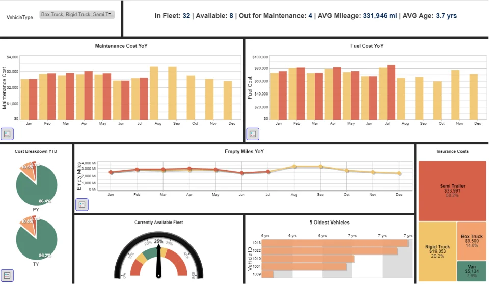
IMG: https://cdn0.capterra-static.com/screenshots/2030282/117133.png

To make it more stand out than other dashboard report, Idashboards show you several dashboard formats such as IT dashboard, healthcare, insurance, credit union, education, call centre, finance, government, and more.

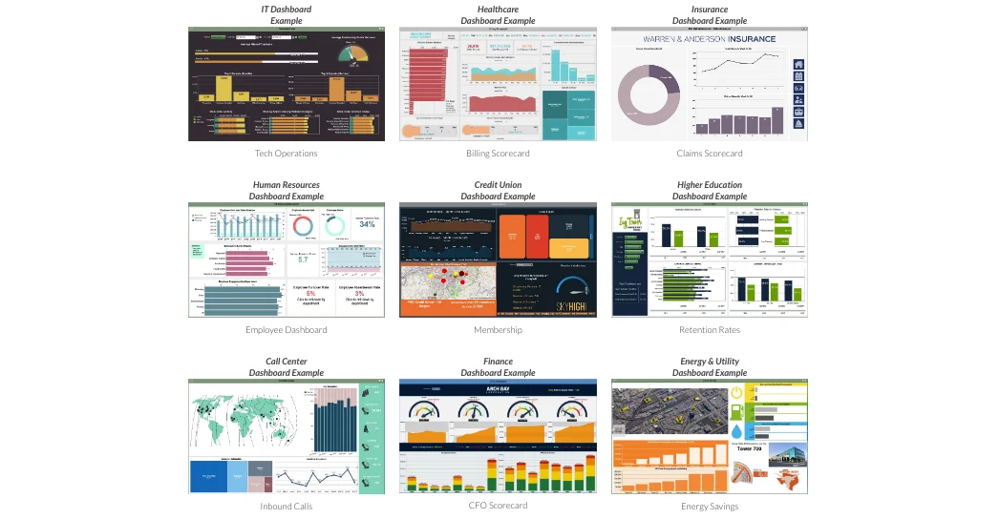
IMG: https://jmp.sh/VMWNOA5

The pricing option comes from user request. Fill out the form and you will get their premium services. 

### AgencyAnalytics
AgencyAnalytics is an all-in-one reporting platform. This platform works for SEO, PPC, social media, email, review, GMB, and call tracking dashboards. The dashboard is customizable with easy-to-use drag and drop.

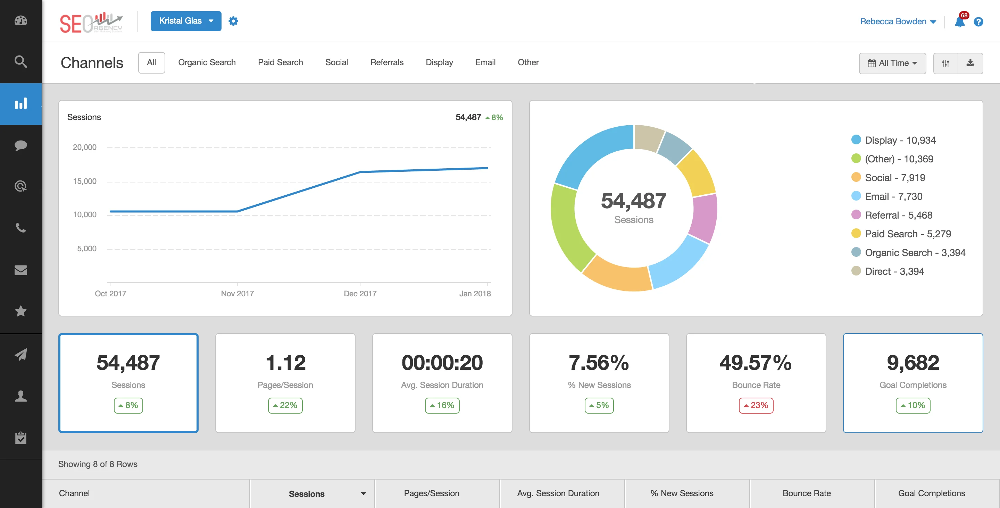
IMG: https://images.g2crowd.com/uploads/attachment/file/74739/expirable-direct-uploads_2Ffc4e0d12-5a2e-4612-a5a1-41f62fb144e6_2Fweb-analytics.png

If you need SEO reports, then this is the best one. The dashboard appears rank tracking, backlink monitoring and website audits without additional cost.

Its interface is extremely beautiful for an agency. AgencyAnalytics allows them to:
* Create monthly for client reports
* Activate monthly reports sent by email
* The panel is more interactive for the client
* Visualization report in vectors and graphs

That is the point. But, how about their pricing? There are three pricing options with 14 days of free trials. 
* Freelancer: 49 USD/month
* Agency: 149 USD/month
* Enterprise: 399 USD/month

The pricing in details is here.


IMG: https://jmp.sh/zycPcdi

### Zoho Analytics
Zoho Analytics (formerly Zoho Reports) is a business intelligence software. Help the company to manage HOC reports in minutes with no IT help.

IMG: 
https://www.zohowebstatic.com/sites/default/files/analytics/zblenddata-video.mp4

As like other reports platform, it allows the user to do more specific activities such as:
Connect to any data source
Upload data from spreadsheets & flat files like Microsoft Excel, CSV, HTML, JSON, XML, text files and more. 
Build insightful reports and dashboards with easy drag-and-drop
Share the dashboard with others
Embed the reports within  product/application or hosted portal/website

To use these all features, we can get a free trial version for 15 days and able to getting out through Zoho Analytics pricing structure.
* Basic: 22 USD/month
* Standard: 45 USD/month
* Premium: 112 USD/month
* Enterprise: 445 USD/month

All these pricing you can see here.

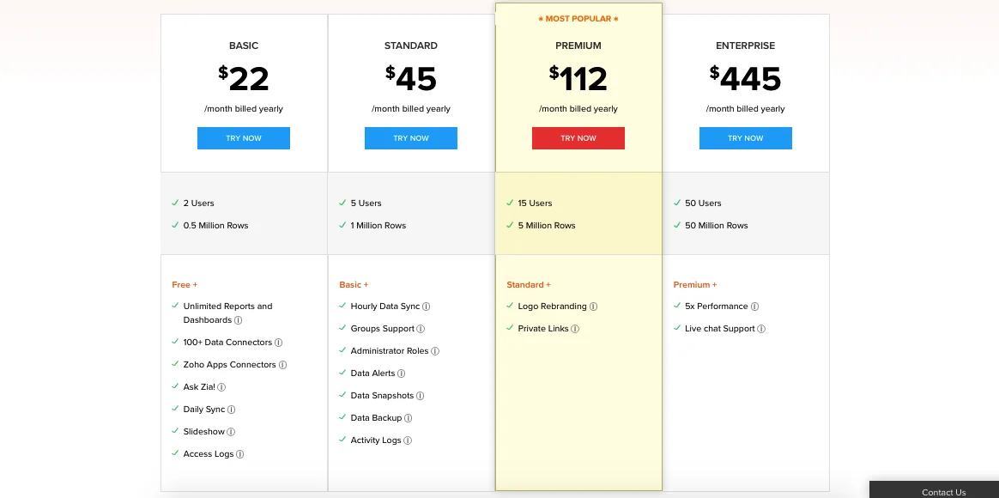
IMG: https://jmp.sh/5m8BFZo

## Next to the action

These are the listing of website analytics tools that might need by you or your company. All of them had a specific focus than others. Pick the one that matches with the business. 

Because I've split into a different category, this can be your first impression before deciding what the tools you want are. The pricing is dynamic and I will update it regularly. Please mention me if you figure out something else within this content.